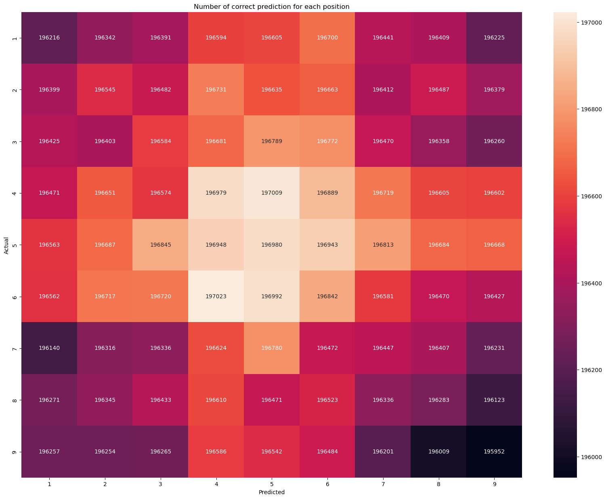
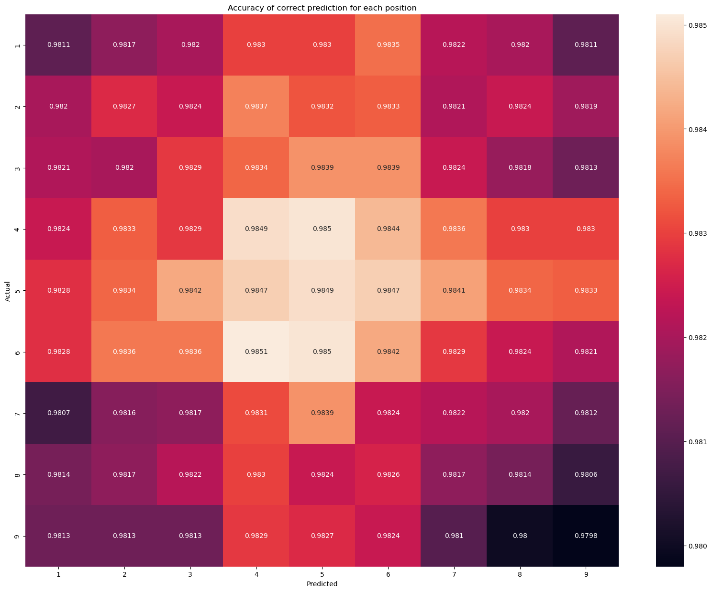
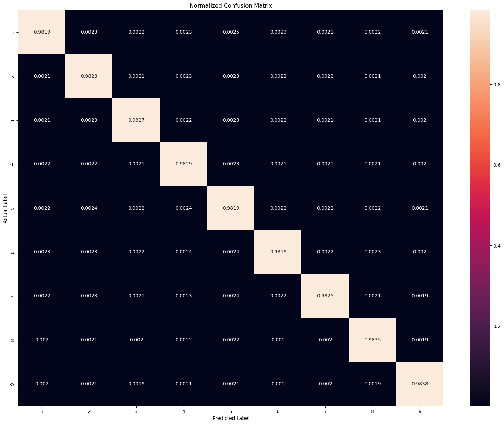

## Final Project: Applied Deep Learning
### Project name: Sudoku
### Author: Qichun Yu

## Table of Contents
1. [Introduction](#Abstract)  
    1.1. [Abstract](#Abstract)  
    1.2. [Use Case](#Use-Case)  
    1.3. [Load and Read Data](#Load-and-Read-Data)  
    1.4. [Data Cleaning](#Data-Cleaning)
2. [Preprocessing](#Preprocessing)  
    2.1. [Normalization](#Normalization)  
    2.2. [Data Splitting](#Data-Splitting)  
3. [Convolutional Neural Networks (CNNs)](#Convolutional-Neural-Networks-(CNNs))  
    3.1. [CNN Model 1](#CNN-Model-1)  
    3.2. [CNN Model 2](#CNN-Model-2)   
    3.3. [CNN Model 3](#CNN-Model-3)  
    3.4. [CNN Model 4](#CNN-Model-4)  
    3.5. [CNN Model 5](#CNN-Model-5)  
    3.6. [CNN Model 6](#CNN-Model-6)  
    3.7. [CNN Model 7](#CNN-Model-7)  
    3.8. [CNN Model 8](#CNN-Model-8)  
    3.9. [CNN Model 9](#CNN-Model-9)  
    3.10. [CNN Model 10](#CNN-Model-10)  
    3.11. [CNN Model 11](#CNN-Model-11)  
4. [Recurrent Neural Networks (RNN)](#Recurrent-Neural-Networks-(RNN))  
    4.1. [RNN Model 1](#RNN-Model-1)    
    4.2. [RNN Model 2](#RNN-Model-2)  
5. [Long Short-Term Memory (LSTM)](#Long-Short-Term-Memory-(LSTM))   
6. [Discussion](#Discussion)
7. [Conclusion](#Conclusion)

### Abstract

Sudoku is a number puzzle game that requires you to fill in digits 1 to 9. The game requires digits 1 to 9 to appear exactly once in each row, column and each of the nine 3x3 subgrids. The project experiment with different neural networks such as CNN, RNN, and LSTM. The data have been divided by 9 and subtracted by 0.5 to achieve zero mean-centred data. The CNN model that includes 9 convolution layers with 512 kernels works best with 95% of training accuracy. The study found that an increase in the number of epochs, number of layers, and number of neurons per layer can help improve the accuracy of the neural network model. Moreover, the dropout layer and maxpooling can help prevent overfitting. Adding strides of 3 x 3 is useful but requires large computing power. The main objective of this project is to build a deep learning model for a mobile app company that can analyze the grid of Sudoku to be filled, solve the Sudoku problem, and fill the grid. The convolution neural networks (CNN) is good at extracting features from the dataset and can be used to solve a sudoku game successfully. 

### Use Case
A mobile app company is building a classical Sudoku game. The development team is working on building a deep learning model which can analyze the grid of sudoku puzzles to be filled, solve the sudoku puzzles problem, and then automatic fill the grid in the end. The dataset includes 1 million Sudoku quizs with solution. This deep learning model will be part of a larger code as the backend of the Sudoku game application. 

### Citation

Kyubyong Park.(September, 2022). 1 million Sudoku games. Retrieved from https://www.kaggle.com/datasets/bryanpark/sudoku.

### Environment
Operating system: Windows Server 2019 atacenter, 64-bit<br>
GPU: Tesla V100-PCIE-16GB

### Import Modules


```python
import numpy as np
import pandas as pd
import matplotlib.pyplot as plt
%matplotlib inline
import seaborn as sns
from sklearn.metrics import confusion_matrix, multilabel_confusion_matrix
import disarray
```

    C:\Miniconda\envs\DL\lib\site-packages\numpy\_distributor_init.py:30: UserWarning: loaded more than 1 DLL from .libs:
    C:\Miniconda\envs\DL\lib\site-packages\numpy\.libs\libopenblas.EL2C6PLE4ZYW3ECEVIV3OXXGRN2NRFM2.gfortran-win_amd64.dll
    C:\Miniconda\envs\DL\lib\site-packages\numpy\.libs\libopenblas.FB5AE2TYXYH2IJRDKGDGQ3XBKLKTF43H.gfortran-win_amd64.dll
      warnings.warn("loaded more than 1 DLL from .libs:"
    


```python
# import libraries for neural network
import tensorflow as tf
from tensorflow.keras.models import Model, Sequential
from tensorflow.keras.layers import Reshape, Dense, Dropout, Flatten,Activation
from tensorflow.keras.layers import Conv1D, Conv2D, BatchNormalization, LayerNormalization, MaxPooling2D
from tensorflow.keras.optimizers import Adam
from tensorflow.keras.layers import SimpleRNN, Input
from tensorflow.keras.utils import to_categorical
from tensorflow.python.keras.layers import LSTM
```

### Load and Read Data


```python
df = pd.read_csv("sudoku.csv")
```


```python
df.head()
```


<div>
<style scoped>
    .dataframe tbody tr th:only-of-type {
        vertical-align: middle;
    }

    .dataframe tbody tr th {
        vertical-align: top;
    }

    .dataframe thead th {
        text-align: right;
    }
</style>
<table border="1" class="dataframe">
  <thead>
    <tr style="text-align: right;">
      <th></th>
      <th>quizzes</th>
      <th>solutions</th>
    </tr>
  </thead>
  <tbody>
    <tr>
      <th>0</th>
      <td>0043002090050090010700600430060020871900074000...</td>
      <td>8643712593258497619712658434361925871986574322...</td>
    </tr>
    <tr>
      <th>1</th>
      <td>0401000501070039605200080000000000170009068008...</td>
      <td>3461792581875239645296483719658324174729168358...</td>
    </tr>
    <tr>
      <th>2</th>
      <td>6001203840084590720000060050002640300700800069...</td>
      <td>6951273841384596727248369158512647392739815469...</td>
    </tr>
    <tr>
      <th>3</th>
      <td>4972000001004000050000160986203000403009000000...</td>
      <td>4972583161864397252537164986293815473759641828...</td>
    </tr>
    <tr>
      <th>4</th>
      <td>0059103080094030600275001000300002010008200070...</td>
      <td>4659123781894735623275681497386452919548216372...</td>
    </tr>
  </tbody>
</table>
</div>


```python
df.shape
```


    (1000000, 2)


```python
df.info()
```

    <class 'pandas.core.frame.DataFrame'>
    RangeIndex: 1000000 entries, 0 to 999999
    Data columns (total 2 columns):
     #   Column     Non-Null Count    Dtype 
    ---  ------     --------------    ----- 
     0   quizzes    1000000 non-null  object
     1   solutions  1000000 non-null  object
    dtypes: object(2)
    memory usage: 15.3+ MB
    

There are 1,000,000 rows with 2 columns (quizzes and solutions). The datatype for each column is an object. They are both relevant to the use case and will be used to train in the model. 


```python
df.describe()
```


<div>
<style scoped>
    .dataframe tbody tr th:only-of-type {
        vertical-align: middle;
    }

    .dataframe tbody tr th {
        vertical-align: top;
    }

    .dataframe thead th {
        text-align: right;
    }
</style>
<table border="1" class="dataframe">
  <thead>
    <tr style="text-align: right;">
      <th></th>
      <th>quizzes</th>
      <th>solutions</th>
    </tr>
  </thead>
  <tbody>
    <tr>
      <th>count</th>
      <td>1000000</td>
      <td>1000000</td>
    </tr>
    <tr>
      <th>unique</th>
      <td>1000000</td>
      <td>1000000</td>
    </tr>
    <tr>
      <th>top</th>
      <td>0160509002050000873900040024207000066075023005...</td>
      <td>7983641251245897366532718498429135673617582945...</td>
    </tr>
    <tr>
      <th>freq</th>
      <td>1</td>
      <td>1</td>
    </tr>
  </tbody>
</table>
</div>


```python
df.isnull().values.any()
```


    False


There are 1,000,000 unique quizzes and solutions. There is not null value in the dataset. 


```python
type(df['quizzes'][0])
```


    str


```python
len(df['quizzes'][0])
```


    81


```python
type(df['solutions'][0])
```


    str


```python
len(df['solutions'][0])
```


    81


The value of the quizzes and the solutions columns are in the form of strings with a length of 81. 

We can use reshape function to represent the puzzle as a 9X9 Python NumPy array. In the quizzes column, '0' is represented as the blank. Let's use reshape to print out the first row of the quiz and solution: 


```python
print("Quiz:\n",np.array(list(map(int,list(df['quizzes'][0])))).reshape(9,9))
```

    Quiz:
     [[0 0 4 3 0 0 2 0 9]
     [0 0 5 0 0 9 0 0 1]
     [0 7 0 0 6 0 0 4 3]
     [0 0 6 0 0 2 0 8 7]
     [1 9 0 0 0 7 4 0 0]
     [0 5 0 0 8 3 0 0 0]
     [6 0 0 0 0 0 1 0 5]
     [0 0 3 5 0 8 6 9 0]
     [0 4 2 9 1 0 3 0 0]]
    


```python
print("Solution:\n",np.array(list(map(int,list(df['solutions'][0])))).reshape(9,9))
```

    Solution:
     [[8 6 4 3 7 1 2 5 9]
     [3 2 5 8 4 9 7 6 1]
     [9 7 1 2 6 5 8 4 3]
     [4 3 6 1 9 2 5 8 7]
     [1 9 8 6 5 7 4 3 2]
     [2 5 7 4 8 3 9 1 6]
     [6 8 9 7 3 4 1 2 5]
     [7 1 3 5 2 8 6 9 4]
     [5 4 2 9 1 6 3 7 8]]
    

Let's build a display function to display the puzzle board. 


```python
def display(board):
    for i in range(9):
        if i in [3, 6]:
            print('------+-------+------')
        for j in range(9):
            if j in [3, 6]:
                print('| ', end='')
            print(board[i * 9 + j] + ' ', end='')
        print()


display(df['quizzes'][0])
```

    0 0 4 | 3 0 0 | 2 0 9 
    0 0 5 | 0 0 9 | 0 0 1 
    0 7 0 | 0 6 0 | 0 4 3 
    ------+-------+------
    0 0 6 | 0 0 2 | 0 8 7 
    1 9 0 | 0 0 7 | 4 0 0 
    0 5 0 | 0 8 3 | 0 0 0 
    ------+-------+------
    6 0 0 | 0 0 0 | 1 0 5 
    0 0 3 | 5 0 8 | 6 9 0 
    0 4 2 | 9 1 0 | 3 0 0 
    


```python
display(df['solutions'][0])
```

    8 6 4 | 3 7 1 | 2 5 9 
    3 2 5 | 8 4 9 | 7 6 1 
    9 7 1 | 2 6 5 | 8 4 3 
    ------+-------+------
    4 3 6 | 1 9 2 | 5 8 7 
    1 9 8 | 6 5 7 | 4 3 2 
    2 5 7 | 4 8 3 | 9 1 6 
    ------+-------+------
    6 8 9 | 7 3 4 | 1 2 5 
    7 1 3 | 5 2 8 | 6 9 4 
    5 4 2 | 9 1 6 | 3 7 8 
    

Sudoku is a logic-based game. It relies on the number of clues available on the board. The position of the available digits that are available on the board also matters to solve the puzzle. From the first game and solution above, the solution is replacing the number '0' with the correct number that fit the sudoku requirement. Each row, each column, and each 3x3 sub-square must contain 1 - 9 without repetition. Therefore, there is a sequence to solve the puzzle. The player must analyze the position of each available number on the board first to decide the next move of the game. 

Let's discover the number of blank squares in each quiz:


```python
list(df['quizzes'][0]).count('0')
```


    46


There are 46 blank squares in the first quiz. 


```python
number_of_blanks=[]
for i in range(df.shape[0]):
    number_of_blanks.append(list(df['quizzes'][i]).count('0'))
number_of_blanks[:10]
```


    [46, 47, 47, 48, 49, 48, 47, 46, 46, 48]


```python
df['number_of_blanks']=number_of_blanks
```


```python
df.head()
```


<div>
<style scoped>
    .dataframe tbody tr th:only-of-type {
        vertical-align: middle;
    }

    .dataframe tbody tr th {
        vertical-align: top;
    }

    .dataframe thead th {
        text-align: right;
    }
</style>
<table border="1" class="dataframe">
  <thead>
    <tr style="text-align: right;">
      <th></th>
      <th>quizzes</th>
      <th>solutions</th>
      <th>number_of_blanks</th>
    </tr>
  </thead>
  <tbody>
    <tr>
      <th>0</th>
      <td>0043002090050090010700600430060020871900074000...</td>
      <td>8643712593258497619712658434361925871986574322...</td>
      <td>46</td>
    </tr>
    <tr>
      <th>1</th>
      <td>0401000501070039605200080000000000170009068008...</td>
      <td>3461792581875239645296483719658324174729168358...</td>
      <td>47</td>
    </tr>
    <tr>
      <th>2</th>
      <td>6001203840084590720000060050002640300700800069...</td>
      <td>6951273841384596727248369158512647392739815469...</td>
      <td>47</td>
    </tr>
    <tr>
      <th>3</th>
      <td>4972000001004000050000160986203000403009000000...</td>
      <td>4972583161864397252537164986293815473759641828...</td>
      <td>48</td>
    </tr>
    <tr>
      <th>4</th>
      <td>0059103080094030600275001000300002010008200070...</td>
      <td>4659123781894735623275681497386452919548216372...</td>
      <td>49</td>
    </tr>
  </tbody>
</table>
</div>


```python
df['number_of_blanks'].value_counts()
```


    47    455004
    48    263913
    46    198940
    49     61122
    45     12662
    50      7748
    51       526
    44        57
    52        28
    Name: number_of_blanks, dtype: int64


From the data above, we can see the number of blanks is between 44 to 52. The percentage of blanks is between 54%(47/81) to 64%(52/81).     The number of given numbers is between 29 (81-52) to 37 (81-47). According to ResearchGate, the number of clues between 28 - 31 is considered to be difficult, the number of clues between 32 - 35 is considered to be medium difficulty level, and the number of clues between 36 - 46 is considered to be easy. Therefore, most of the Sudoku quizzes from this dataset are considered to be medium.  (https://www.researchgate.net/figure/Number-of-clues-for-each-difficulty-level_tbl1_259525699) 


```python
sns.countplot(x=df['number_of_blanks'])
```


    <matplotlib.axes._subplots.AxesSubplot at 0x208000796a0>


    

    


From the plot above, most of the puzzle has 47 blank grids. 


```python
fig1, ax1 = plt.subplots(figsize=(8, 8))
ax1.pie(df['number_of_blanks'].value_counts(), autopct='%1.2f%%', pctdistance=1.1)
ax1.legend(df['number_of_blanks'].value_counts().index)
ax1.axis('equal')  # Equal aspect ratio ensures that pie is drawn as a circle.

plt.title("Percentage by the Number of Blanks Cells in the quizzes")
plt.show()
```


    

    


From the pie chart above, we can see about 45.5% of quizzes with 47 blank cells. The medium difficulty level (46-49 blanks) is about 98% (45.50%+26.39%+19.89%+6.11%). 

Before the model building, it is important to verify that all the solutions are valid sudoku solutions. A solution is valid must be validated with the following rules: 
<ul>
<li>Each row must contain 1 - 9 without repetition</li>
<li>Each column must contain 1 - 9 without repetition</li>
<li>Each of the nine 3 x 3 sub-squares must contain 1 - 9 without repetition</li>
</ul>
Sudoku_check is a python code to validate a sudoku solution, which was built by Suyash. The code has been modified to return True when is valid and False when is invalid. The original code can be found here: https://www.codespeedy.com/check-for-a-valid-sudoku-in-python. 


```python
import sudoku_check as sudoku_check
grid_0=np.array(list(map(int,list(df['solutions'][0])))).reshape(9,9)
sudoku_check.valid_board(grid_0)
```


    True


```python
df['is_valid']=df.apply(lambda x: sudoku_check.valid_board(np.array(list(map(int,list(x['solutions'])))).reshape(9,9)), axis=1)
```


```python
df.head()
```


<div>
<style scoped>
    .dataframe tbody tr th:only-of-type {
        vertical-align: middle;
    }

    .dataframe tbody tr th {
        vertical-align: top;
    }

    .dataframe thead th {
        text-align: right;
    }
</style>
<table border="1" class="dataframe">
  <thead>
    <tr style="text-align: right;">
      <th></th>
      <th>quizzes</th>
      <th>solutions</th>
      <th>number_of_blanks</th>
      <th>is_valid</th>
    </tr>
  </thead>
  <tbody>
    <tr>
      <th>0</th>
      <td>0043002090050090010700600430060020871900074000...</td>
      <td>8643712593258497619712658434361925871986574322...</td>
      <td>46</td>
      <td>True</td>
    </tr>
    <tr>
      <th>1</th>
      <td>0401000501070039605200080000000000170009068008...</td>
      <td>3461792581875239645296483719658324174729168358...</td>
      <td>47</td>
      <td>True</td>
    </tr>
    <tr>
      <th>2</th>
      <td>6001203840084590720000060050002640300700800069...</td>
      <td>6951273841384596727248369158512647392739815469...</td>
      <td>47</td>
      <td>True</td>
    </tr>
    <tr>
      <th>3</th>
      <td>4972000001004000050000160986203000403009000000...</td>
      <td>4972583161864397252537164986293815473759641828...</td>
      <td>48</td>
      <td>True</td>
    </tr>
    <tr>
      <th>4</th>
      <td>0059103080094030600275001000300002010008200070...</td>
      <td>4659123781894735623275681497386452919548216372...</td>
      <td>49</td>
      <td>True</td>
    </tr>
  </tbody>
</table>
</div>


```python
df['is_valid'].value_counts()
```


    True    1000000
    Name: is_valid, dtype: int64


All the solutions are vaild!

### Data Cleaning

Because we don't need the 'number_of_blanks' or 'is_valid' for deep learning model training; therefore, we may drop these two columns after the analysis. 


```python
data = df.drop(['number_of_blanks','is_valid'], axis=1)
data.head()
```


<div>
<style scoped>
    .dataframe tbody tr th:only-of-type {
        vertical-align: middle;
    }

    .dataframe tbody tr th {
        vertical-align: top;
    }

    .dataframe thead th {
        text-align: right;
    }
</style>
<table border="1" class="dataframe">
  <thead>
    <tr style="text-align: right;">
      <th></th>
      <th>quizzes</th>
      <th>solutions</th>
    </tr>
  </thead>
  <tbody>
    <tr>
      <th>0</th>
      <td>0043002090050090010700600430060020871900074000...</td>
      <td>8643712593258497619712658434361925871986574322...</td>
    </tr>
    <tr>
      <th>1</th>
      <td>0401000501070039605200080000000000170009068008...</td>
      <td>3461792581875239645296483719658324174729168358...</td>
    </tr>
    <tr>
      <th>2</th>
      <td>6001203840084590720000060050002640300700800069...</td>
      <td>6951273841384596727248369158512647392739815469...</td>
    </tr>
    <tr>
      <th>3</th>
      <td>4972000001004000050000160986203000403009000000...</td>
      <td>4972583161864397252537164986293815473759641828...</td>
    </tr>
    <tr>
      <th>4</th>
      <td>0059103080094030600275001000300002010008200070...</td>
      <td>4659123781894735623275681497386452919548216372...</td>
    </tr>
  </tbody>
</table>
</div>


### Preprocessing

[Return to top](#Final-Project:-Applied-Deep-Learning)

Before passing the data as inputs to the neural net model, use reshape function from NumPy to expand the dimensions (N, 9, 9, -1). 


```python
X = np.array(df.quizzes.map(lambda x: list(map(int, x))).to_list()).reshape(-1,9,9,1)
Y = np.array(df.solutions.map(lambda x: list(map(int, x))).to_list()).reshape(-1,9,9)
```


```python
X.shape
```


    (1000000, 9, 9, 1)


#### Normalization

Normalize the data by dividing it by 9 and subtracting it by 0.5 to achieve zero mean-centred data. Because the neural networks usually generate a better performance with zero-centred normalized data. 


```python
# print the original first sudoku quiz
print(X[0].reshape(9,9))
```

    [[0 0 4 3 0 0 2 0 9]
     [0 0 5 0 0 9 0 0 1]
     [0 7 0 0 6 0 0 4 3]
     [0 0 6 0 0 2 0 8 7]
     [1 9 0 0 0 7 4 0 0]
     [0 5 0 0 8 3 0 0 0]
     [6 0 0 0 0 0 1 0 5]
     [0 0 3 5 0 8 6 9 0]
     [0 4 2 9 1 0 3 0 0]]
    


```python
X = X / 9
```


```python
# print the first sudoku quiz to verify
print(X[0].reshape(9,9))
```

    [[0.         0.         0.44444444 0.33333333 0.         0.
      0.22222222 0.         1.        ]
     [0.         0.         0.55555556 0.         0.         1.
      0.         0.         0.11111111]
     [0.         0.77777778 0.         0.         0.66666667 0.
      0.         0.44444444 0.33333333]
     [0.         0.         0.66666667 0.         0.         0.22222222
      0.         0.88888889 0.77777778]
     [0.11111111 1.         0.         0.         0.         0.77777778
      0.44444444 0.         0.        ]
     [0.         0.55555556 0.         0.         0.88888889 0.33333333
      0.         0.         0.        ]
     [0.66666667 0.         0.         0.         0.         0.
      0.11111111 0.         0.55555556]
     [0.         0.         0.33333333 0.55555556 0.         0.88888889
      0.66666667 1.         0.        ]
     [0.         0.44444444 0.22222222 1.         0.11111111 0.
      0.33333333 0.         0.        ]]
    


```python
X -= .5
```


```python
# print the first sudoku quiz to verify
print(X[0].reshape(9,9))
```

    [[-0.5        -0.5        -0.05555556 -0.16666667 -0.5        -0.5
      -0.27777778 -0.5         0.5       ]
     [-0.5        -0.5         0.05555556 -0.5        -0.5         0.5
      -0.5        -0.5        -0.38888889]
     [-0.5         0.27777778 -0.5        -0.5         0.16666667 -0.5
      -0.5        -0.05555556 -0.16666667]
     [-0.5        -0.5         0.16666667 -0.5        -0.5        -0.27777778
      -0.5         0.38888889  0.27777778]
     [-0.38888889  0.5        -0.5        -0.5        -0.5         0.27777778
      -0.05555556 -0.5        -0.5       ]
     [-0.5         0.05555556 -0.5        -0.5         0.38888889 -0.16666667
      -0.5        -0.5        -0.5       ]
     [ 0.16666667 -0.5        -0.5        -0.5        -0.5        -0.5
      -0.38888889 -0.5         0.05555556]
     [-0.5        -0.5        -0.16666667  0.05555556 -0.5         0.38888889
       0.16666667  0.5        -0.5       ]
     [-0.5        -0.05555556 -0.27777778  0.5        -0.38888889 -0.5
      -0.16666667 -0.5        -0.5       ]]
    

Subtract 1 from the sudoku solution to reassign labels 0 ~ 8 to corresponding digits 1 ~ 9. 


```python
# print the original first sudoku solution
print(Y[0].reshape(9,9))
```

    [[8 6 4 3 7 1 2 5 9]
     [3 2 5 8 4 9 7 6 1]
     [9 7 1 2 6 5 8 4 3]
     [4 3 6 1 9 2 5 8 7]
     [1 9 8 6 5 7 4 3 2]
     [2 5 7 4 8 3 9 1 6]
     [6 8 9 7 3 4 1 2 5]
     [7 1 3 5 2 8 6 9 4]
     [5 4 2 9 1 6 3 7 8]]
    


```python
Y -= 1
```


```python
# print the first sudoku solution to verify
print(Y[0].reshape(9,9))
```

    [[7 5 3 2 6 0 1 4 8]
     [2 1 4 7 3 8 6 5 0]
     [8 6 0 1 5 4 7 3 2]
     [3 2 5 0 8 1 4 7 6]
     [0 8 7 5 4 6 3 2 1]
     [1 4 6 3 7 2 8 0 5]
     [5 7 8 6 2 3 0 1 4]
     [6 0 2 4 1 7 5 8 3]
     [4 3 1 8 0 5 2 6 7]]
    

#### Data Splitting

Splitting data with a ratio of 80/20. The first 800,000 data (80%) as the training set and the last 200,000 data (20%) as the testing set. 


```python
# set training split equal to 0.8
training_split = 0.8

splitidx = int(len(data) * training_split)
# first 80% of data as training set, last 20% of data as testing set
x_train, x_test = X[:splitidx], X[splitidx:]
y_train, y_test = Y[:splitidx], Y[splitidx:]
```


```python
# valify the size of training set
print(x_train.shape)
```

    (800000, 9, 9, 1)
    


```python
# valify the size of testing set
print(x_test.shape)
```

    (200000, 9, 9, 1)
    

### Neural Networks Models

Visualizing the Loss & Accuracy Plot of Training & Validation data can help us to know if a model has overfitting or underfitting. Matplotlib plots can help us visualize the history of network learning (accuracy & loss). 

<ul>
    <li>If loss falls on the training set and increases on the testing set, the network model has overfitted.</li>
    <li>Training loss is much lower than validation loss, the network is overfitting.</li>
    <li>If the training loss is too high, it indicates the neural network model could not learn the training data and the network is underfitting.</li>
</ul>


```python
# define a plot function to plot the loss and accuracy of train and test
def loss_acc_plot(history):
    fig, ax = plt.subplots(1,2)
    fig.set_size_inches(12,6)

    ax[0].plot(history.history['loss'], label='train loss')
    ax[0].plot(history.history['val_loss'], label='val loss')
    ax[0].set_title('Training and Validation Loss')
    ax[0].set_ylabel('Loss')
    ax[0].set_xlabel('Epochs')
    ax[0].legend(['train', 'val'], loc='upper right')

    ax[1].plot(history.history['accuracy'], label='accuracy')
    ax[1].plot(history.history['val_accuracy'], label='val_accuracy')
    ax[1].set_title('Training and Validation Accuracy')
    ax[1].set_ylabel('Accuracy')
    ax[1].set_xlabel('Epochs')
    ax[1].legend(['train', 'val'], loc='upper right')

    plt.show()
```

The models use **Adam Optimizer** with a learning rate of **0.001**, the optimizer is save to a variable called optimizer. 


```python
# using an Adam optimizer with a learning rate of 0.001
optimizer = tf.keras.optimizers.Adam(0.001)
```

Because we are training a **multiclass** classifier, predicting digits 1~9 (9 classes). Since we are not using one-hot encoded, the loss function that is using is **sparse_categorical_crossentropy**. For multi-class classification, **Softmax** will be the activation function for the last layer, which outputs multiple numerical numbers ranging from 0 to 8 (9 classes)corresponding to the probability of each class. 

### Convolutional Neural Networks (CNNs)

[Return to top](#Final-Project:-Applied-Deep-Learning)

Convolutional neural networks (CNN) are good at extracting local features from the image and are commonly used to analyze visual imagery. If we treat each number as its own feature of the puzzle, so there are 81 different features available. CNN is good at extracting features, which could generate good performance.

**Hyperparameter Tuning**:<br>

<ul>
    <li><strong>Number of epochs:</strong> Increasing number of epochs can help improve the accuracy and lowers the loss; however, a high number of epochs may result in an overfitting model.</li>
    <li><strong>Number of layers:</strong> Increasing number of layers help increases the accuracy; however, a high number of layers may result in an overfitting model.</li>
    <li><strong>Number of neurons per layer:</strong> Increasing number of neurons can help imporve the accuracy.</li>
</ul>


#### CNN Model 1

Let's start with a simple CNN model. 
<ul>
    <li>The model start with a <strong>Conv2D()</strong>  class, which is a 2D convolution layer. The first layer is a convolution layer with 64 kernels that are (3,3) in dimension. The padding is 'same' so that a padding gets the same output dimension as the input. The ReLU is used as the activation function. The input are batches of arrays of shape (9,9).</li>
    <li><strong>Batch normalization</strong> is a method to normalize the inputs of each layer. It can help speed up and stabilize neural networks.</li>
    <li>Adding a convolution layer with 64 kernels of shape (3 x 3), a batch normalization layer and a convolution layer with 128 kernels of shape (1 x 1).</li>
    <li>After that, a <strong>Flatten</strong> layer help to comprise the (9,9, 128) to 10,368 (9x9x128) input nodes.</li>
    <li><strong>Dense</strong> is a regular neural network layer that performs a dot product operation. The matrix multiplication is represented by the dot(X, W) + B, where X is the input to the layer, W is the weight, and B is the bias. Using 729 (81x9) in the dense layer means performing matrix multiplication to result in an output matrix with a desired last dimension to be 729. </li>
    <li><strong>LayerNormalization</strong> is used to normalize a layer.</li>
    <li>Using <strong>Reshape</strong> layer to (9,9,9) so that the last layer has 9 neurons corresponding to the 9 classes(0~8) with a <strong>softmax activation function</strong>. </li>
</ul>


```python
# Function for the cnn model function
def cnn_model_func1():
    # Instantiate model
    model = tf.keras.Sequential()
    # add a convolution layer with 64 kernels of shape (3 x 3)
    model.add(Conv2D(64, kernel_size=(3,3), activation='relu', padding='same', input_shape=(9,9,1)))
    # normalize the kernel values for Convolution Layers
    model.add(BatchNormalization())
    # add a convolution layer with 64 kernels of shape (3 x 3)
    model.add(Conv2D(64, kernel_size=(3,3), activation='relu', padding='same'))
    # normalize the kernel values for Convolution Layers
    model.add(BatchNormalization())
    # add a convolution layer with 128 kernels of shape (1 x 1)
    model.add(Conv2D(128, kernel_size=(1,1), activation='relu', padding='same'))
    # comprises the (9,9, 128) to a 10,368 (9*9*128) input nodes
    model.add(Flatten())
    # Add a dense layer to perform matrix multiplication to result in an output matix with 729(81*9)
    model.add(Dense(81*9))
    # normalize the dense layer above
    model.add(LayerNormalization(axis=-1))
    # the last layer has 9 neurons corresponding to the 9 classes with a softmax activation function
    model.add(Reshape((9, 9, 9)))
    # using softmax as activation function for multiclass
    model.add(Activation('softmax'))
    
    return model
```


```python
# Initialise the cnn model
cnn_model1 = cnn_model_func1()
# print summary of the cnn model
cnn_model1.summary()
```

    Model: "sequential"
    _________________________________________________________________
     Layer (type)                Output Shape              Param #   
    =================================================================
     conv2d (Conv2D)             (None, 9, 9, 64)          640       
                                                                     
     batch_normalization (BatchN  (None, 9, 9, 64)         256       
     ormalization)                                                   
                                                                     
     conv2d_1 (Conv2D)           (None, 9, 9, 64)          36928     
                                                                     
     batch_normalization_1 (Batc  (None, 9, 9, 64)         256       
     hNormalization)                                                 
                                                                     
     conv2d_2 (Conv2D)           (None, 9, 9, 128)         8320      
                                                                     
     flatten (Flatten)           (None, 10368)             0         
                                                                     
     dense (Dense)               (None, 729)               7559001   
                                                                     
     layer_normalization (LayerN  (None, 729)              1458      
     ormalization)                                                   
                                                                     
     reshape (Reshape)           (None, 9, 9, 9)           0         
                                                                     
     activation (Activation)     (None, 9, 9, 9)           0         
                                                                     
    =================================================================
    Total params: 7,606,859
    Trainable params: 7,606,603
    Non-trainable params: 256
    _________________________________________________________________
    

The model compile with the **sparse_categorical_crossentropy** loss function which does not require passing one-hot vectors as output. 
Training with a **batch size of 32 and epochs of 5**. Batch size is the number of samples processed before the network model is updated. Large batch size may result in overfitting so the model starts with 32. 
Let's train it with five epochs to see how it performs. 


```python
# Train the model
cnn_model1.compile(loss='sparse_categorical_crossentropy', optimizer=optimizer, metrics=['accuracy'])

history1 = cnn_model1.fit(x_train, y_train, batch_size=32, epochs=5, validation_data=(x_test, y_test))
```

    Epoch 1/5
    25000/25000 [==============================] - 160s 4ms/step - loss: 0.4753 - accuracy: 0.7985 - val_loss: 0.3760 - val_accuracy: 0.8243
    Epoch 2/5
    25000/25000 [==============================] - 96s 4ms/step - loss: 0.3631 - accuracy: 0.8307 - val_loss: 0.3601 - val_accuracy: 0.8312
    Epoch 3/5
    25000/25000 [==============================] - 97s 4ms/step - loss: 0.3475 - accuracy: 0.8391 - val_loss: 0.3541 - val_accuracy: 0.8340
    Epoch 4/5
    25000/25000 [==============================] - 97s 4ms/step - loss: 0.3381 - accuracy: 0.8444 - val_loss: 0.3519 - val_accuracy: 0.8351
    Epoch 5/5
    25000/25000 [==============================] - 96s 4ms/step - loss: 0.3314 - accuracy: 0.8483 - val_loss: 0.3509 - val_accuracy: 0.8358
    


```python
loss_acc_plot(history1)
```


    

    


From the above training, it looks like the training loss decreasing but validation loss is increasing. The model is overfitting. 


```python
training_accuracy1 = history1.history['accuracy'][-1]
training_loss1 = history1.history['loss'][-1]
print(f"Training Loss: {training_loss1:.4f}, Training Accuracy: {training_accuracy1:.4f}")
```

    Training Loss: 0.3314, Training Accuracy: 0.8483
    


```python
val_loss1, val_accuracy1 = cnn_model1.evaluate(x_test,y_test)
print(f"Done!\nValiation Loss: {val_loss1:.4f}, Validation Accuracy: {val_accuracy1:.4f}")
```

    6250/6250 [==============================] - 14s 2ms/step - loss: 0.3509 - accuracy: 0.8358
    Done!
    Valiation Loss: 0.3509, Validation Accuracy: 0.8358
    

The training accuracy of 0.8483 is not bad. But let's test the model to see if it can solve a real sudoku game or not. 


```python
train_pred_1 = cnn_model1.predict(x_train[0].reshape((9, 9)).reshape(1, 9, 9, 1)).argmax(-1)+1
train_pred_1
```


    array([[[8, 6, 4, 3, 7, 5, 2, 6, 9],
            [3, 3, 5, 4, 4, 9, 7, 7, 1],
            [9, 7, 1, 2, 6, 5, 5, 4, 3],
            [4, 3, 6, 1, 5, 2, 9, 8, 7],
            [1, 9, 8, 6, 5, 7, 4, 3, 6],
            [4, 5, 7, 6, 8, 3, 9, 1, 6],
            [6, 8, 9, 7, 3, 4, 1, 2, 5],
            [7, 1, 3, 5, 2, 8, 6, 9, 4],
            [5, 4, 2, 9, 1, 6, 3, 7, 8]]], dtype=int64)


```python
train_real_1 = y_train[0]+1
train_real_1
```


    array([[8, 6, 4, 3, 7, 1, 2, 5, 9],
           [3, 2, 5, 8, 4, 9, 7, 6, 1],
           [9, 7, 1, 2, 6, 5, 8, 4, 3],
           [4, 3, 6, 1, 9, 2, 5, 8, 7],
           [1, 9, 8, 6, 5, 7, 4, 3, 2],
           [2, 5, 7, 4, 8, 3, 9, 1, 6],
           [6, 8, 9, 7, 3, 4, 1, 2, 5],
           [7, 1, 3, 5, 2, 8, 6, 9, 4],
           [5, 4, 2, 9, 1, 6, 3, 7, 8]])


```python
train_pred_1 - train_real_1
```


    array([[[ 0,  0,  0,  0,  0,  4,  0,  1,  0],
            [ 0,  1,  0, -4,  0,  0,  0,  1,  0],
            [ 0,  0,  0,  0,  0,  0, -3,  0,  0],
            [ 0,  0,  0,  0, -4,  0,  4,  0,  0],
            [ 0,  0,  0,  0,  0,  0,  0,  0,  4],
            [ 2,  0,  0,  2,  0,  0,  0,  0,  0],
            [ 0,  0,  0,  0,  0,  0,  0,  0,  0],
            [ 0,  0,  0,  0,  0,  0,  0,  0,  0],
            [ 0,  0,  0,  0,  0,  0,  0,  0,  0]]], dtype=int64)


From above, we can see the model is making some bad prediction with the first training quiz. 


```python
test_pred_1 = cnn_model1.predict(x_test[1].reshape((9, 9)).reshape(1, 9, 9, 1)).argmax(-1)+1
test_pred_1
```


    array([[[3, 1, 6, 4, 9, 2, 7, 6, 7],
            [7, 9, 7, 5, 1, 8, 2, 4, 3],
            [2, 5, 4, 3, 7, 6, 2, 8, 1],
            [8, 2, 9, 6, 4, 1, 5, 3, 7],
            [6, 7, 3, 2, 8, 5, 4, 9, 4],
            [5, 4, 9, 7, 3, 9, 6, 2, 8],
            [4, 3, 2, 8, 5, 7, 9, 1, 6],
            [1, 6, 6, 6, 6, 3, 8, 7, 4],
            [9, 8, 6, 1, 6, 7, 8, 5, 2]]], dtype=int64)


```python
test_real_1 = y_test[1]+1
test_real_1
```


    array([[3, 1, 8, 4, 9, 2, 7, 6, 5],
           [7, 9, 6, 5, 1, 8, 2, 4, 3],
           [2, 5, 4, 3, 7, 6, 1, 8, 9],
           [8, 2, 9, 6, 4, 1, 5, 3, 7],
           [6, 7, 3, 2, 8, 5, 4, 9, 1],
           [5, 4, 1, 7, 3, 9, 6, 2, 8],
           [4, 3, 2, 8, 5, 7, 9, 1, 6],
           [1, 6, 5, 9, 2, 3, 8, 7, 4],
           [9, 8, 7, 1, 6, 4, 3, 5, 2]])


```python
test_pred_1 - test_real_1
```


    array([[[ 0,  0, -2,  0,  0,  0,  0,  0,  2],
            [ 0,  0,  1,  0,  0,  0,  0,  0,  0],
            [ 0,  0,  0,  0,  0,  0,  1,  0, -8],
            [ 0,  0,  0,  0,  0,  0,  0,  0,  0],
            [ 0,  0,  0,  0,  0,  0,  0,  0,  3],
            [ 0,  0,  8,  0,  0,  0,  0,  0,  0],
            [ 0,  0,  0,  0,  0,  0,  0,  0,  0],
            [ 0,  0,  1, -3,  4,  0,  0,  0,  0],
            [ 0,  0, -1,  0,  0,  3,  5,  0,  0]]], dtype=int64)


We can see it is making bad prediction on some number on the second testing quiz. 

CNN Model 1 only achieved an accuracy of 84% on the training set and is not ideal fro solving a sudoku game since it is making bad prediction on the real sudoku game. Let's see if we can create a better model for solving sudoku game.

#### CNN Model 2

[Return to top](#Final-Project:-Applied-Deep-Learning)

Let's try with another simple CNN model. 

<ul>
    <li>The model start with a <strong>Conv2D()</strong>  class, which is a 2D convolution layer. The first layer is a convolution layer with 64 kernels that are (3,3) in dimension. The padding is 'same' so that a padding gets the same output dimension as the input. The ReLU is used as the activation function. </li>
    <li>After that, a <strong>Flatten</strong> layer help to comprise the (9,9, 64) to 5,184 (9x9x64) input nodes.</li>
    <li>Add a <strong>Dense</strong> layer that performs a dot product operation. Using 2187 (81x9x3) in the dense layer means performing matrix multiplication to result in an output matrix with a desired last dimension to be 2187. </li>
    <li>Add a <strong>Dense</strong> layer that performs a dot product operation. Using 1458 (81x9x2) in the dense layer means performing matrix multiplication to result in an output matrix with a desired last dimension to be 1458. </li>
    <li>A <strong>Dropout</strong> of 20% is added to the hidden layer. A dropout method randomly deactivated a certain number of neurons during the training process. Adding a dropout of 20% means 20% of the neurons in that layer will be randomly deactivated during training.</li>
    <li>Add a <strong>Dense</strong> layer that performs a dot product operation. Using 729 (81x9) in the dense layer means performing matrix multiplication to result in an output matrix with a desired last dimension to be 729. </li>
    <li><strong>LayerNormalization</strong> is used to normalize a layer.</li>
    <li>Using <strong>Reshape</strong> layer to (9,9,9) so that the last layer has 9 neurons corresponding to the 9 classes(0~8) with a <strong>softmax activation function</strong>. </li>
</ul>


```python
def cnn_model_func2():
    # Instantiate model
    model = tf.keras.Sequential()
    # add a convolutiion layer with 64 kernels of shape (3 x 3)
    model.add(Conv2D(64, kernel_size=(3,3), activation='relu', padding='same', input_shape=(9,9,1)))
    # comprise the (9 , 9 , 64) to 5184 input nodes
    model.add(Flatten())
    # add a dense layer (81 * 9 *3)
    model.add(Dense(81*9*3, activation='relu'))
     # add a dense layer (81 * 9 *2)
    model.add(Dense(81*9*2, activation='relu'))
    # add a dropout layer of 20% to prevent overfitting
    model.add(Dropout(.20))
     # add a dense layer (81 * 9 )
    model.add(Dense(81*9, activation='relu'))
    # normalize the dense layer 
    model.add(LayerNormalization(axis=-1))
    # reshape and using softmax as activation function for multiclass
    model.add(Reshape((9, 9, 9)))
    model.add(Activation('softmax'))
    
    return model
```


```python
# Initialise the cnn model
cnn_model2 = cnn_model_func2()
# print summary of the cnn model
cnn_model2.summary()
```

    Model: "sequential_3"
    _________________________________________________________________
     Layer (type)                Output Shape              Param #   
    =================================================================
     conv2d_5 (Conv2D)           (None, 9, 9, 64)          640       
                                                                     
     flatten_3 (Flatten)         (None, 5184)              0         
                                                                     
     dense_7 (Dense)             (None, 2187)              11339595  
                                                                     
     dense_8 (Dense)             (None, 1458)              3190104   
                                                                     
     dropout_4 (Dropout)         (None, 1458)              0         
                                                                     
     dense_9 (Dense)             (None, 729)               1063611   
                                                                     
     layer_normalization_3 (Laye  (None, 729)              1458      
     rNormalization)                                                 
                                                                     
     reshape_3 (Reshape)         (None, 9, 9, 9)           0         
                                                                     
     activation_3 (Activation)   (None, 9, 9, 9)           0         
                                                                     
    =================================================================
    Total params: 15,595,408
    Trainable params: 15,595,408
    Non-trainable params: 0
    _________________________________________________________________
    


```python
# Train the model
cnn_model2.compile(loss='sparse_categorical_crossentropy', optimizer=optimizer, metrics=['accuracy'])

history2 = cnn_model2.fit(x_train, y_train, batch_size=32, epochs=100, validation_data=(x_test, y_test))
```

    Epoch 1/100
    25000/25000 [==============================] - 90s 4ms/step - loss: 2.1621 - accuracy: 0.1277 - val_loss: 2.1413 - val_accuracy: 0.1374
    Epoch 2/100
    25000/25000 [==============================] - 89s 4ms/step - loss: 2.1354 - accuracy: 0.1399 - val_loss: 2.1266 - val_accuracy: 0.1439
    Epoch 3/100
    25000/25000 [==============================] - 90s 4ms/step - loss: 2.1236 - accuracy: 0.1466 - val_loss: 2.1175 - val_accuracy: 0.1497
    Epoch 4/100
    25000/25000 [==============================] - 88s 4ms/step - loss: 2.1157 - accuracy: 0.1515 - val_loss: 2.1077 - val_accuracy: 0.1542
    Epoch 5/100
    25000/25000 [==============================] - 89s 4ms/step - loss: 2.1057 - accuracy: 0.1567 - val_loss: 2.0970 - val_accuracy: 0.1605
    Epoch 6/100
    25000/25000 [==============================] - 89s 4ms/step - loss: 2.0962 - accuracy: 0.1617 - val_loss: 2.0882 - val_accuracy: 0.1657
    Epoch 7/100
    25000/25000 [==============================] - 89s 4ms/step - loss: 2.0860 - accuracy: 0.1672 - val_loss: 2.0742 - val_accuracy: 0.1725
    Epoch 8/100
    25000/25000 [==============================] - 88s 4ms/step - loss: 2.0752 - accuracy: 0.1722 - val_loss: 2.0652 - val_accuracy: 0.1758
    Epoch 9/100
    25000/25000 [==============================] - 88s 4ms/step - loss: 2.0677 - accuracy: 0.1759 - val_loss: 2.0549 - val_accuracy: 0.1816
    Epoch 10/100
    25000/25000 [==============================] - 89s 4ms/step - loss: 2.0582 - accuracy: 0.1805 - val_loss: 2.0460 - val_accuracy: 0.1850
    Epoch 11/100
    25000/25000 [==============================] - 88s 4ms/step - loss: 2.0510 - accuracy: 0.1834 - val_loss: 2.0385 - val_accuracy: 0.1883
    Epoch 12/100
    25000/25000 [==============================] - 88s 4ms/step - loss: 2.0451 - accuracy: 0.1861 - val_loss: 2.0342 - val_accuracy: 0.1899
    Epoch 13/100
    25000/25000 [==============================] - 108s 4ms/step - loss: 2.0402 - accuracy: 0.1885 - val_loss: 2.0271 - val_accuracy: 0.1932
    Epoch 14/100
    25000/25000 [==============================] - 87s 3ms/step - loss: 2.0335 - accuracy: 0.1915 - val_loss: 2.0198 - val_accuracy: 0.1961
    Epoch 15/100
    25000/25000 [==============================] - 86s 3ms/step - loss: 2.0270 - accuracy: 0.1944 - val_loss: 2.0093 - val_accuracy: 0.2008
    Epoch 16/100
    25000/25000 [==============================] - 86s 3ms/step - loss: 2.0184 - accuracy: 0.1981 - val_loss: 2.0017 - val_accuracy: 0.2040
    Epoch 17/100
    25000/25000 [==============================] - 86s 3ms/step - loss: 2.0131 - accuracy: 0.2004 - val_loss: 1.9967 - val_accuracy: 0.2060
    Epoch 18/100
    25000/25000 [==============================] - 87s 3ms/step - loss: 2.0094 - accuracy: 0.2020 - val_loss: 1.9934 - val_accuracy: 0.2078
    Epoch 19/100
    25000/25000 [==============================] - 86s 3ms/step - loss: 2.0046 - accuracy: 0.2040 - val_loss: 1.9872 - val_accuracy: 0.2105
    Epoch 20/100
    25000/25000 [==============================] - 87s 3ms/step - loss: 1.9998 - accuracy: 0.2060 - val_loss: 1.9819 - val_accuracy: 0.2118
    Epoch 21/100
    25000/25000 [==============================] - 86s 3ms/step - loss: 1.9951 - accuracy: 0.2078 - val_loss: 1.9773 - val_accuracy: 0.2133
    Epoch 22/100
    25000/25000 [==============================] - 89s 4ms/step - loss: 1.9920 - accuracy: 0.2089 - val_loss: 1.9731 - val_accuracy: 0.2154
    Epoch 23/100
    25000/25000 [==============================] - 89s 4ms/step - loss: 1.9896 - accuracy: 0.2098 - val_loss: 1.9716 - val_accuracy: 0.2160
    Epoch 24/100
    25000/25000 [==============================] - 89s 4ms/step - loss: 1.9868 - accuracy: 0.2111 - val_loss: 1.9667 - val_accuracy: 0.2177
    Epoch 25/100
    25000/25000 [==============================] - 88s 4ms/step - loss: 1.9827 - accuracy: 0.2127 - val_loss: 1.9623 - val_accuracy: 0.2199
    Epoch 26/100
    25000/25000 [==============================] - 88s 4ms/step - loss: 1.9784 - accuracy: 0.2145 - val_loss: 1.9582 - val_accuracy: 0.2210
    Epoch 27/100
    25000/25000 [==============================] - 88s 4ms/step - loss: 1.9757 - accuracy: 0.2153 - val_loss: 1.9541 - val_accuracy: 0.2222
    Epoch 28/100
    25000/25000 [==============================] - 89s 4ms/step - loss: 1.9726 - accuracy: 0.2163 - val_loss: 1.9506 - val_accuracy: 0.2238
    Epoch 29/100
    25000/25000 [==============================] - 88s 4ms/step - loss: 1.9702 - accuracy: 0.2174 - val_loss: 1.9477 - val_accuracy: 0.2250
    Epoch 30/100
    25000/25000 [==============================] - 88s 4ms/step - loss: 1.9662 - accuracy: 0.2192 - val_loss: 1.9425 - val_accuracy: 0.2269
    Epoch 31/100
    25000/25000 [==============================] - 88s 4ms/step - loss: 1.9629 - accuracy: 0.2205 - val_loss: 1.9393 - val_accuracy: 0.2276
    Epoch 32/100
    25000/25000 [==============================] - 90s 4ms/step - loss: 1.9603 - accuracy: 0.2216 - val_loss: 1.9359 - val_accuracy: 0.2301
    Epoch 33/100
    25000/25000 [==============================] - 88s 4ms/step - loss: 1.9575 - accuracy: 0.2229 - val_loss: 1.9322 - val_accuracy: 0.2313
    Epoch 34/100
    25000/25000 [==============================] - 90s 4ms/step - loss: 1.9557 - accuracy: 0.2236 - val_loss: 1.9311 - val_accuracy: 0.2313
    Epoch 35/100
    25000/25000 [==============================] - 89s 4ms/step - loss: 1.9543 - accuracy: 0.2241 - val_loss: 1.9283 - val_accuracy: 0.2326
    Epoch 36/100
    25000/25000 [==============================] - 88s 4ms/step - loss: 1.9515 - accuracy: 0.2253 - val_loss: 1.9259 - val_accuracy: 0.2330
    Epoch 37/100
    25000/25000 [==============================] - 87s 3ms/step - loss: 1.9491 - accuracy: 0.2262 - val_loss: 1.9242 - val_accuracy: 0.2343
    Epoch 38/100
    25000/25000 [==============================] - 88s 4ms/step - loss: 1.9477 - accuracy: 0.2268 - val_loss: 1.9221 - val_accuracy: 0.2351
    Epoch 39/100
    25000/25000 [==============================] - 108s 4ms/step - loss: 1.9452 - accuracy: 0.2281 - val_loss: 1.9193 - val_accuracy: 0.2368
    Epoch 40/100
    25000/25000 [==============================] - 88s 4ms/step - loss: 1.9432 - accuracy: 0.2290 - val_loss: 1.9169 - val_accuracy: 0.2378
    Epoch 41/100
    25000/25000 [==============================] - 86s 3ms/step - loss: 1.9422 - accuracy: 0.2293 - val_loss: 1.9166 - val_accuracy: 0.2374
    Epoch 42/100
    25000/25000 [==============================] - 86s 3ms/step - loss: 1.9412 - accuracy: 0.2295 - val_loss: 1.9143 - val_accuracy: 0.2385
    Epoch 43/100
    25000/25000 [==============================] - 87s 3ms/step - loss: 1.9401 - accuracy: 0.2302 - val_loss: 1.9134 - val_accuracy: 0.2385
    Epoch 44/100
    25000/25000 [==============================] - 88s 4ms/step - loss: 1.9388 - accuracy: 0.2309 - val_loss: 1.9112 - val_accuracy: 0.2398
    Epoch 45/100
    25000/25000 [==============================] - 89s 4ms/step - loss: 1.9358 - accuracy: 0.2326 - val_loss: 1.9082 - val_accuracy: 0.2412
    Epoch 46/100
    25000/25000 [==============================] - 86s 3ms/step - loss: 1.9341 - accuracy: 0.2331 - val_loss: 1.9058 - val_accuracy: 0.2428
    Epoch 47/100
    25000/25000 [==============================] - 87s 3ms/step - loss: 1.9331 - accuracy: 0.2334 - val_loss: 1.9057 - val_accuracy: 0.2425
    Epoch 48/100
    25000/25000 [==============================] - 88s 4ms/step - loss: 1.9323 - accuracy: 0.2336 - val_loss: 1.9043 - val_accuracy: 0.2430
    Epoch 49/100
    25000/25000 [==============================] - 88s 4ms/step - loss: 1.9313 - accuracy: 0.2342 - val_loss: 1.9037 - val_accuracy: 0.2437
    Epoch 50/100
    25000/25000 [==============================] - 89s 4ms/step - loss: 1.9302 - accuracy: 0.2348 - val_loss: 1.9018 - val_accuracy: 0.2439
    Epoch 51/100
    25000/25000 [==============================] - 90s 4ms/step - loss: 1.9295 - accuracy: 0.2351 - val_loss: 1.9021 - val_accuracy: 0.2439
    Epoch 52/100
    25000/25000 [==============================] - 90s 4ms/step - loss: 1.9289 - accuracy: 0.2353 - val_loss: 1.9007 - val_accuracy: 0.2445
    Epoch 53/100
    25000/25000 [==============================] - 89s 4ms/step - loss: 1.9283 - accuracy: 0.2355 - val_loss: 1.9015 - val_accuracy: 0.2443
    Epoch 54/100
    25000/25000 [==============================] - 88s 4ms/step - loss: 1.9276 - accuracy: 0.2358 - val_loss: 1.8998 - val_accuracy: 0.2454
    Epoch 55/100
    25000/25000 [==============================] - 90s 4ms/step - loss: 1.9271 - accuracy: 0.2360 - val_loss: 1.8996 - val_accuracy: 0.2446
    Epoch 56/100
    25000/25000 [==============================] - 89s 4ms/step - loss: 1.9266 - accuracy: 0.2361 - val_loss: 1.8978 - val_accuracy: 0.2457
    Epoch 57/100
    25000/25000 [==============================] - 89s 4ms/step - loss: 1.9262 - accuracy: 0.2363 - val_loss: 1.8975 - val_accuracy: 0.2454
    Epoch 58/100
    25000/25000 [==============================] - 88s 4ms/step - loss: 1.9258 - accuracy: 0.2364 - val_loss: 1.8967 - val_accuracy: 0.2463
    Epoch 59/100
    25000/25000 [==============================] - 89s 4ms/step - loss: 1.9254 - accuracy: 0.2365 - val_loss: 1.8974 - val_accuracy: 0.2460
    Epoch 60/100
    25000/25000 [==============================] - 89s 4ms/step - loss: 1.9246 - accuracy: 0.2370 - val_loss: 1.8958 - val_accuracy: 0.2462
    Epoch 61/100
    25000/25000 [==============================] - 90s 4ms/step - loss: 1.9242 - accuracy: 0.2372 - val_loss: 1.8947 - val_accuracy: 0.2475
    Epoch 62/100
    25000/25000 [==============================] - 88s 4ms/step - loss: 1.9227 - accuracy: 0.2378 - val_loss: 1.8925 - val_accuracy: 0.2473
    Epoch 63/100
    25000/25000 [==============================] - 89s 4ms/step - loss: 1.9219 - accuracy: 0.2382 - val_loss: 1.8938 - val_accuracy: 0.2467
    Epoch 64/100
    25000/25000 [==============================] - 88s 4ms/step - loss: 1.9215 - accuracy: 0.2384 - val_loss: 1.8916 - val_accuracy: 0.2477
    Epoch 65/100
    25000/25000 [==============================] - 110s 4ms/step - loss: 1.9208 - accuracy: 0.2389 - val_loss: 1.8910 - val_accuracy: 0.2479
    Epoch 66/100
    25000/25000 [==============================] - 90s 4ms/step - loss: 1.9200 - accuracy: 0.2393 - val_loss: 1.8899 - val_accuracy: 0.2493
    Epoch 67/100
    25000/25000 [==============================] - 87s 3ms/step - loss: 1.9193 - accuracy: 0.2394 - val_loss: 1.8894 - val_accuracy: 0.2491
    Epoch 68/100
    25000/25000 [==============================] - 87s 3ms/step - loss: 1.9188 - accuracy: 0.2398 - val_loss: 1.8887 - val_accuracy: 0.2496
    Epoch 69/100
    25000/25000 [==============================] - 88s 4ms/step - loss: 1.9178 - accuracy: 0.2404 - val_loss: 1.8875 - val_accuracy: 0.2504
    Epoch 70/100
    25000/25000 [==============================] - 89s 4ms/step - loss: 1.9172 - accuracy: 0.2408 - val_loss: 1.8868 - val_accuracy: 0.2507
    Epoch 71/100
    25000/25000 [==============================] - 86s 3ms/step - loss: 1.9152 - accuracy: 0.2419 - val_loss: 1.8841 - val_accuracy: 0.2523
    Epoch 72/100
    25000/25000 [==============================] - 87s 3ms/step - loss: 1.9141 - accuracy: 0.2423 - val_loss: 1.8827 - val_accuracy: 0.2529
    Epoch 73/100
    25000/25000 [==============================] - 87s 3ms/step - loss: 1.9135 - accuracy: 0.2424 - val_loss: 1.8830 - val_accuracy: 0.2525
    Epoch 74/100
    25000/25000 [==============================] - 88s 4ms/step - loss: 1.9130 - accuracy: 0.2425 - val_loss: 1.8828 - val_accuracy: 0.2525
    Epoch 75/100
    25000/25000 [==============================] - 86s 3ms/step - loss: 1.9126 - accuracy: 0.2426 - val_loss: 1.8821 - val_accuracy: 0.2526
    Epoch 76/100
    25000/25000 [==============================] - 90s 4ms/step - loss: 1.9117 - accuracy: 0.2431 - val_loss: 1.8798 - val_accuracy: 0.2541
    Epoch 77/100
    25000/25000 [==============================] - 90s 4ms/step - loss: 1.9100 - accuracy: 0.2438 - val_loss: 1.8783 - val_accuracy: 0.2541
    Epoch 78/100
    25000/25000 [==============================] - 94s 4ms/step - loss: 1.9091 - accuracy: 0.2442 - val_loss: 1.8765 - val_accuracy: 0.2554
    Epoch 79/100
    25000/25000 [==============================] - 90s 4ms/step - loss: 1.9081 - accuracy: 0.2446 - val_loss: 1.8762 - val_accuracy: 0.2553
    Epoch 80/100
    25000/25000 [==============================] - 91s 4ms/step - loss: 1.9075 - accuracy: 0.2448 - val_loss: 1.8748 - val_accuracy: 0.2555
    Epoch 81/100
    25000/25000 [==============================] - 91s 4ms/step - loss: 1.9071 - accuracy: 0.2449 - val_loss: 1.8759 - val_accuracy: 0.2554
    Epoch 82/100
    25000/25000 [==============================] - 91s 4ms/step - loss: 1.9068 - accuracy: 0.2449 - val_loss: 1.8746 - val_accuracy: 0.2562
    Epoch 83/100
    25000/25000 [==============================] - 88s 4ms/step - loss: 1.9056 - accuracy: 0.2453 - val_loss: 1.8718 - val_accuracy: 0.2569
    Epoch 84/100
    25000/25000 [==============================] - 89s 4ms/step - loss: 1.9041 - accuracy: 0.2459 - val_loss: 1.8706 - val_accuracy: 0.2568
    Epoch 85/100
    25000/25000 [==============================] - 89s 4ms/step - loss: 1.9033 - accuracy: 0.2461 - val_loss: 1.8709 - val_accuracy: 0.2562
    Epoch 86/100
    25000/25000 [==============================] - 89s 4ms/step - loss: 1.9026 - accuracy: 0.2464 - val_loss: 1.8693 - val_accuracy: 0.2568
    Epoch 87/100
    25000/25000 [==============================] - 88s 4ms/step - loss: 1.9018 - accuracy: 0.2468 - val_loss: 1.8689 - val_accuracy: 0.2580
    Epoch 88/100
    25000/25000 [==============================] - 89s 4ms/step - loss: 1.9013 - accuracy: 0.2469 - val_loss: 1.8691 - val_accuracy: 0.2575
    Epoch 89/100
    25000/25000 [==============================] - 89s 4ms/step - loss: 1.9005 - accuracy: 0.2472 - val_loss: 1.8663 - val_accuracy: 0.2582
    Epoch 90/100
    25000/25000 [==============================] - 88s 4ms/step - loss: 1.8989 - accuracy: 0.2479 - val_loss: 1.8652 - val_accuracy: 0.2586
    Epoch 91/100
    25000/25000 [==============================] - 88s 4ms/step - loss: 1.8977 - accuracy: 0.2482 - val_loss: 1.8636 - val_accuracy: 0.2601
    Epoch 92/100
    25000/25000 [==============================] - 109s 4ms/step - loss: 1.8970 - accuracy: 0.2485 - val_loss: 1.8625 - val_accuracy: 0.2599
    Epoch 93/100
    25000/25000 [==============================] - 89s 4ms/step - loss: 1.8965 - accuracy: 0.2486 - val_loss: 1.8628 - val_accuracy: 0.2597
    Epoch 94/100
    25000/25000 [==============================] - 86s 3ms/step - loss: 1.8959 - accuracy: 0.2488 - val_loss: 1.8621 - val_accuracy: 0.2597
    Epoch 95/100
    25000/25000 [==============================] - 86s 3ms/step - loss: 1.8953 - accuracy: 0.2490 - val_loss: 1.8607 - val_accuracy: 0.2608
    Epoch 96/100
    25000/25000 [==============================] - 87s 3ms/step - loss: 1.8944 - accuracy: 0.2495 - val_loss: 1.8598 - val_accuracy: 0.2609
    Epoch 97/100
    25000/25000 [==============================] - 87s 3ms/step - loss: 1.8938 - accuracy: 0.2496 - val_loss: 1.8598 - val_accuracy: 0.2603
    Epoch 98/100
    25000/25000 [==============================] - 87s 3ms/step - loss: 1.8935 - accuracy: 0.2498 - val_loss: 1.8592 - val_accuracy: 0.2619
    Epoch 99/100
    25000/25000 [==============================] - 86s 3ms/step - loss: 1.8932 - accuracy: 0.2499 - val_loss: 1.8582 - val_accuracy: 0.2612
    Epoch 100/100
    25000/25000 [==============================] - 86s 3ms/step - loss: 1.8927 - accuracy: 0.2503 - val_loss: 1.8568 - val_accuracy: 0.2627
    


```python
loss_acc_plot(history2)
```


    

    


```python
training_accuracy2 = history2.history['accuracy'][-1]
training_loss2 = history2.history['loss'][-1]
print(f"Training Loss: {training_loss2:.4f}, Training Accuracy: {training_accuracy2:.4f}")
```

    Training Loss: 1.8927, Training Accuracy: 0.2503
    


```python
val_loss2, val_accuracy2 = cnn_model2.evaluate(x_test,y_test)
print(f"Done!\nValiation Loss: {val_loss2:.4f}, Validation Accuracy: {val_accuracy2:.4f}")
```

    6250/6250 [==============================] - 12s 2ms/step - loss: 1.8568 - accuracy: 0.2627
    Done!
    Valiation Loss: 1.8568, Validation Accuracy: 0.2627
    

After 100 epochs, the training accuracy is only 0.2503. The model takes a longer time to train and the prediction is low. The model is underfitting. 

#### CNN Model 3

[Return to top](#Final-Project:-Applied-Deep-Learning)

Let's build on top of the CNN Model 1 with **MaxPooling**.

**Pooling layers** can help to reduce the dimensions of the feature maps of convolution. It can help the model focus only on the detected pattern. **Max Pooling** will find the maximum values at a specific area of the feature map. Adding pooling layers can help speed up the training time and reduce overfitting issues. 

The model is using **MaxPooling2d** with (3,3) since it makes sense with a 9 X 9 sudoku board game.


```python
def cnn_model_func3():
    
    model = tf.keras.Sequential()
    model.add(Conv2D(64, kernel_size=(3,3), activation='relu', padding='same', input_shape=(9,9,1)))
    model.add(BatchNormalization())
    model.add(Conv2D(64, kernel_size=(3,3), activation='relu', padding='same'))
    model.add(BatchNormalization())
    model.add(Conv2D(128, kernel_size=(1,1), activation='relu', padding='same'))
    
    # adding MaxPooling layer
    model.add(MaxPooling2D(3,3))
    
    model.add(Flatten())
    model.add(Dense(81*9))
    model.add(tf.keras.layers.LayerNormalization(axis=-1))
    model.add(Reshape((9, 9, 9)))
    model.add(Activation('softmax'))
    
    return model
```


```python
# Initialise the cnn model
cnn_model3 = cnn_model_func3()
# print summary of the cnn model
cnn_model3.summary()
```

    Model: "sequential_4"
    _________________________________________________________________
     Layer (type)                Output Shape              Param #   
    =================================================================
     conv2d_6 (Conv2D)           (None, 9, 9, 64)          640       
                                                                     
     batch_normalization_2 (Batc  (None, 9, 9, 64)         256       
     hNormalization)                                                 
                                                                     
     conv2d_7 (Conv2D)           (None, 9, 9, 64)          36928     
                                                                     
     batch_normalization_3 (Batc  (None, 9, 9, 64)         256       
     hNormalization)                                                 
                                                                     
     conv2d_8 (Conv2D)           (None, 9, 9, 128)         8320      
                                                                     
     max_pooling2d (MaxPooling2D  (None, 3, 3, 128)        0         
     )                                                               
                                                                     
     flatten_4 (Flatten)         (None, 1152)              0         
                                                                     
     dense_10 (Dense)            (None, 729)               840537    
                                                                     
     layer_normalization_4 (Laye  (None, 729)              1458      
     rNormalization)                                                 
                                                                     
     reshape_4 (Reshape)         (None, 9, 9, 9)           0         
                                                                     
     activation_4 (Activation)   (None, 9, 9, 9)           0         
                                                                     
    =================================================================
    Total params: 888,395
    Trainable params: 888,139
    Non-trainable params: 256
    _________________________________________________________________
    


```python
# Train the model
cnn_model3.compile(loss='sparse_categorical_crossentropy', optimizer=optimizer, metrics=['accuracy'])

history3 = cnn_model3.fit(x_train, y_train, batch_size=64, epochs=30, validation_data=(x_test, y_test))
```

    Epoch 1/30
    12500/12500 [==============================] - 52s 4ms/step - loss: 1.4390 - accuracy: 0.4503 - val_loss: 1.1656 - val_accuracy: 0.5610
    Epoch 2/30
    12500/12500 [==============================] - 51s 4ms/step - loss: 1.0534 - accuracy: 0.6039 - val_loss: 0.9830 - val_accuracy: 0.6294
    Epoch 3/30
    12500/12500 [==============================] - 50s 4ms/step - loss: 0.9294 - accuracy: 0.6477 - val_loss: 0.9005 - val_accuracy: 0.6578
    Epoch 4/30
    12500/12500 [==============================] - 50s 4ms/step - loss: 0.8626 - accuracy: 0.6704 - val_loss: 0.8400 - val_accuracy: 0.6767
    Epoch 5/30
    12500/12500 [==============================] - 50s 4ms/step - loss: 0.8077 - accuracy: 0.6880 - val_loss: 0.7978 - val_accuracy: 0.6907
    Epoch 6/30
    12500/12500 [==============================] - 50s 4ms/step - loss: 0.7696 - accuracy: 0.6999 - val_loss: 0.7638 - val_accuracy: 0.7014
    Epoch 7/30
    12500/12500 [==============================] - 50s 4ms/step - loss: 0.7417 - accuracy: 0.7085 - val_loss: 0.7339 - val_accuracy: 0.7104
    Epoch 8/30
    12500/12500 [==============================] - 49s 4ms/step - loss: 0.7135 - accuracy: 0.7168 - val_loss: 0.7073 - val_accuracy: 0.7180
    Epoch 9/30
    12500/12500 [==============================] - 50s 4ms/step - loss: 0.6931 - accuracy: 0.7229 - val_loss: 0.6938 - val_accuracy: 0.7228
    Epoch 10/30
    12500/12500 [==============================] - 51s 4ms/step - loss: 0.6800 - accuracy: 0.7268 - val_loss: 0.6818 - val_accuracy: 0.7259
    Epoch 11/30
    12500/12500 [==============================] - 51s 4ms/step - loss: 0.6696 - accuracy: 0.7300 - val_loss: 0.6833 - val_accuracy: 0.7253
    Epoch 12/30
    12500/12500 [==============================] - 51s 4ms/step - loss: 0.6608 - accuracy: 0.7325 - val_loss: 0.6674 - val_accuracy: 0.7300
    Epoch 13/30
    12500/12500 [==============================] - 50s 4ms/step - loss: 0.6493 - accuracy: 0.7362 - val_loss: 0.6465 - val_accuracy: 0.7364
    Epoch 14/30
    12500/12500 [==============================] - 51s 4ms/step - loss: 0.6281 - accuracy: 0.7428 - val_loss: 0.6348 - val_accuracy: 0.7395
    Epoch 15/30
    12500/12500 [==============================] - 51s 4ms/step - loss: 0.6144 - accuracy: 0.7469 - val_loss: 0.6169 - val_accuracy: 0.7452
    Epoch 16/30
    12500/12500 [==============================] - 51s 4ms/step - loss: 0.6041 - accuracy: 0.7500 - val_loss: 0.6049 - val_accuracy: 0.7493
    Epoch 17/30
    12500/12500 [==============================] - 51s 4ms/step - loss: 0.5960 - accuracy: 0.7525 - val_loss: 0.5973 - val_accuracy: 0.7514
    Epoch 18/30
    12500/12500 [==============================] - 52s 4ms/step - loss: 0.5859 - accuracy: 0.7556 - val_loss: 0.5895 - val_accuracy: 0.7539
    Epoch 19/30
    12500/12500 [==============================] - 51s 4ms/step - loss: 0.5776 - accuracy: 0.7582 - val_loss: 0.5814 - val_accuracy: 0.7560
    Epoch 20/30
    12500/12500 [==============================] - 51s 4ms/step - loss: 0.5701 - accuracy: 0.7606 - val_loss: 0.5791 - val_accuracy: 0.7572
    Epoch 21/30
    12500/12500 [==============================] - 52s 4ms/step - loss: 0.5639 - accuracy: 0.7625 - val_loss: 0.5694 - val_accuracy: 0.7603
    Epoch 22/30
    12500/12500 [==============================] - 52s 4ms/step - loss: 0.5590 - accuracy: 0.7640 - val_loss: 0.5628 - val_accuracy: 0.7624
    Epoch 23/30
    12500/12500 [==============================] - 50s 4ms/step - loss: 0.5546 - accuracy: 0.7654 - val_loss: 0.5593 - val_accuracy: 0.7635
    Epoch 24/30
    12500/12500 [==============================] - 51s 4ms/step - loss: 0.5503 - accuracy: 0.7668 - val_loss: 0.5571 - val_accuracy: 0.7641
    Epoch 25/30
    12500/12500 [==============================] - 50s 4ms/step - loss: 0.5464 - accuracy: 0.7680 - val_loss: 0.5506 - val_accuracy: 0.7661
    Epoch 26/30
    12500/12500 [==============================] - 51s 4ms/step - loss: 0.5430 - accuracy: 0.7691 - val_loss: 0.5485 - val_accuracy: 0.7668
    Epoch 27/30
    12500/12500 [==============================] - 51s 4ms/step - loss: 0.5365 - accuracy: 0.7710 - val_loss: 0.5398 - val_accuracy: 0.7695
    Epoch 28/30
    12500/12500 [==============================] - 50s 4ms/step - loss: 0.5291 - accuracy: 0.7733 - val_loss: 0.5343 - val_accuracy: 0.7711
    Epoch 29/30
    12500/12500 [==============================] - 73s 6ms/step - loss: 0.5232 - accuracy: 0.7752 - val_loss: 0.5239 - val_accuracy: 0.7745
    Epoch 30/30
    12500/12500 [==============================] - 51s 4ms/step - loss: 0.5169 - accuracy: 0.7771 - val_loss: 0.5279 - val_accuracy: 0.7735
    


```python
loss_acc_plot(history3)
```


    

    


```python
training_accuracy3 = history3.history['accuracy'][-1]
training_loss3 = history3.history['loss'][-1]
print(f"Training Loss: {training_loss3:.4f}, Training Accuracy: {training_accuracy3:.4f}")
```

    Training Loss: 0.5169, Training Accuracy: 0.7771
    


```python
val_loss3, val_accuracy3 = cnn_model3.evaluate(x_test,y_test)
print(f"Done!\nValiation Loss: {val_loss3:.4f}, Validation Accuracy: {val_accuracy3:.4f}")
```

    6250/6250 [==============================] - 16s 3ms/step - loss: 0.5279 - accuracy: 0.7735
    Done!
    Valiation Loss: 0.5279, Validation Accuracy: 0.7735
    

After 30 epochs, the model has a training accuracy of 0.7771. The training accuracy is still low. 

#### CNN Model 4

[Return to top](#Final-Project:-Applied-Deep-Learning)

Let's build on top of the CNN Model 1 with **strides of (3x3)**. Considering a valid Sudoku solution must follow each of the nine 3 X 3 sub-squares must contain 1 - 9 without repetition. 

**Stride** defines how many steps we are moving in each step in convolution. Using a stride of (3,3) means the convolution moving each of the nine 3 x 3 sub-squares. 

Since the first model was overfitting. Let's add a **Dropout** layer of 20%. 


```python
# Function for the cnn model function
def cnn_model_func4():
    
    model = tf.keras.Sequential()
     # add a convolution layer with 64 kernels of shape (3 x 3), strides (3,3)
    model.add(Conv2D(64, kernel_size=(3,3), strides=(3,3), activation='relu', padding='same', input_shape=(9,9,1)))
    model.add(BatchNormalization())
    model.add(Conv2D(64, kernel_size=(3,3), strides=(3,3), activation='relu', padding='same'))
    model.add(BatchNormalization())
    model.add(Conv2D(128, kernel_size=(1,1), strides=(3,3), activation='relu', padding='same'))

    model.add(Flatten())
    model.add(Dense(81*9))
    # add a dropout layer of 10% to prevent overfitting
    model.add(Dropout(.10))
    model.add(tf.keras.layers.LayerNormalization(axis=-1))
    model.add(Reshape((9, 9, 9)))
    model.add(Activation('softmax'))
    
    return model
```


```python
# Initialise the cnn model
cnn_model4 = cnn_model_func4()
# print summary of the cnn model
cnn_model4.summary()
```

    Model: "sequential_9"
    _________________________________________________________________
     Layer (type)                Output Shape              Param #   
    =================================================================
     conv2d_21 (Conv2D)          (None, 3, 3, 64)          640       
                                                                     
     batch_normalization_12 (Bat  (None, 3, 3, 64)         256       
     chNormalization)                                                
                                                                     
     conv2d_22 (Conv2D)          (None, 1, 1, 64)          36928     
                                                                     
     batch_normalization_13 (Bat  (None, 1, 1, 64)         256       
     chNormalization)                                                
                                                                     
     conv2d_23 (Conv2D)          (None, 1, 1, 128)         8320      
                                                                     
     flatten_9 (Flatten)         (None, 128)               0         
                                                                     
     dense_15 (Dense)            (None, 729)               94041     
                                                                     
     dropout_8 (Dropout)         (None, 729)               0         
                                                                     
     layer_normalization_9 (Laye  (None, 729)              1458      
     rNormalization)                                                 
                                                                     
     reshape_9 (Reshape)         (None, 9, 9, 9)           0         
                                                                     
     activation_9 (Activation)   (None, 9, 9, 9)           0         
                                                                     
    =================================================================
    Total params: 141,899
    Trainable params: 141,643
    Non-trainable params: 256
    _________________________________________________________________
    


```python
# Train the model
cnn_model4.compile(loss='sparse_categorical_crossentropy', optimizer=optimizer, metrics=['accuracy'])

history4 = cnn_model4.fit(x_train, y_train, batch_size=32, epochs=100, validation_data=(x_test, y_test))
```

    Epoch 1/100
    25000/25000 [==============================] - 95s 4ms/step - loss: 1.9399 - accuracy: 0.2204 - val_loss: 1.8473 - val_accuracy: 0.2385
    Epoch 2/100
    25000/25000 [==============================] - 94s 4ms/step - loss: 1.9016 - accuracy: 0.2339 - val_loss: 1.8246 - val_accuracy: 0.2499
    Epoch 3/100
    25000/25000 [==============================] - 115s 5ms/step - loss: 1.8843 - accuracy: 0.2430 - val_loss: 1.8066 - val_accuracy: 0.2620
    Epoch 4/100
    25000/25000 [==============================] - 92s 4ms/step - loss: 1.8704 - accuracy: 0.2533 - val_loss: 1.7950 - val_accuracy: 0.2708
    Epoch 5/100
    25000/25000 [==============================] - 92s 4ms/step - loss: 1.8618 - accuracy: 0.2598 - val_loss: 1.7897 - val_accuracy: 0.2767
    Epoch 6/100
    25000/25000 [==============================] - 93s 4ms/step - loss: 1.8551 - accuracy: 0.2650 - val_loss: 1.7776 - val_accuracy: 0.2835
    Epoch 7/100
    25000/25000 [==============================] - 94s 4ms/step - loss: 1.8495 - accuracy: 0.2688 - val_loss: 1.7711 - val_accuracy: 0.2876
    Epoch 8/100
    25000/25000 [==============================] - 91s 4ms/step - loss: 1.8452 - accuracy: 0.2719 - val_loss: 1.7669 - val_accuracy: 0.2910
    Epoch 9/100
    25000/25000 [==============================] - 92s 4ms/step - loss: 1.8414 - accuracy: 0.2747 - val_loss: 1.7616 - val_accuracy: 0.2947
    Epoch 10/100
    25000/25000 [==============================] - 92s 4ms/step - loss: 1.8384 - accuracy: 0.2771 - val_loss: 1.7572 - val_accuracy: 0.2975
    Epoch 11/100
    25000/25000 [==============================] - 93s 4ms/step - loss: 1.8357 - accuracy: 0.2793 - val_loss: 1.7546 - val_accuracy: 0.3006
    Epoch 12/100
    25000/25000 [==============================] - 93s 4ms/step - loss: 1.8334 - accuracy: 0.2810 - val_loss: 1.7525 - val_accuracy: 0.3012
    Epoch 13/100
    25000/25000 [==============================] - 95s 4ms/step - loss: 1.8313 - accuracy: 0.2825 - val_loss: 1.7498 - val_accuracy: 0.3040
    Epoch 14/100
    25000/25000 [==============================] - 96s 4ms/step - loss: 1.8298 - accuracy: 0.2837 - val_loss: 1.7474 - val_accuracy: 0.3045
    Epoch 15/100
    25000/25000 [==============================] - 94s 4ms/step - loss: 1.8284 - accuracy: 0.2847 - val_loss: 1.7457 - val_accuracy: 0.3068
    Epoch 16/100
    25000/25000 [==============================] - 96s 4ms/step - loss: 1.8271 - accuracy: 0.2857 - val_loss: 1.7442 - val_accuracy: 0.3074
    Epoch 17/100
    25000/25000 [==============================] - 95s 4ms/step - loss: 1.8259 - accuracy: 0.2866 - val_loss: 1.7431 - val_accuracy: 0.3074
    Epoch 18/100
    25000/25000 [==============================] - 95s 4ms/step - loss: 1.8248 - accuracy: 0.2875 - val_loss: 1.7409 - val_accuracy: 0.3109
    Epoch 19/100
    25000/25000 [==============================] - 95s 4ms/step - loss: 1.8233 - accuracy: 0.2885 - val_loss: 1.7393 - val_accuracy: 0.3108
    Epoch 20/100
    25000/25000 [==============================] - 94s 4ms/step - loss: 1.8222 - accuracy: 0.2895 - val_loss: 1.7372 - val_accuracy: 0.3116
    Epoch 21/100
    25000/25000 [==============================] - 95s 4ms/step - loss: 1.8211 - accuracy: 0.2902 - val_loss: 1.7376 - val_accuracy: 0.3131
    Epoch 22/100
    25000/25000 [==============================] - 95s 4ms/step - loss: 1.8203 - accuracy: 0.2910 - val_loss: 1.7344 - val_accuracy: 0.3137
    Epoch 23/100
    25000/25000 [==============================] - 98s 4ms/step - loss: 1.8193 - accuracy: 0.2918 - val_loss: 1.7340 - val_accuracy: 0.3153
    Epoch 24/100
    25000/25000 [==============================] - 94s 4ms/step - loss: 1.8184 - accuracy: 0.2925 - val_loss: 1.7327 - val_accuracy: 0.3162
    Epoch 25/100
    25000/25000 [==============================] - 95s 4ms/step - loss: 1.8176 - accuracy: 0.2932 - val_loss: 1.7316 - val_accuracy: 0.3169
    Epoch 26/100
    25000/25000 [==============================] - 95s 4ms/step - loss: 1.8167 - accuracy: 0.2939 - val_loss: 1.7297 - val_accuracy: 0.3177
    Epoch 27/100
    25000/25000 [==============================] - 96s 4ms/step - loss: 1.8159 - accuracy: 0.2947 - val_loss: 1.7290 - val_accuracy: 0.3192
    Epoch 28/100
    25000/25000 [==============================] - 116s 5ms/step - loss: 1.8150 - accuracy: 0.2953 - val_loss: 1.7270 - val_accuracy: 0.3211
    Epoch 29/100
    25000/25000 [==============================] - 96s 4ms/step - loss: 1.8141 - accuracy: 0.2960 - val_loss: 1.7265 - val_accuracy: 0.3222
    Epoch 30/100
    25000/25000 [==============================] - 94s 4ms/step - loss: 1.8133 - accuracy: 0.2966 - val_loss: 1.7266 - val_accuracy: 0.3221
    Epoch 31/100
    25000/25000 [==============================] - 93s 4ms/step - loss: 1.8126 - accuracy: 0.2972 - val_loss: 1.7235 - val_accuracy: 0.3236
    Epoch 32/100
    25000/25000 [==============================] - 92s 4ms/step - loss: 1.8118 - accuracy: 0.2978 - val_loss: 1.7245 - val_accuracy: 0.3230
    Epoch 33/100
    25000/25000 [==============================] - 92s 4ms/step - loss: 1.8112 - accuracy: 0.2983 - val_loss: 1.7234 - val_accuracy: 0.3238
    Epoch 34/100
    25000/25000 [==============================] - 93s 4ms/step - loss: 1.8105 - accuracy: 0.2988 - val_loss: 1.7219 - val_accuracy: 0.3252
    Epoch 35/100
    25000/25000 [==============================] - 93s 4ms/step - loss: 1.8100 - accuracy: 0.2993 - val_loss: 1.7209 - val_accuracy: 0.3262
    Epoch 36/100
    25000/25000 [==============================] - 93s 4ms/step - loss: 1.8094 - accuracy: 0.2997 - val_loss: 1.7203 - val_accuracy: 0.3260
    Epoch 37/100
    25000/25000 [==============================] - 94s 4ms/step - loss: 1.8088 - accuracy: 0.3002 - val_loss: 1.7200 - val_accuracy: 0.3265
    Epoch 38/100
    25000/25000 [==============================] - 96s 4ms/step - loss: 1.8083 - accuracy: 0.3007 - val_loss: 1.7188 - val_accuracy: 0.3269
    Epoch 39/100
    25000/25000 [==============================] - 97s 4ms/step - loss: 1.8077 - accuracy: 0.3010 - val_loss: 1.7180 - val_accuracy: 0.3271
    Epoch 40/100
    25000/25000 [==============================] - 98s 4ms/step - loss: 1.8071 - accuracy: 0.3013 - val_loss: 1.7179 - val_accuracy: 0.3282
    Epoch 41/100
    25000/25000 [==============================] - 99s 4ms/step - loss: 1.8066 - accuracy: 0.3017 - val_loss: 1.7180 - val_accuracy: 0.3279
    Epoch 42/100
    25000/25000 [==============================] - 98s 4ms/step - loss: 1.8061 - accuracy: 0.3021 - val_loss: 1.7167 - val_accuracy: 0.3295
    Epoch 43/100
    25000/25000 [==============================] - 99s 4ms/step - loss: 1.8056 - accuracy: 0.3024 - val_loss: 1.7159 - val_accuracy: 0.3286
    Epoch 44/100
    25000/25000 [==============================] - 98s 4ms/step - loss: 1.8052 - accuracy: 0.3026 - val_loss: 1.7165 - val_accuracy: 0.3292
    Epoch 45/100
    25000/25000 [==============================] - 98s 4ms/step - loss: 1.8048 - accuracy: 0.3030 - val_loss: 1.7154 - val_accuracy: 0.3300
    Epoch 46/100
    25000/25000 [==============================] - 97s 4ms/step - loss: 1.8041 - accuracy: 0.3033 - val_loss: 1.7134 - val_accuracy: 0.3304
    Epoch 47/100
    25000/25000 [==============================] - 96s 4ms/step - loss: 1.8036 - accuracy: 0.3038 - val_loss: 1.7149 - val_accuracy: 0.3311
    Epoch 48/100
    25000/25000 [==============================] - 96s 4ms/step - loss: 1.8029 - accuracy: 0.3042 - val_loss: 1.7131 - val_accuracy: 0.3318
    Epoch 49/100
    25000/25000 [==============================] - 96s 4ms/step - loss: 1.8025 - accuracy: 0.3045 - val_loss: 1.7120 - val_accuracy: 0.3322
    Epoch 50/100
    25000/25000 [==============================] - 97s 4ms/step - loss: 1.8018 - accuracy: 0.3050 - val_loss: 1.7123 - val_accuracy: 0.3327
    Epoch 51/100
    25000/25000 [==============================] - 94s 4ms/step - loss: 1.8013 - accuracy: 0.3053 - val_loss: 1.7112 - val_accuracy: 0.3326
    Epoch 52/100
    25000/25000 [==============================] - 95s 4ms/step - loss: 1.8007 - accuracy: 0.3058 - val_loss: 1.7111 - val_accuracy: 0.3343
    Epoch 53/100
    25000/25000 [==============================] - 117s 5ms/step - loss: 1.8001 - accuracy: 0.3063 - val_loss: 1.7096 - val_accuracy: 0.3346
    Epoch 54/100
    25000/25000 [==============================] - 96s 4ms/step - loss: 1.7995 - accuracy: 0.3067 - val_loss: 1.7093 - val_accuracy: 0.3350
    Epoch 55/100
    25000/25000 [==============================] - 93s 4ms/step - loss: 1.7990 - accuracy: 0.3070 - val_loss: 1.7093 - val_accuracy: 0.3358
    Epoch 56/100
    25000/25000 [==============================] - 93s 4ms/step - loss: 1.7984 - accuracy: 0.3074 - val_loss: 1.7091 - val_accuracy: 0.3353
    Epoch 57/100
    25000/25000 [==============================] - 94s 4ms/step - loss: 1.7978 - accuracy: 0.3078 - val_loss: 1.7067 - val_accuracy: 0.3367
    Epoch 58/100
    25000/25000 [==============================] - 93s 4ms/step - loss: 1.7971 - accuracy: 0.3083 - val_loss: 1.7078 - val_accuracy: 0.3372
    Epoch 59/100
    25000/25000 [==============================] - 95s 4ms/step - loss: 1.7964 - accuracy: 0.3088 - val_loss: 1.7056 - val_accuracy: 0.3379
    Epoch 60/100
    25000/25000 [==============================] - 95s 4ms/step - loss: 1.7958 - accuracy: 0.3093 - val_loss: 1.7056 - val_accuracy: 0.3380
    Epoch 61/100
    25000/25000 [==============================] - 95s 4ms/step - loss: 1.7950 - accuracy: 0.3097 - val_loss: 1.7048 - val_accuracy: 0.3378
    Epoch 62/100
    25000/25000 [==============================] - 94s 4ms/step - loss: 1.7946 - accuracy: 0.3100 - val_loss: 1.7146 - val_accuracy: 0.3334
    Epoch 63/100
    25000/25000 [==============================] - 98s 4ms/step - loss: 1.7938 - accuracy: 0.3104 - val_loss: 1.7032 - val_accuracy: 0.3398
    Epoch 64/100
    25000/25000 [==============================] - 99s 4ms/step - loss: 1.7933 - accuracy: 0.3109 - val_loss: 1.7023 - val_accuracy: 0.3395
    Epoch 65/100
    25000/25000 [==============================] - 98s 4ms/step - loss: 1.7928 - accuracy: 0.3113 - val_loss: 1.7014 - val_accuracy: 0.3404
    Epoch 66/100
    25000/25000 [==============================] - 99s 4ms/step - loss: 1.7923 - accuracy: 0.3117 - val_loss: 1.7019 - val_accuracy: 0.3411
    Epoch 67/100
    25000/25000 [==============================] - 98s 4ms/step - loss: 1.7916 - accuracy: 0.3120 - val_loss: 1.7013 - val_accuracy: 0.3409
    Epoch 68/100
    25000/25000 [==============================] - 100s 4ms/step - loss: 1.7910 - accuracy: 0.3124 - val_loss: 1.7004 - val_accuracy: 0.3412
    Epoch 69/100
    25000/25000 [==============================] - 98s 4ms/step - loss: 1.7905 - accuracy: 0.3128 - val_loss: 1.7007 - val_accuracy: 0.3407
    Epoch 70/100
    25000/25000 [==============================] - 98s 4ms/step - loss: 1.7899 - accuracy: 0.3132 - val_loss: 1.6991 - val_accuracy: 0.3420
    Epoch 71/100
    25000/25000 [==============================] - 98s 4ms/step - loss: 1.7893 - accuracy: 0.3136 - val_loss: 1.6981 - val_accuracy: 0.3426
    Epoch 72/100
    25000/25000 [==============================] - 99s 4ms/step - loss: 1.7888 - accuracy: 0.3139 - val_loss: 1.6980 - val_accuracy: 0.3421
    Epoch 73/100
    25000/25000 [==============================] - 98s 4ms/step - loss: 1.7884 - accuracy: 0.3141 - val_loss: 1.6979 - val_accuracy: 0.3426
    Epoch 74/100
    25000/25000 [==============================] - 99s 4ms/step - loss: 1.7877 - accuracy: 0.3145 - val_loss: 1.6968 - val_accuracy: 0.3438
    Epoch 75/100
    25000/25000 [==============================] - 99s 4ms/step - loss: 1.7872 - accuracy: 0.3148 - val_loss: 1.6964 - val_accuracy: 0.3440
    Epoch 76/100
    25000/25000 [==============================] - 97s 4ms/step - loss: 1.7866 - accuracy: 0.3153 - val_loss: 1.6968 - val_accuracy: 0.3432
    Epoch 77/100
    25000/25000 [==============================] - 117s 5ms/step - loss: 1.7862 - accuracy: 0.3156 - val_loss: 1.6965 - val_accuracy: 0.3445
    Epoch 78/100
    25000/25000 [==============================] - 100s 4ms/step - loss: 1.7857 - accuracy: 0.3160 - val_loss: 1.6958 - val_accuracy: 0.3449
    Epoch 79/100
    25000/25000 [==============================] - 98s 4ms/step - loss: 1.7851 - accuracy: 0.3163 - val_loss: 1.6952 - val_accuracy: 0.3449
    Epoch 80/100
    25000/25000 [==============================] - 94s 4ms/step - loss: 1.7846 - accuracy: 0.3167 - val_loss: 1.6948 - val_accuracy: 0.3450
    Epoch 81/100
    25000/25000 [==============================] - 95s 4ms/step - loss: 1.7841 - accuracy: 0.3170 - val_loss: 1.6957 - val_accuracy: 0.3452
    Epoch 82/100
    25000/25000 [==============================] - 95s 4ms/step - loss: 1.7836 - accuracy: 0.3172 - val_loss: 1.6939 - val_accuracy: 0.3457
    Epoch 83/100
    25000/25000 [==============================] - 95s 4ms/step - loss: 1.7830 - accuracy: 0.3177 - val_loss: 1.6934 - val_accuracy: 0.3458
    Epoch 84/100
    25000/25000 [==============================] - 94s 4ms/step - loss: 1.7825 - accuracy: 0.3179 - val_loss: 1.6929 - val_accuracy: 0.3468
    Epoch 85/100
    25000/25000 [==============================] - 95s 4ms/step - loss: 1.7821 - accuracy: 0.3183 - val_loss: 1.6929 - val_accuracy: 0.3470
    Epoch 86/100
    25000/25000 [==============================] - 95s 4ms/step - loss: 1.7818 - accuracy: 0.3185 - val_loss: 1.6922 - val_accuracy: 0.3468
    Epoch 87/100
    25000/25000 [==============================] - 97s 4ms/step - loss: 1.7812 - accuracy: 0.3189 - val_loss: 1.6912 - val_accuracy: 0.3482
    Epoch 88/100
    25000/25000 [==============================] - 98s 4ms/step - loss: 1.7808 - accuracy: 0.3191 - val_loss: 1.6918 - val_accuracy: 0.3480
    Epoch 89/100
    25000/25000 [==============================] - 98s 4ms/step - loss: 1.7803 - accuracy: 0.3195 - val_loss: 1.6917 - val_accuracy: 0.3478
    Epoch 90/100
    25000/25000 [==============================] - 98s 4ms/step - loss: 1.7799 - accuracy: 0.3196 - val_loss: 1.6904 - val_accuracy: 0.3481
    Epoch 91/100
    25000/25000 [==============================] - 97s 4ms/step - loss: 1.7793 - accuracy: 0.3201 - val_loss: 1.6906 - val_accuracy: 0.3492
    Epoch 92/100
    25000/25000 [==============================] - 98s 4ms/step - loss: 1.7789 - accuracy: 0.3204 - val_loss: 1.6902 - val_accuracy: 0.3487
    Epoch 93/100
    25000/25000 [==============================] - 98s 4ms/step - loss: 1.7785 - accuracy: 0.3207 - val_loss: 1.6894 - val_accuracy: 0.3491
    Epoch 94/100
    25000/25000 [==============================] - 99s 4ms/step - loss: 1.7781 - accuracy: 0.3211 - val_loss: 1.6887 - val_accuracy: 0.3495
    Epoch 95/100
    25000/25000 [==============================] - 99s 4ms/step - loss: 1.7777 - accuracy: 0.3213 - val_loss: 1.6880 - val_accuracy: 0.3507
    Epoch 96/100
    25000/25000 [==============================] - 98s 4ms/step - loss: 1.7772 - accuracy: 0.3216 - val_loss: 1.6882 - val_accuracy: 0.3497
    Epoch 97/100
    25000/25000 [==============================] - 98s 4ms/step - loss: 1.7769 - accuracy: 0.3218 - val_loss: 1.6864 - val_accuracy: 0.3510
    Epoch 98/100
    25000/25000 [==============================] - 98s 4ms/step - loss: 1.7764 - accuracy: 0.3222 - val_loss: 1.6867 - val_accuracy: 0.3505
    Epoch 99/100
    25000/25000 [==============================] - 97s 4ms/step - loss: 1.7762 - accuracy: 0.3223 - val_loss: 1.6867 - val_accuracy: 0.3510
    Epoch 100/100
    25000/25000 [==============================] - 98s 4ms/step - loss: 1.7757 - accuracy: 0.3226 - val_loss: 1.6860 - val_accuracy: 0.3510
    


```python
loss_acc_plot(history4)
```


    

    


```python
training_accuracy4 = history4.history['accuracy'][-1]
training_loss4 = history4.history['loss'][-1]
print(f"Training Loss: {training_loss4:.4f}, Training Accuracy: {training_accuracy4:.4f}")
```

    Training Loss: 1.7757, Training Accuracy: 0.3226
    


```python
val_loss4, val_accuracy4 = cnn_model4.evaluate(x_test,y_test)
print(f"Done!\nValiation Loss: {val_loss4:.4f}, Validation Accuracy: {val_accuracy4:.4f}")
```

    6250/6250 [==============================] - 14s 2ms/step - loss: 1.6860 - accuracy: 0.3510
    Done!
    Valiation Loss: 1.6860, Validation Accuracy: 0.3510
    

After 100 epochs, the model generates a training accuracy of 0.3326. The model takes a longer time to train and the model is underfitting. After adding the dropout, the validation accuracy is higher than the training accuracy because adding a 20% dropout means 20% of the features are set to zero. When validating, all features are used so it can lead to higher validation accuracy. 

#### CNN Model 5

[Return to top](#Final-Project:-Applied-Deep-Learning)

Let's add more layers and increase the number of neurons to see if the model performs better. 


```python
# Function for the cnn model function
def cnn_model_func5():
    
    model = tf.keras.Sequential()

    model.add(Conv2D(64, kernel_size=(3,3), activation='relu', padding='same', input_shape=(9,9,1)))
    model.add(BatchNormalization())
    model.add(Conv2D(64, kernel_size=(3,3), activation='relu', padding='same'))
    model.add(BatchNormalization())
    model.add(Conv2D(128, kernel_size=(3,3), activation='relu', padding='same'))
    model.add(BatchNormalization())
    model.add(Conv2D(256, kernel_size=(3,3), activation='relu', padding='same'))
    model.add(BatchNormalization())
    model.add(Conv2D(512, kernel_size=(3,3), activation='relu', padding='same'))
    model.add(BatchNormalization())
    model.add(Conv2D(1024, kernel_size=(3,3), activation='relu', padding='same'))
    
    model.add(Flatten())
    model.add(Dense(81*9))
    # add a dropout layer of 10% to prevent overfitting
    model.add(Dropout(.1))
    model.add(tf.keras.layers.LayerNormalization(axis=-1))
    model.add(Reshape((9, 9, 9)))
    model.add(Activation('softmax'))
    
    return model
```


```python
# Initialise the cnn model
cnn_model5 = cnn_model_func5()
# print summary of the cnn model
cnn_model5.summary()
```

    Model: "sequential_10"
    _________________________________________________________________
     Layer (type)                Output Shape              Param #   
    =================================================================
     conv2d_24 (Conv2D)          (None, 9, 9, 64)          640       
                                                                     
     batch_normalization_14 (Bat  (None, 9, 9, 64)         256       
     chNormalization)                                                
                                                                     
     conv2d_25 (Conv2D)          (None, 9, 9, 64)          36928     
                                                                     
     batch_normalization_15 (Bat  (None, 9, 9, 64)         256       
     chNormalization)                                                
                                                                     
     conv2d_26 (Conv2D)          (None, 9, 9, 128)         73856     
                                                                     
     batch_normalization_16 (Bat  (None, 9, 9, 128)        512       
     chNormalization)                                                
                                                                     
     conv2d_27 (Conv2D)          (None, 9, 9, 256)         295168    
                                                                     
     batch_normalization_17 (Bat  (None, 9, 9, 256)        1024      
     chNormalization)                                                
                                                                     
     conv2d_28 (Conv2D)          (None, 9, 9, 512)         1180160   
                                                                     
     batch_normalization_18 (Bat  (None, 9, 9, 512)        2048      
     chNormalization)                                                
                                                                     
     conv2d_29 (Conv2D)          (None, 9, 9, 1024)        4719616   
                                                                     
     flatten_10 (Flatten)        (None, 82944)             0         
                                                                     
     dense_16 (Dense)            (None, 729)               60466905  
                                                                     
     dropout_9 (Dropout)         (None, 729)               0         
                                                                     
     layer_normalization_10 (Lay  (None, 729)              1458      
     erNormalization)                                                
                                                                     
     reshape_10 (Reshape)        (None, 9, 9, 9)           0         
                                                                     
     activation_10 (Activation)  (None, 9, 9, 9)           0         
                                                                     
    =================================================================
    Total params: 66,778,827
    Trainable params: 66,776,779
    Non-trainable params: 2,048
    _________________________________________________________________
    


```python
# Train the model
cnn_model5.compile(loss='sparse_categorical_crossentropy', optimizer=optimizer, metrics=['accuracy'])

history5 = cnn_model5.fit(x_train, y_train, batch_size=64, epochs=8, validation_data=(x_test, y_test))
```

    Epoch 1/8
    12500/12500 [==============================] - 268s 21ms/step - loss: 0.6147 - accuracy: 0.7647 - val_loss: 0.3002 - val_accuracy: 0.8734
    Epoch 2/8
    12500/12500 [==============================] - 244s 20ms/step - loss: 0.3574 - accuracy: 0.8528 - val_loss: 0.2360 - val_accuracy: 0.9028
    Epoch 3/8
    12500/12500 [==============================] - 243s 19ms/step - loss: 0.3044 - accuracy: 0.8736 - val_loss: 0.2038 - val_accuracy: 0.9167
    Epoch 4/8
    12500/12500 [==============================] - 243s 19ms/step - loss: 0.2730 - accuracy: 0.8860 - val_loss: 0.1846 - val_accuracy: 0.9253
    Epoch 5/8
    12500/12500 [==============================] - 247s 20ms/step - loss: 0.2503 - accuracy: 0.8950 - val_loss: 0.1746 - val_accuracy: 0.9301
    Epoch 6/8
    12500/12500 [==============================] - 249s 20ms/step - loss: 0.2297 - accuracy: 0.9033 - val_loss: 0.1708 - val_accuracy: 0.9323
    Epoch 7/8
    12500/12500 [==============================] - 249s 20ms/step - loss: 0.2066 - accuracy: 0.9127 - val_loss: 0.1750 - val_accuracy: 0.9328
    Epoch 8/8
    12500/12500 [==============================] - 250s 20ms/step - loss: 0.1824 - accuracy: 0.9223 - val_loss: 0.1861 - val_accuracy: 0.9312
    


```python
loss_acc_plot(history5)
```


    

    


```python
training_accuracy5 = history5.history['accuracy'][-1]
training_loss5 = history5.history['loss'][-1]
print(f"Training Loss: {training_loss5:.4f}, Training Accuracy: {training_accuracy5:.4f}")
```

    Training Loss: 0.1824, Training Accuracy: 0.9223
    


```python
val_loss5, val_accuracy5 = cnn_model5.evaluate(x_test,y_test)
print(f"Done!\nValiation Loss: {val_loss5:.4f}, Validation Accuracy: {val_accuracy5:.4f}")
```

    6250/6250 [==============================] - 29s 5ms/step - loss: 0.1861 - accuracy: 0.9312
    Done!
    Valiation Loss: 0.1861, Validation Accuracy: 0.9312
    

After 8 epochs, the training accuracy is 0.9223 and the validation accuracy is 0.9312. This is a high accuracy; however, if we check the graph that compared the training and validation loss, we can see that the model is overfitting after five epochs since the validation loss is increasing but the training loss is still decreasing. 

#### CNN Model 6

[Return to top](#Final-Project:-Applied-Deep-Learning)

Adding strides of (3x3) to see how it performs. 


```python
# Function for the cnn model function
def cnn_model_func6():
    
    model = tf.keras.Sequential()

    model.add(Conv2D(32, kernel_size=(3,3), strides=(3,3), activation='relu', padding='same', input_shape=(9,9,1)))
    model.add(BatchNormalization())
    model.add(Conv2D(64, kernel_size=(3,3), strides=(3,3), activation='relu', padding='same'))
    model.add(BatchNormalization())
    model.add(Conv2D(128, kernel_size=(3,3), strides=(3,3), activation='relu', padding='same'))
    model.add(BatchNormalization())
    model.add(Conv2D(256, kernel_size=(3,3), strides=(3,3), activation='relu', padding='same'))
    model.add(BatchNormalization())
    model.add(Conv2D(512, kernel_size=(3,3), strides=(3,3), activation='relu', padding='same'))
    model.add(BatchNormalization())
    model.add(Conv2D(1024, kernel_size=(3,3), strides=(3,3), activation='relu', padding='same'))
    model.add(Flatten())
    model.add(Dense(512,activation='relu'))
    model.add(Dropout(0.1))
    model.add(Dense(81*9))
    model.add(tf.keras.layers.LayerNormalization(axis=-1))
    model.add(Reshape((9, 9, 9)))
    model.add(Activation('softmax'))
    
    return model
```


```python
# Initialise the cnn model
cnn_model6 = cnn_model_func6()
# print summary of the cnn model
cnn_model6.summary()
```

    Model: "sequential_11"
    _________________________________________________________________
     Layer (type)                Output Shape              Param #   
    =================================================================
     conv2d_30 (Conv2D)          (None, 3, 3, 32)          320       
                                                                     
     batch_normalization_19 (Bat  (None, 3, 3, 32)         128       
     chNormalization)                                                
                                                                     
     conv2d_31 (Conv2D)          (None, 1, 1, 64)          18496     
                                                                     
     batch_normalization_20 (Bat  (None, 1, 1, 64)         256       
     chNormalization)                                                
                                                                     
     conv2d_32 (Conv2D)          (None, 1, 1, 128)         73856     
                                                                     
     batch_normalization_21 (Bat  (None, 1, 1, 128)        512       
     chNormalization)                                                
                                                                     
     conv2d_33 (Conv2D)          (None, 1, 1, 256)         295168    
                                                                     
     batch_normalization_22 (Bat  (None, 1, 1, 256)        1024      
     chNormalization)                                                
                                                                     
     conv2d_34 (Conv2D)          (None, 1, 1, 512)         1180160   
                                                                     
     batch_normalization_23 (Bat  (None, 1, 1, 512)        2048      
     chNormalization)                                                
                                                                     
     conv2d_35 (Conv2D)          (None, 1, 1, 1024)        4719616   
                                                                     
     flatten_11 (Flatten)        (None, 1024)              0         
                                                                     
     dense_17 (Dense)            (None, 512)               524800    
                                                                     
     dropout_10 (Dropout)        (None, 512)               0         
                                                                     
     dense_18 (Dense)            (None, 729)               373977    
                                                                     
     layer_normalization_11 (Lay  (None, 729)              1458      
     erNormalization)                                                
                                                                     
     reshape_11 (Reshape)        (None, 9, 9, 9)           0         
                                                                     
     activation_11 (Activation)  (None, 9, 9, 9)           0         
                                                                     
    =================================================================
    Total params: 7,191,819
    Trainable params: 7,189,835
    Non-trainable params: 1,984
    _________________________________________________________________
    


```python
# Train the model
cnn_model6.compile(loss='sparse_categorical_crossentropy', optimizer=optimizer, metrics=['accuracy'])

history6 = cnn_model6.fit(x_train, y_train, batch_size=64, epochs=100, validation_data=(x_test, y_test))
```

    Epoch 1/100
    12500/12500 [==============================] - 98s 8ms/step - loss: 2.0258 - accuracy: 0.1999 - val_loss: 1.9509 - val_accuracy: 0.2329
    Epoch 2/100
    12500/12500 [==============================] - 97s 8ms/step - loss: 1.9316 - accuracy: 0.2439 - val_loss: 1.8801 - val_accuracy: 0.2630
    Epoch 3/100
    12500/12500 [==============================] - 97s 8ms/step - loss: 1.8876 - accuracy: 0.2593 - val_loss: 1.8490 - val_accuracy: 0.2717
    Epoch 4/100
    12500/12500 [==============================] - 96s 8ms/step - loss: 1.8642 - accuracy: 0.2661 - val_loss: 1.8218 - val_accuracy: 0.2792
    Epoch 5/100
    12500/12500 [==============================] - 96s 8ms/step - loss: 1.8453 - accuracy: 0.2717 - val_loss: 1.8042 - val_accuracy: 0.2838
    Epoch 6/100
    12500/12500 [==============================] - 116s 9ms/step - loss: 1.8284 - accuracy: 0.2768 - val_loss: 1.7900 - val_accuracy: 0.2880
    Epoch 7/100
    12500/12500 [==============================] - 94s 8ms/step - loss: 1.8147 - accuracy: 0.2814 - val_loss: 1.7782 - val_accuracy: 0.2923
    Epoch 8/100
    12500/12500 [==============================] - 94s 7ms/step - loss: 1.8025 - accuracy: 0.2859 - val_loss: 1.7691 - val_accuracy: 0.2959
    Epoch 9/100
    12500/12500 [==============================] - 94s 8ms/step - loss: 1.7918 - accuracy: 0.2901 - val_loss: 1.7572 - val_accuracy: 0.3006
    Epoch 10/100
    12500/12500 [==============================] - 94s 8ms/step - loss: 1.7820 - accuracy: 0.2943 - val_loss: 1.7463 - val_accuracy: 0.3053
    Epoch 11/100
    12500/12500 [==============================] - 94s 8ms/step - loss: 1.7721 - accuracy: 0.2986 - val_loss: 1.7372 - val_accuracy: 0.3100
    Epoch 12/100
    12500/12500 [==============================] - 94s 8ms/step - loss: 1.7628 - accuracy: 0.3028 - val_loss: 1.7313 - val_accuracy: 0.3133
    Epoch 13/100
    12500/12500 [==============================] - 94s 8ms/step - loss: 1.7543 - accuracy: 0.3067 - val_loss: 1.7183 - val_accuracy: 0.3186
    Epoch 14/100
    12500/12500 [==============================] - 94s 8ms/step - loss: 1.7464 - accuracy: 0.3102 - val_loss: 1.7089 - val_accuracy: 0.3226
    Epoch 15/100
    12500/12500 [==============================] - 94s 8ms/step - loss: 1.7388 - accuracy: 0.3134 - val_loss: 1.7018 - val_accuracy: 0.3257
    Epoch 16/100
    12500/12500 [==============================] - 97s 8ms/step - loss: 1.7314 - accuracy: 0.3164 - val_loss: 1.6917 - val_accuracy: 0.3295
    Epoch 17/100
    12500/12500 [==============================] - 97s 8ms/step - loss: 1.7240 - accuracy: 0.3194 - val_loss: 1.6847 - val_accuracy: 0.3322
    Epoch 18/100
    12500/12500 [==============================] - 98s 8ms/step - loss: 1.7169 - accuracy: 0.3222 - val_loss: 1.6768 - val_accuracy: 0.3356
    Epoch 19/100
    12500/12500 [==============================] - 97s 8ms/step - loss: 1.7100 - accuracy: 0.3252 - val_loss: 1.6685 - val_accuracy: 0.3392
    Epoch 20/100
    12500/12500 [==============================] - 97s 8ms/step - loss: 1.7029 - accuracy: 0.3282 - val_loss: 1.6605 - val_accuracy: 0.3425
    Epoch 21/100
    12500/12500 [==============================] - 97s 8ms/step - loss: 1.6967 - accuracy: 0.3308 - val_loss: 1.6530 - val_accuracy: 0.3456
    Epoch 22/100
    12500/12500 [==============================] - 98s 8ms/step - loss: 1.6910 - accuracy: 0.3331 - val_loss: 1.6480 - val_accuracy: 0.3477
    Epoch 23/100
    12500/12500 [==============================] - 98s 8ms/step - loss: 1.6858 - accuracy: 0.3353 - val_loss: 1.6411 - val_accuracy: 0.3508
    Epoch 24/100
    12500/12500 [==============================] - 97s 8ms/step - loss: 1.6808 - accuracy: 0.3373 - val_loss: 1.6353 - val_accuracy: 0.3533
    Epoch 25/100
    12500/12500 [==============================] - 98s 8ms/step - loss: 1.6759 - accuracy: 0.3393 - val_loss: 1.6293 - val_accuracy: 0.3560
    Epoch 26/100
    12500/12500 [==============================] - 97s 8ms/step - loss: 1.6705 - accuracy: 0.3416 - val_loss: 1.6221 - val_accuracy: 0.3589
    Epoch 27/100
    12500/12500 [==============================] - 97s 8ms/step - loss: 1.6652 - accuracy: 0.3437 - val_loss: 1.6158 - val_accuracy: 0.3619
    Epoch 28/100
    12500/12500 [==============================] - 96s 8ms/step - loss: 1.6603 - accuracy: 0.3459 - val_loss: 1.6110 - val_accuracy: 0.3643
    Epoch 29/100
    12500/12500 [==============================] - 96s 8ms/step - loss: 1.6559 - accuracy: 0.3479 - val_loss: 1.6051 - val_accuracy: 0.3667
    Epoch 30/100
    12500/12500 [==============================] - 97s 8ms/step - loss: 1.6521 - accuracy: 0.3497 - val_loss: 1.6015 - val_accuracy: 0.3687
    Epoch 31/100
    12500/12500 [==============================] - 116s 9ms/step - loss: 1.6487 - accuracy: 0.3512 - val_loss: 1.5966 - val_accuracy: 0.3705
    Epoch 32/100
    12500/12500 [==============================] - 94s 8ms/step - loss: 1.6455 - accuracy: 0.3527 - val_loss: 1.5935 - val_accuracy: 0.3718
    Epoch 33/100
    12500/12500 [==============================] - 94s 8ms/step - loss: 1.6419 - accuracy: 0.3542 - val_loss: 1.5898 - val_accuracy: 0.3738
    Epoch 34/100
    12500/12500 [==============================] - 94s 8ms/step - loss: 1.6387 - accuracy: 0.3557 - val_loss: 1.5853 - val_accuracy: 0.3753
    Epoch 35/100
    12500/12500 [==============================] - 94s 8ms/step - loss: 1.6354 - accuracy: 0.3570 - val_loss: 1.5834 - val_accuracy: 0.3763
    Epoch 36/100
    12500/12500 [==============================] - 94s 8ms/step - loss: 1.6324 - accuracy: 0.3582 - val_loss: 1.5797 - val_accuracy: 0.3780
    Epoch 37/100
    12500/12500 [==============================] - 94s 8ms/step - loss: 1.6296 - accuracy: 0.3595 - val_loss: 1.5762 - val_accuracy: 0.3795
    Epoch 38/100
    12500/12500 [==============================] - 94s 8ms/step - loss: 1.6271 - accuracy: 0.3606 - val_loss: 1.5732 - val_accuracy: 0.3806
    Epoch 39/100
    12500/12500 [==============================] - 94s 8ms/step - loss: 1.6246 - accuracy: 0.3617 - val_loss: 1.5714 - val_accuracy: 0.3814
    Epoch 40/100
    12500/12500 [==============================] - 95s 8ms/step - loss: 1.6224 - accuracy: 0.3627 - val_loss: 1.5685 - val_accuracy: 0.3829
    Epoch 41/100
    12500/12500 [==============================] - 97s 8ms/step - loss: 1.6196 - accuracy: 0.3640 - val_loss: 1.5642 - val_accuracy: 0.3847
    Epoch 42/100
    12500/12500 [==============================] - 98s 8ms/step - loss: 1.6172 - accuracy: 0.3651 - val_loss: 1.5621 - val_accuracy: 0.3854
    Epoch 43/100
    12500/12500 [==============================] - 97s 8ms/step - loss: 1.6150 - accuracy: 0.3660 - val_loss: 1.5605 - val_accuracy: 0.3867
    Epoch 44/100
    12500/12500 [==============================] - 96s 8ms/step - loss: 1.6125 - accuracy: 0.3672 - val_loss: 1.5578 - val_accuracy: 0.3877
    Epoch 45/100
    12500/12500 [==============================] - 97s 8ms/step - loss: 1.6107 - accuracy: 0.3680 - val_loss: 1.5550 - val_accuracy: 0.3891
    Epoch 46/100
    12500/12500 [==============================] - 97s 8ms/step - loss: 1.6088 - accuracy: 0.3689 - val_loss: 1.5695 - val_accuracy: 0.3823
    Epoch 47/100
    12500/12500 [==============================] - 96s 8ms/step - loss: 1.6068 - accuracy: 0.3697 - val_loss: 1.5510 - val_accuracy: 0.3909
    Epoch 48/100
    12500/12500 [==============================] - 97s 8ms/step - loss: 1.6048 - accuracy: 0.3705 - val_loss: 1.5482 - val_accuracy: 0.3922
    Epoch 49/100
    12500/12500 [==============================] - 97s 8ms/step - loss: 1.6031 - accuracy: 0.3713 - val_loss: 1.5468 - val_accuracy: 0.3928
    Epoch 50/100
    12500/12500 [==============================] - 97s 8ms/step - loss: 1.6012 - accuracy: 0.3722 - val_loss: 1.5437 - val_accuracy: 0.3938
    Epoch 51/100
    12500/12500 [==============================] - 97s 8ms/step - loss: 1.5990 - accuracy: 0.3731 - val_loss: 1.5406 - val_accuracy: 0.3948
    Epoch 52/100
    12500/12500 [==============================] - 97s 8ms/step - loss: 1.5967 - accuracy: 0.3742 - val_loss: 1.5386 - val_accuracy: 0.3963
    Epoch 53/100
    12500/12500 [==============================] - 96s 8ms/step - loss: 1.5943 - accuracy: 0.3752 - val_loss: 1.5350 - val_accuracy: 0.3975
    Epoch 54/100
    12500/12500 [==============================] - 96s 8ms/step - loss: 1.5920 - accuracy: 0.3761 - val_loss: 1.5320 - val_accuracy: 0.3989
    Epoch 55/100
    12500/12500 [==============================] - 117s 9ms/step - loss: 1.5894 - accuracy: 0.3771 - val_loss: 1.5286 - val_accuracy: 0.4001
    Epoch 56/100
    12500/12500 [==============================] - 94s 8ms/step - loss: 1.5870 - accuracy: 0.3781 - val_loss: 1.5257 - val_accuracy: 0.4012
    Epoch 57/100
    12500/12500 [==============================] - 94s 8ms/step - loss: 1.5845 - accuracy: 0.3791 - val_loss: 1.5224 - val_accuracy: 0.4026
    Epoch 58/100
    12500/12500 [==============================] - 94s 8ms/step - loss: 1.5819 - accuracy: 0.3801 - val_loss: 1.5210 - val_accuracy: 0.4036
    Epoch 59/100
    12500/12500 [==============================] - 94s 7ms/step - loss: 1.5796 - accuracy: 0.3810 - val_loss: 1.5162 - val_accuracy: 0.4052
    Epoch 60/100
    12500/12500 [==============================] - 94s 8ms/step - loss: 1.5769 - accuracy: 0.3821 - val_loss: 1.5134 - val_accuracy: 0.4063
    Epoch 61/100
    12500/12500 [==============================] - 94s 8ms/step - loss: 1.5743 - accuracy: 0.3831 - val_loss: 1.5107 - val_accuracy: 0.4073
    Epoch 62/100
    12500/12500 [==============================] - 95s 8ms/step - loss: 1.5718 - accuracy: 0.3841 - val_loss: 1.5069 - val_accuracy: 0.4086
    Epoch 63/100
    12500/12500 [==============================] - 94s 7ms/step - loss: 1.5695 - accuracy: 0.3850 - val_loss: 1.5057 - val_accuracy: 0.4094
    Epoch 64/100
    12500/12500 [==============================] - 94s 8ms/step - loss: 1.5672 - accuracy: 0.3859 - val_loss: 1.5025 - val_accuracy: 0.4103
    Epoch 65/100
    12500/12500 [==============================] - 95s 8ms/step - loss: 1.5648 - accuracy: 0.3868 - val_loss: 1.4989 - val_accuracy: 0.4115
    Epoch 66/100
    12500/12500 [==============================] - 97s 8ms/step - loss: 1.5625 - accuracy: 0.3876 - val_loss: 1.4972 - val_accuracy: 0.4123
    Epoch 67/100
    12500/12500 [==============================] - 97s 8ms/step - loss: 1.5602 - accuracy: 0.3886 - val_loss: 1.4951 - val_accuracy: 0.4131
    Epoch 68/100
    12500/12500 [==============================] - 97s 8ms/step - loss: 1.5578 - accuracy: 0.3895 - val_loss: 1.4920 - val_accuracy: 0.4142
    Epoch 69/100
    12500/12500 [==============================] - 96s 8ms/step - loss: 1.5557 - accuracy: 0.3903 - val_loss: 1.4886 - val_accuracy: 0.4155
    Epoch 70/100
    12500/12500 [==============================] - 97s 8ms/step - loss: 1.5532 - accuracy: 0.3913 - val_loss: 1.4862 - val_accuracy: 0.4160
    Epoch 71/100
    12500/12500 [==============================] - 97s 8ms/step - loss: 1.5511 - accuracy: 0.3921 - val_loss: 1.4835 - val_accuracy: 0.4173
    Epoch 72/100
    12500/12500 [==============================] - 97s 8ms/step - loss: 1.5487 - accuracy: 0.3930 - val_loss: 1.4807 - val_accuracy: 0.4183
    Epoch 73/100
    12500/12500 [==============================] - 97s 8ms/step - loss: 1.5461 - accuracy: 0.3938 - val_loss: 1.4780 - val_accuracy: 0.4193
    Epoch 74/100
    12500/12500 [==============================] - 97s 8ms/step - loss: 1.5437 - accuracy: 0.3948 - val_loss: 1.4744 - val_accuracy: 0.4204
    Epoch 75/100
    12500/12500 [==============================] - 98s 8ms/step - loss: 1.5412 - accuracy: 0.3957 - val_loss: 1.4721 - val_accuracy: 0.4215
    Epoch 76/100
    12500/12500 [==============================] - 98s 8ms/step - loss: 1.5390 - accuracy: 0.3965 - val_loss: 1.4688 - val_accuracy: 0.4226
    Epoch 77/100
    12500/12500 [==============================] - 97s 8ms/step - loss: 1.5367 - accuracy: 0.3974 - val_loss: 1.4672 - val_accuracy: 0.4231
    Epoch 78/100
    12500/12500 [==============================] - 96s 8ms/step - loss: 1.5340 - accuracy: 0.3984 - val_loss: 1.4643 - val_accuracy: 0.4242
    Epoch 79/100
    12500/12500 [==============================] - 115s 9ms/step - loss: 1.5321 - accuracy: 0.3991 - val_loss: 1.4624 - val_accuracy: 0.4247
    Epoch 80/100
    12500/12500 [==============================] - 99s 8ms/step - loss: 1.5295 - accuracy: 0.4001 - val_loss: 1.4591 - val_accuracy: 0.4257
    Epoch 81/100
    12500/12500 [==============================] - 94s 7ms/step - loss: 1.5272 - accuracy: 0.4010 - val_loss: 1.4564 - val_accuracy: 0.4270
    Epoch 82/100
    12500/12500 [==============================] - 94s 8ms/step - loss: 1.5247 - accuracy: 0.4019 - val_loss: 1.4536 - val_accuracy: 0.4282
    Epoch 83/100
    12500/12500 [==============================] - 94s 8ms/step - loss: 1.5226 - accuracy: 0.4026 - val_loss: 1.4514 - val_accuracy: 0.4288
    Epoch 84/100
    12500/12500 [==============================] - 94s 8ms/step - loss: 1.5208 - accuracy: 0.4033 - val_loss: 1.4494 - val_accuracy: 0.4296
    Epoch 85/100
    12500/12500 [==============================] - 94s 8ms/step - loss: 1.5189 - accuracy: 0.4040 - val_loss: 1.4465 - val_accuracy: 0.4307
    Epoch 86/100
    12500/12500 [==============================] - 94s 8ms/step - loss: 1.5170 - accuracy: 0.4047 - val_loss: 1.4449 - val_accuracy: 0.4313
    Epoch 87/100
    12500/12500 [==============================] - 94s 8ms/step - loss: 1.5151 - accuracy: 0.4054 - val_loss: 1.4432 - val_accuracy: 0.4318
    Epoch 88/100
    12500/12500 [==============================] - 94s 8ms/step - loss: 1.5133 - accuracy: 0.4059 - val_loss: 1.4416 - val_accuracy: 0.4323
    Epoch 89/100
    12500/12500 [==============================] - 94s 8ms/step - loss: 1.5115 - accuracy: 0.4066 - val_loss: 1.4394 - val_accuracy: 0.4334
    Epoch 90/100
    12500/12500 [==============================] - 96s 8ms/step - loss: 1.5099 - accuracy: 0.4072 - val_loss: 1.4370 - val_accuracy: 0.4343
    Epoch 91/100
    12500/12500 [==============================] - 97s 8ms/step - loss: 1.5083 - accuracy: 0.4078 - val_loss: 1.4351 - val_accuracy: 0.4349
    Epoch 92/100
    12500/12500 [==============================] - 97s 8ms/step - loss: 1.5067 - accuracy: 0.4084 - val_loss: 1.4335 - val_accuracy: 0.4357
    Epoch 93/100
    12500/12500 [==============================] - 97s 8ms/step - loss: 1.5049 - accuracy: 0.4090 - val_loss: 1.4320 - val_accuracy: 0.4362
    Epoch 94/100
    12500/12500 [==============================] - 96s 8ms/step - loss: 1.5034 - accuracy: 0.4096 - val_loss: 1.4300 - val_accuracy: 0.4368
    Epoch 95/100
    12500/12500 [==============================] - 97s 8ms/step - loss: 1.5017 - accuracy: 0.4101 - val_loss: 1.4280 - val_accuracy: 0.4375
    Epoch 96/100
    12500/12500 [==============================] - 97s 8ms/step - loss: 1.5000 - accuracy: 0.4108 - val_loss: 1.4259 - val_accuracy: 0.4382
    Epoch 97/100
    12500/12500 [==============================] - 97s 8ms/step - loss: 1.4982 - accuracy: 0.4114 - val_loss: 1.4240 - val_accuracy: 0.4389
    Epoch 98/100
    12500/12500 [==============================] - 98s 8ms/step - loss: 1.4961 - accuracy: 0.4121 - val_loss: 1.4223 - val_accuracy: 0.4395
    Epoch 99/100
    12500/12500 [==============================] - 98s 8ms/step - loss: 1.4942 - accuracy: 0.4128 - val_loss: 1.4207 - val_accuracy: 0.4401
    Epoch 100/100
    12500/12500 [==============================] - 97s 8ms/step - loss: 1.4924 - accuracy: 0.4133 - val_loss: 1.4183 - val_accuracy: 0.4410
    


```python
loss_acc_plot(history6)
```


    

    


```python
training_accuracy6 = history6.history['accuracy'][-1]
training_loss6 = history6.history['loss'][-1]
print(f"Training Loss: {training_loss6:.4f}, Training Accuracy: {training_accuracy6:.4f}")
```

    Training Loss: 1.4924, Training Accuracy: 0.4133
    


```python
val_loss6, val_accuracy6 = cnn_model6.evaluate(x_test,y_test)
print(f"Done!\nValiation Loss: {val_loss6:.4f}, Validation Accuracy: {val_accuracy6:.4f}")
```

    6250/6250 [==============================] - 20s 3ms/step - loss: 1.4183 - accuracy: 0.4410
    Done!
    Valiation Loss: 1.4183, Validation Accuracy: 0.4410
    

After 100 epochs, the training accuracy is only 41.33%. The model is underfitting. 

#### CNN Model 7

[Return to top](#Final-Project:-Applied-Deep-Learning)

Testing model with strides of (2x2).


```python
def cnn_model_func7():
    
    model = tf.keras.Sequential()

    model.add(Conv2D(32, kernel_size=(3,3), strides=(2,2), activation='relu', padding='same', input_shape=(9,9,1)))
    model.add(BatchNormalization())
    model.add(Conv2D(64, kernel_size=(3,3), strides=(2,2), activation='relu', padding='same'))
    model.add(BatchNormalization())
    model.add(Conv2D(128, kernel_size=(3,3), strides=(2,2), activation='relu', padding='same'))
    model.add(BatchNormalization())
    model.add(Conv2D(256, kernel_size=(3,3), strides=(2,2), activation='relu', padding='same'))
    model.add(BatchNormalization())
    model.add(Conv2D(512, kernel_size=(3,3), strides=(2,2), activation='relu', padding='same'))
    model.add(BatchNormalization())
    model.add(Conv2D(1024, kernel_size=(3,3), strides=(2,2), activation='relu', padding='same'))
    model.add(Flatten())
    model.add(Dense(512,activation='relu'))
    model.add(Dropout(0.1))
    model.add(Dense(81*9))
    model.add(tf.keras.layers.LayerNormalization(axis=-1))
    model.add(Reshape((9, 9, 9)))
    model.add(Activation('softmax'))
    
    return model
```


```python
# Initialise the cnn model
cnn_model7 = cnn_model_func7()
# print summary of the cnn model
cnn_model7.summary()
```

    Model: "sequential_12"
    _________________________________________________________________
     Layer (type)                Output Shape              Param #   
    =================================================================
     conv2d_36 (Conv2D)          (None, 5, 5, 32)          320       
                                                                     
     batch_normalization_24 (Bat  (None, 5, 5, 32)         128       
     chNormalization)                                                
                                                                     
     conv2d_37 (Conv2D)          (None, 3, 3, 64)          18496     
                                                                     
     batch_normalization_25 (Bat  (None, 3, 3, 64)         256       
     chNormalization)                                                
                                                                     
     conv2d_38 (Conv2D)          (None, 2, 2, 128)         73856     
                                                                     
     batch_normalization_26 (Bat  (None, 2, 2, 128)        512       
     chNormalization)                                                
                                                                     
     conv2d_39 (Conv2D)          (None, 1, 1, 256)         295168    
                                                                     
     batch_normalization_27 (Bat  (None, 1, 1, 256)        1024      
     chNormalization)                                                
                                                                     
     conv2d_40 (Conv2D)          (None, 1, 1, 512)         1180160   
                                                                     
     batch_normalization_28 (Bat  (None, 1, 1, 512)        2048      
     chNormalization)                                                
                                                                     
     conv2d_41 (Conv2D)          (None, 1, 1, 1024)        4719616   
                                                                     
     flatten_12 (Flatten)        (None, 1024)              0         
                                                                     
     dense_19 (Dense)            (None, 512)               524800    
                                                                     
     dropout_11 (Dropout)        (None, 512)               0         
                                                                     
     dense_20 (Dense)            (None, 729)               373977    
                                                                     
     layer_normalization_12 (Lay  (None, 729)              1458      
     erNormalization)                                                
                                                                     
     reshape_12 (Reshape)        (None, 9, 9, 9)           0         
                                                                     
     activation_12 (Activation)  (None, 9, 9, 9)           0         
                                                                     
    =================================================================
    Total params: 7,191,819
    Trainable params: 7,189,835
    Non-trainable params: 1,984
    _________________________________________________________________
    


```python
# Train the model
cnn_model7.compile(loss='sparse_categorical_crossentropy', optimizer=optimizer, metrics=['accuracy'])

history7 = cnn_model7.fit(x_train, y_train, batch_size=64, epochs=100, validation_data=(x_test, y_test))
```

    Epoch 1/100
    12500/12500 [==============================] - 97s 8ms/step - loss: 1.9570 - accuracy: 0.2226 - val_loss: 1.8521 - val_accuracy: 0.2617
    Epoch 2/100
    12500/12500 [==============================] - 95s 8ms/step - loss: 1.8050 - accuracy: 0.2751 - val_loss: 1.7312 - val_accuracy: 0.2938
    Epoch 3/100
    12500/12500 [==============================] - 95s 8ms/step - loss: 1.7237 - accuracy: 0.2963 - val_loss: 1.6898 - val_accuracy: 0.3035
    Epoch 4/100
    12500/12500 [==============================] - 118s 9ms/step - loss: 1.7032 - accuracy: 0.3015 - val_loss: 1.6781 - val_accuracy: 0.3060
    Epoch 5/100
    12500/12500 [==============================] - 95s 8ms/step - loss: 1.6922 - accuracy: 0.3044 - val_loss: 1.6675 - val_accuracy: 0.3083
    Epoch 6/100
    12500/12500 [==============================] - 93s 7ms/step - loss: 1.6827 - accuracy: 0.3069 - val_loss: 1.6605 - val_accuracy: 0.3097
    Epoch 7/100
    12500/12500 [==============================] - 92s 7ms/step - loss: 1.6748 - accuracy: 0.3089 - val_loss: 1.6533 - val_accuracy: 0.3112
    Epoch 8/100
    12500/12500 [==============================] - 93s 7ms/step - loss: 1.6682 - accuracy: 0.3106 - val_loss: 1.6480 - val_accuracy: 0.3122
    Epoch 9/100
    12500/12500 [==============================] - 93s 7ms/step - loss: 1.6628 - accuracy: 0.3120 - val_loss: 1.6443 - val_accuracy: 0.3130
    Epoch 10/100
    12500/12500 [==============================] - 93s 7ms/step - loss: 1.6580 - accuracy: 0.3132 - val_loss: 1.6405 - val_accuracy: 0.3138
    Epoch 11/100
    12500/12500 [==============================] - 92s 7ms/step - loss: 1.6538 - accuracy: 0.3142 - val_loss: 1.6376 - val_accuracy: 0.3143
    Epoch 12/100
    12500/12500 [==============================] - 93s 7ms/step - loss: 1.6500 - accuracy: 0.3150 - val_loss: 1.6343 - val_accuracy: 0.3150
    Epoch 13/100
    12500/12500 [==============================] - 93s 7ms/step - loss: 1.6464 - accuracy: 0.3158 - val_loss: 1.6322 - val_accuracy: 0.3153
    Epoch 14/100
    12500/12500 [==============================] - 93s 7ms/step - loss: 1.6434 - accuracy: 0.3165 - val_loss: 1.6304 - val_accuracy: 0.3158
    Epoch 15/100
    12500/12500 [==============================] - 95s 8ms/step - loss: 1.6407 - accuracy: 0.3172 - val_loss: 1.6285 - val_accuracy: 0.3161
    Epoch 16/100
    12500/12500 [==============================] - 96s 8ms/step - loss: 1.6383 - accuracy: 0.3176 - val_loss: 1.6269 - val_accuracy: 0.3162
    Epoch 17/100
    12500/12500 [==============================] - 96s 8ms/step - loss: 1.6360 - accuracy: 0.3181 - val_loss: 1.6255 - val_accuracy: 0.3166
    Epoch 18/100
    12500/12500 [==============================] - 95s 8ms/step - loss: 1.6340 - accuracy: 0.3186 - val_loss: 1.6237 - val_accuracy: 0.3169
    Epoch 19/100
    12500/12500 [==============================] - 95s 8ms/step - loss: 1.6322 - accuracy: 0.3190 - val_loss: 1.6240 - val_accuracy: 0.3169
    Epoch 20/100
    12500/12500 [==============================] - 96s 8ms/step - loss: 1.6307 - accuracy: 0.3194 - val_loss: 1.6224 - val_accuracy: 0.3171
    Epoch 21/100
    12500/12500 [==============================] - 96s 8ms/step - loss: 1.6293 - accuracy: 0.3197 - val_loss: 1.6216 - val_accuracy: 0.3173
    Epoch 22/100
    12500/12500 [==============================] - 95s 8ms/step - loss: 1.6277 - accuracy: 0.3200 - val_loss: 1.6210 - val_accuracy: 0.3175
    Epoch 23/100
    12500/12500 [==============================] - 96s 8ms/step - loss: 1.6264 - accuracy: 0.3203 - val_loss: 1.6200 - val_accuracy: 0.3175
    Epoch 24/100
    12500/12500 [==============================] - 96s 8ms/step - loss: 1.6252 - accuracy: 0.3205 - val_loss: 1.6199 - val_accuracy: 0.3179
    Epoch 25/100
    12500/12500 [==============================] - 96s 8ms/step - loss: 1.6243 - accuracy: 0.3208 - val_loss: 1.6189 - val_accuracy: 0.3179
    Epoch 26/100
    12500/12500 [==============================] - 96s 8ms/step - loss: 1.6233 - accuracy: 0.3210 - val_loss: 1.6184 - val_accuracy: 0.3178
    Epoch 27/100
    12500/12500 [==============================] - 95s 8ms/step - loss: 1.6223 - accuracy: 0.3212 - val_loss: 1.6176 - val_accuracy: 0.3181
    Epoch 28/100
    12500/12500 [==============================] - 114s 9ms/step - loss: 1.6213 - accuracy: 0.3214 - val_loss: 1.6185 - val_accuracy: 0.3178
    Epoch 29/100
    12500/12500 [==============================] - 96s 8ms/step - loss: 1.6205 - accuracy: 0.3216 - val_loss: 1.6173 - val_accuracy: 0.3180
    Epoch 30/100
    12500/12500 [==============================] - 94s 8ms/step - loss: 1.6196 - accuracy: 0.3217 - val_loss: 1.6175 - val_accuracy: 0.3180
    Epoch 31/100
    12500/12500 [==============================] - 93s 7ms/step - loss: 1.6189 - accuracy: 0.3220 - val_loss: 1.6169 - val_accuracy: 0.3181
    Epoch 32/100
    12500/12500 [==============================] - 92s 7ms/step - loss: 1.6182 - accuracy: 0.3222 - val_loss: 1.6166 - val_accuracy: 0.3182
    Epoch 33/100
    12500/12500 [==============================] - 93s 7ms/step - loss: 1.6175 - accuracy: 0.3223 - val_loss: 1.6168 - val_accuracy: 0.3180
    Epoch 34/100
    12500/12500 [==============================] - 93s 7ms/step - loss: 1.6168 - accuracy: 0.3226 - val_loss: 1.6161 - val_accuracy: 0.3181
    Epoch 35/100
    12500/12500 [==============================] - 93s 7ms/step - loss: 1.6163 - accuracy: 0.3226 - val_loss: 1.6153 - val_accuracy: 0.3184
    Epoch 36/100
    12500/12500 [==============================] - 93s 7ms/step - loss: 1.6157 - accuracy: 0.3228 - val_loss: 1.6155 - val_accuracy: 0.3183
    Epoch 37/100
    12500/12500 [==============================] - 93s 7ms/step - loss: 1.6150 - accuracy: 0.3229 - val_loss: 1.6154 - val_accuracy: 0.3182
    Epoch 38/100
    12500/12500 [==============================] - 92s 7ms/step - loss: 1.6145 - accuracy: 0.3230 - val_loss: 1.6152 - val_accuracy: 0.3185
    Epoch 39/100
    12500/12500 [==============================] - 92s 7ms/step - loss: 1.6140 - accuracy: 0.3232 - val_loss: 1.6162 - val_accuracy: 0.3180
    Epoch 40/100
    12500/12500 [==============================] - 94s 8ms/step - loss: 1.6134 - accuracy: 0.3233 - val_loss: 1.6159 - val_accuracy: 0.3183
    Epoch 41/100
    12500/12500 [==============================] - 96s 8ms/step - loss: 1.6130 - accuracy: 0.3234 - val_loss: 1.6146 - val_accuracy: 0.3184
    Epoch 42/100
    12500/12500 [==============================] - 96s 8ms/step - loss: 1.6124 - accuracy: 0.3236 - val_loss: 1.6147 - val_accuracy: 0.3184
    Epoch 43/100
    12500/12500 [==============================] - 96s 8ms/step - loss: 1.6120 - accuracy: 0.3236 - val_loss: 1.6143 - val_accuracy: 0.3185
    Epoch 44/100
    12500/12500 [==============================] - 95s 8ms/step - loss: 1.6116 - accuracy: 0.3237 - val_loss: 1.6152 - val_accuracy: 0.3183
    Epoch 45/100
    12500/12500 [==============================] - 96s 8ms/step - loss: 1.6111 - accuracy: 0.3239 - val_loss: 1.6147 - val_accuracy: 0.3184
    Epoch 46/100
    12500/12500 [==============================] - 96s 8ms/step - loss: 1.6107 - accuracy: 0.3239 - val_loss: 1.6142 - val_accuracy: 0.3187
    Epoch 47/100
    12500/12500 [==============================] - 95s 8ms/step - loss: 1.6103 - accuracy: 0.3240 - val_loss: 1.6149 - val_accuracy: 0.3183
    Epoch 48/100
    12500/12500 [==============================] - 96s 8ms/step - loss: 1.6099 - accuracy: 0.3242 - val_loss: 1.6139 - val_accuracy: 0.3185
    Epoch 49/100
    12500/12500 [==============================] - 96s 8ms/step - loss: 1.6095 - accuracy: 0.3242 - val_loss: 1.6148 - val_accuracy: 0.3185
    Epoch 50/100
    12500/12500 [==============================] - 95s 8ms/step - loss: 1.6091 - accuracy: 0.3243 - val_loss: 1.6146 - val_accuracy: 0.3184
    Epoch 51/100
    12500/12500 [==============================] - 95s 8ms/step - loss: 1.6088 - accuracy: 0.3244 - val_loss: 1.6136 - val_accuracy: 0.3186
    Epoch 52/100
    12500/12500 [==============================] - 96s 8ms/step - loss: 1.6084 - accuracy: 0.3245 - val_loss: 1.6140 - val_accuracy: 0.3185
    Epoch 53/100
    12500/12500 [==============================] - 95s 8ms/step - loss: 1.6082 - accuracy: 0.3245 - val_loss: 1.6137 - val_accuracy: 0.3186
    Epoch 54/100
    12500/12500 [==============================] - 117s 9ms/step - loss: 1.6078 - accuracy: 0.3246 - val_loss: 1.6144 - val_accuracy: 0.3185
    Epoch 55/100
    12500/12500 [==============================] - 96s 8ms/step - loss: 1.6074 - accuracy: 0.3248 - val_loss: 1.6137 - val_accuracy: 0.3186
    Epoch 56/100
    12500/12500 [==============================] - 93s 7ms/step - loss: 1.6071 - accuracy: 0.3249 - val_loss: 1.6137 - val_accuracy: 0.3185
    Epoch 57/100
    12500/12500 [==============================] - 94s 7ms/step - loss: 1.6068 - accuracy: 0.3249 - val_loss: 1.6137 - val_accuracy: 0.3186
    Epoch 58/100
    12500/12500 [==============================] - 93s 7ms/step - loss: 1.6064 - accuracy: 0.3250 - val_loss: 1.6139 - val_accuracy: 0.3185
    Epoch 59/100
    12500/12500 [==============================] - 93s 7ms/step - loss: 1.6062 - accuracy: 0.3251 - val_loss: 1.6142 - val_accuracy: 0.3185
    Epoch 60/100
    12500/12500 [==============================] - 93s 7ms/step - loss: 1.6059 - accuracy: 0.3252 - val_loss: 1.6139 - val_accuracy: 0.3185
    Epoch 61/100
    12500/12500 [==============================] - 92s 7ms/step - loss: 1.6056 - accuracy: 0.3252 - val_loss: 1.6139 - val_accuracy: 0.3185
    Epoch 62/100
    12500/12500 [==============================] - 93s 7ms/step - loss: 1.6053 - accuracy: 0.3253 - val_loss: 1.6136 - val_accuracy: 0.3186
    Epoch 63/100
    12500/12500 [==============================] - 93s 7ms/step - loss: 1.6049 - accuracy: 0.3254 - val_loss: 1.6142 - val_accuracy: 0.3186
    Epoch 64/100
    12500/12500 [==============================] - 93s 7ms/step - loss: 1.6047 - accuracy: 0.3255 - val_loss: 1.6135 - val_accuracy: 0.3187
    Epoch 65/100
    12500/12500 [==============================] - 94s 7ms/step - loss: 1.6045 - accuracy: 0.3256 - val_loss: 1.6145 - val_accuracy: 0.3184
    Epoch 66/100
    12500/12500 [==============================] - 96s 8ms/step - loss: 1.6041 - accuracy: 0.3256 - val_loss: 1.6139 - val_accuracy: 0.3185
    Epoch 67/100
    12500/12500 [==============================] - 96s 8ms/step - loss: 1.6039 - accuracy: 0.3256 - val_loss: 1.6151 - val_accuracy: 0.3183
    Epoch 68/100
    12500/12500 [==============================] - 96s 8ms/step - loss: 1.6037 - accuracy: 0.3258 - val_loss: 1.6132 - val_accuracy: 0.3187
    Epoch 69/100
    12500/12500 [==============================] - 94s 8ms/step - loss: 1.6034 - accuracy: 0.3259 - val_loss: 1.6131 - val_accuracy: 0.3188
    Epoch 70/100
    12500/12500 [==============================] - 96s 8ms/step - loss: 1.6032 - accuracy: 0.3259 - val_loss: 1.6136 - val_accuracy: 0.3188
    Epoch 71/100
    12500/12500 [==============================] - 96s 8ms/step - loss: 1.6029 - accuracy: 0.3259 - val_loss: 1.6153 - val_accuracy: 0.3183
    Epoch 72/100
    12500/12500 [==============================] - 96s 8ms/step - loss: 1.6027 - accuracy: 0.3261 - val_loss: 1.6134 - val_accuracy: 0.3187
    Epoch 73/100
    12500/12500 [==============================] - 96s 8ms/step - loss: 1.6024 - accuracy: 0.3261 - val_loss: 1.6145 - val_accuracy: 0.3186
    Epoch 74/100
    12500/12500 [==============================] - 96s 8ms/step - loss: 1.6021 - accuracy: 0.3262 - val_loss: 1.6136 - val_accuracy: 0.3189
    Epoch 75/100
    12500/12500 [==============================] - 96s 8ms/step - loss: 1.6019 - accuracy: 0.3263 - val_loss: 1.6140 - val_accuracy: 0.3187
    Epoch 76/100
    12500/12500 [==============================] - 96s 8ms/step - loss: 1.6017 - accuracy: 0.3265 - val_loss: 1.6145 - val_accuracy: 0.3188
    Epoch 77/100
    12500/12500 [==============================] - 96s 8ms/step - loss: 1.6014 - accuracy: 0.3266 - val_loss: 1.6153 - val_accuracy: 0.3188
    Epoch 78/100
    12500/12500 [==============================] - 115s 9ms/step - loss: 1.6013 - accuracy: 0.3267 - val_loss: 1.6142 - val_accuracy: 0.3191
    Epoch 79/100
    12500/12500 [==============================] - 97s 8ms/step - loss: 1.6010 - accuracy: 0.3270 - val_loss: 1.6136 - val_accuracy: 0.3193
    Epoch 80/100
    12500/12500 [==============================] - 95s 8ms/step - loss: 1.6007 - accuracy: 0.3272 - val_loss: 1.6142 - val_accuracy: 0.3195
    Epoch 81/100
    12500/12500 [==============================] - 93s 7ms/step - loss: 1.6005 - accuracy: 0.3276 - val_loss: 1.6144 - val_accuracy: 0.3201
    Epoch 82/100
    12500/12500 [==============================] - 93s 7ms/step - loss: 1.6003 - accuracy: 0.3281 - val_loss: 1.6136 - val_accuracy: 0.3209
    Epoch 83/100
    12500/12500 [==============================] - 92s 7ms/step - loss: 1.5999 - accuracy: 0.3291 - val_loss: 1.6140 - val_accuracy: 0.3223
    Epoch 84/100
    12500/12500 [==============================] - 93s 7ms/step - loss: 1.5992 - accuracy: 0.3307 - val_loss: 1.6119 - val_accuracy: 0.3247
    Epoch 85/100
    12500/12500 [==============================] - 92s 7ms/step - loss: 1.5978 - accuracy: 0.3331 - val_loss: 1.6092 - val_accuracy: 0.3282
    Epoch 86/100
    12500/12500 [==============================] - 92s 7ms/step - loss: 1.5955 - accuracy: 0.3358 - val_loss: 1.6062 - val_accuracy: 0.3314
    Epoch 87/100
    12500/12500 [==============================] - 93s 7ms/step - loss: 1.5929 - accuracy: 0.3383 - val_loss: 1.6024 - val_accuracy: 0.3341
    Epoch 88/100
    12500/12500 [==============================] - 92s 7ms/step - loss: 1.5896 - accuracy: 0.3410 - val_loss: 1.5976 - val_accuracy: 0.3375
    Epoch 89/100
    12500/12500 [==============================] - 92s 7ms/step - loss: 1.5858 - accuracy: 0.3441 - val_loss: 1.5927 - val_accuracy: 0.3416
    Epoch 90/100
    12500/12500 [==============================] - 93s 7ms/step - loss: 1.5801 - accuracy: 0.3488 - val_loss: 1.5857 - val_accuracy: 0.3474
    Epoch 91/100
    12500/12500 [==============================] - 97s 8ms/step - loss: 1.5743 - accuracy: 0.3539 - val_loss: 1.5793 - val_accuracy: 0.3531
    Epoch 92/100
    12500/12500 [==============================] - 97s 8ms/step - loss: 1.5687 - accuracy: 0.3588 - val_loss: 1.5731 - val_accuracy: 0.3582
    Epoch 93/100
    12500/12500 [==============================] - 95s 8ms/step - loss: 1.5636 - accuracy: 0.3629 - val_loss: 1.5678 - val_accuracy: 0.3620
    Epoch 94/100
    12500/12500 [==============================] - 95s 8ms/step - loss: 1.5590 - accuracy: 0.3659 - val_loss: 1.5633 - val_accuracy: 0.3650
    Epoch 95/100
    12500/12500 [==============================] - 96s 8ms/step - loss: 1.5543 - accuracy: 0.3689 - val_loss: 1.5577 - val_accuracy: 0.3685
    Epoch 96/100
    12500/12500 [==============================] - 96s 8ms/step - loss: 1.5489 - accuracy: 0.3719 - val_loss: 1.5501 - val_accuracy: 0.3726
    Epoch 97/100
    12500/12500 [==============================] - 95s 8ms/step - loss: 1.5422 - accuracy: 0.3754 - val_loss: 1.5416 - val_accuracy: 0.3762
    Epoch 98/100
    12500/12500 [==============================] - 96s 8ms/step - loss: 1.5357 - accuracy: 0.3785 - val_loss: 1.5346 - val_accuracy: 0.3794
    Epoch 99/100
    12500/12500 [==============================] - 96s 8ms/step - loss: 1.5297 - accuracy: 0.3812 - val_loss: 1.5270 - val_accuracy: 0.3826
    Epoch 100/100
    12500/12500 [==============================] - 96s 8ms/step - loss: 1.5239 - accuracy: 0.3838 - val_loss: 1.5201 - val_accuracy: 0.3855
    


```python
loss_acc_plot(history7)
```


    

    


```python
training_accuracy7 = history7.history['accuracy'][-1]
training_loss7 = history7.history['loss'][-1]
print(f"Training Loss: {training_loss7:.4f}, Training Accuracy: {training_accuracy7:.4f}")
```

    Training Loss: 1.5239, Training Accuracy: 0.3838
    


```python
val_loss7, val_accuracy7 = cnn_model7.evaluate(x_test,y_test)
print(f"Done!\nValiation Loss: {val_loss7:.4f}, Validation Accuracy: {val_accuracy7:.4f}")
```

    6250/6250 [==============================] - 19s 3ms/step - loss: 1.5201 - accuracy: 0.3855
    Done!
    Valiation Loss: 1.5201, Validation Accuracy: 0.3855
    

The training accuracy is 0.3838, using strides (2X2) is not preferable. 

#### CNN Model 8

[Return to top](#Final-Project:-Applied-Deep-Learning)

Using 6 convolution layers with 512 kernels to see if the model performance has improved. 


```python
# Function for the cnn model function
def cnn_model_func8():
    
    model = tf.keras.Sequential()

    model.add(Conv2D(512, kernel_size=(3,3), activation='relu', padding='same', input_shape=(9,9,1)))
    model.add(BatchNormalization())
    model.add(Conv2D(512, kernel_size=(3,3), activation='relu', padding='same'))
    model.add(BatchNormalization())
    model.add(Conv2D(512, kernel_size=(3,3), activation='relu', padding='same'))
    model.add(BatchNormalization())
    model.add(Conv2D(512, kernel_size=(3,3), activation='relu', padding='same'))
    model.add(BatchNormalization())
    model.add(Conv2D(512, kernel_size=(3,3), activation='relu', padding='same'))
    model.add(BatchNormalization())
    model.add(Conv2D(512, kernel_size=(3,3), activation='relu', padding='same'))
    model.add(Flatten())
    model.add(Dense(81*9))
    model.add(Dropout(0.1))
    model.add(tf.keras.layers.LayerNormalization(axis=-1))
    model.add(Reshape((9, 9, 9)))
    model.add(Activation('softmax'))
    
    return model
```


```python
# Initialise the cnn model
cnn_model8 = cnn_model_func8()
# print summary of the cnn model
cnn_model8.summary()
```

    Model: "sequential_1"
    _________________________________________________________________
     Layer (type)                Output Shape              Param #   
    =================================================================
     conv2d_6 (Conv2D)           (None, 9, 9, 512)         5120      
                                                                     
     batch_normalization_5 (Batc  (None, 9, 9, 512)        2048      
     hNormalization)                                                 
                                                                     
     conv2d_7 (Conv2D)           (None, 9, 9, 512)         2359808   
                                                                     
     batch_normalization_6 (Batc  (None, 9, 9, 512)        2048      
     hNormalization)                                                 
                                                                     
     conv2d_8 (Conv2D)           (None, 9, 9, 512)         2359808   
                                                                     
     batch_normalization_7 (Batc  (None, 9, 9, 512)        2048      
     hNormalization)                                                 
                                                                     
     conv2d_9 (Conv2D)           (None, 9, 9, 512)         2359808   
                                                                     
     batch_normalization_8 (Batc  (None, 9, 9, 512)        2048      
     hNormalization)                                                 
                                                                     
     conv2d_10 (Conv2D)          (None, 9, 9, 512)         2359808   
                                                                     
     batch_normalization_9 (Batc  (None, 9, 9, 512)        2048      
     hNormalization)                                                 
                                                                     
     conv2d_11 (Conv2D)          (None, 9, 9, 512)         2359808   
                                                                     
     flatten_1 (Flatten)         (None, 41472)             0         
                                                                     
     dense_1 (Dense)             (None, 729)               30233817  
                                                                     
     dropout_1 (Dropout)         (None, 729)               0         
                                                                     
     layer_normalization_1 (Laye  (None, 729)              1458      
     rNormalization)                                                 
                                                                     
     reshape_1 (Reshape)         (None, 9, 9, 9)           0         
                                                                     
     activation_1 (Activation)   (None, 9, 9, 9)           0         
                                                                     
    =================================================================
    Total params: 42,049,675
    Trainable params: 42,044,555
    Non-trainable params: 5,120
    _________________________________________________________________
    


```python
# Train the model
cnn_model8.compile(loss='sparse_categorical_crossentropy', optimizer=optimizer, metrics=['accuracy'])

history8 = cnn_model8.fit(x_train, y_train, batch_size=64, epochs=5, validation_data=(x_test, y_test))
```

    Epoch 1/5
    12500/12500 [==============================] - 326s 26ms/step - loss: 0.6094 - accuracy: 0.7667 - val_loss: 0.2944 - val_accuracy: 0.8764
    Epoch 2/5
    12500/12500 [==============================] - 325s 26ms/step - loss: 0.3510 - accuracy: 0.8552 - val_loss: 0.2278 - val_accuracy: 0.9059
    Epoch 3/5
    12500/12500 [==============================] - 331s 26ms/step - loss: 0.2928 - accuracy: 0.8781 - val_loss: 0.1904 - val_accuracy: 0.9228
    Epoch 4/5
    12500/12500 [==============================] - 330s 26ms/step - loss: 0.2556 - accuracy: 0.8929 - val_loss: 0.1669 - val_accuracy: 0.9332
    Epoch 5/5
    12500/12500 [==============================] - 332s 27ms/step - loss: 0.2268 - accuracy: 0.9043 - val_loss: 0.1500 - val_accuracy: 0.9410
    


```python
loss_acc_plot(history8)
```


    

    


```python
training_accuracy8 = history8.history['accuracy'][-1]
training_loss8 = history8.history['loss'][-1]
print(f"Training Loss: {training_loss8:.4f}, Training Accuracy: {training_accuracy8:.4f}")
```

    Training Loss: 0.2268, Training Accuracy: 0.9043
    


```python
val_loss8, val_accuracy8 = cnn_model8.evaluate(x_test,y_test)
print(f"Done!\nValiation Loss: {val_loss8:.4f}, Validation Accuracy: {val_accuracy8:.4f}")
```

    6250/6250 [==============================] - 35s 6ms/step - loss: 0.1500 - accuracy: 0.9410
    Done!
    Valiation Loss: 0.1500, Validation Accuracy: 0.9410
    

The training accuracy improved to 90.43%. From the graph above, the model doesn't seem to be overfitting. Let's use the model to predict the quiz to see how it performs. 


```python
train_pred_8 = cnn_model8.predict(x_train[0].reshape((9, 9)).reshape(1, 9, 9, 1)).argmax(-1)+1
train_pred_8
```


    array([[[8, 6, 4, 3, 7, 1, 2, 5, 9],
            [3, 2, 5, 8, 4, 9, 7, 6, 1],
            [8, 7, 1, 2, 6, 5, 8, 4, 3],
            [4, 3, 6, 1, 9, 2, 5, 8, 7],
            [1, 9, 8, 6, 5, 7, 4, 3, 2],
            [2, 5, 7, 4, 8, 3, 9, 1, 6],
            [6, 8, 9, 7, 3, 4, 1, 2, 5],
            [7, 1, 3, 5, 2, 8, 6, 9, 4],
            [5, 4, 2, 9, 1, 6, 3, 7, 8]]], dtype=int64)


```python
train_real_8 = y_train[0]+1
train_real_8
```


    array([[8, 6, 4, 3, 7, 1, 2, 5, 9],
           [3, 2, 5, 8, 4, 9, 7, 6, 1],
           [9, 7, 1, 2, 6, 5, 8, 4, 3],
           [4, 3, 6, 1, 9, 2, 5, 8, 7],
           [1, 9, 8, 6, 5, 7, 4, 3, 2],
           [2, 5, 7, 4, 8, 3, 9, 1, 6],
           [6, 8, 9, 7, 3, 4, 1, 2, 5],
           [7, 1, 3, 5, 2, 8, 6, 9, 4],
           [5, 4, 2, 9, 1, 6, 3, 7, 8]])


```python
train_pred_8 - train_real_8
```


    array([[[ 0,  0,  0,  0,  0,  0,  0,  0,  0],
            [ 0,  0,  0,  0,  0,  0,  0,  0,  0],
            [-1,  0,  0,  0,  0,  0,  0,  0,  0],
            [ 0,  0,  0,  0,  0,  0,  0,  0,  0],
            [ 0,  0,  0,  0,  0,  0,  0,  0,  0],
            [ 0,  0,  0,  0,  0,  0,  0,  0,  0],
            [ 0,  0,  0,  0,  0,  0,  0,  0,  0],
            [ 0,  0,  0,  0,  0,  0,  0,  0,  0],
            [ 0,  0,  0,  0,  0,  0,  0,  0,  0]]], dtype=int64)


There is one wrong prediction. 


```python
test_pred_8 = cnn_model8.predict(x_test[1].reshape((9, 9)).reshape(1, 9, 9, 1)).argmax(-1)+1
test_pred_8
```


    array([[[3, 1, 8, 4, 9, 2, 7, 5, 5],
            [7, 9, 6, 5, 1, 8, 2, 4, 3],
            [2, 5, 4, 3, 7, 6, 1, 8, 1],
            [8, 8, 9, 6, 4, 1, 5, 3, 7],
            [6, 7, 1, 2, 8, 5, 4, 9, 4],
            [5, 4, 3, 7, 3, 9, 6, 2, 8],
            [4, 3, 2, 8, 5, 7, 9, 1, 6],
            [1, 6, 5, 9, 2, 3, 8, 7, 4],
            [9, 6, 7, 1, 6, 4, 3, 5, 2]]], dtype=int64)


```python
test_real_8 = y_test[1]+1
test_real_8
```


    array([[3, 1, 8, 4, 9, 2, 7, 6, 5],
           [7, 9, 6, 5, 1, 8, 2, 4, 3],
           [2, 5, 4, 3, 7, 6, 1, 8, 9],
           [8, 2, 9, 6, 4, 1, 5, 3, 7],
           [6, 7, 3, 2, 8, 5, 4, 9, 1],
           [5, 4, 1, 7, 3, 9, 6, 2, 8],
           [4, 3, 2, 8, 5, 7, 9, 1, 6],
           [1, 6, 5, 9, 2, 3, 8, 7, 4],
           [9, 8, 7, 1, 6, 4, 3, 5, 2]])


```python
test_pred_8 - test_real_8
```


    array([[[ 0,  0,  0,  0,  0,  0,  0, -1,  0],
            [ 0,  0,  0,  0,  0,  0,  0,  0,  0],
            [ 0,  0,  0,  0,  0,  0,  0,  0, -8],
            [ 0,  6,  0,  0,  0,  0,  0,  0,  0],
            [ 0,  0, -2,  0,  0,  0,  0,  0,  3],
            [ 0,  0,  2,  0,  0,  0,  0,  0,  0],
            [ 0,  0,  0,  0,  0,  0,  0,  0,  0],
            [ 0,  0,  0,  0,  0,  0,  0,  0,  0],
            [ 0, -2,  0,  0,  0,  0,  0,  0,  0]]], dtype=int64)


There are 7 out of 81 wrong prediction on one of the testing quiz. This is not a good performance model. 

#### CNN Model 9

[Return to top](#Final-Project:-Applied-Deep-Learning)

Let's build on top of the CNN Model 8 with strides of (3x3).


```python
# Function for the cnn model function
def cnn_model_func9():
    
    model = tf.keras.Sequential()

    model.add(Conv2D(512, kernel_size=(3,3), strides=(3,3), activation='relu', padding='same', input_shape=(9,9,1)))
    model.add(BatchNormalization())
    model.add(Conv2D(512, kernel_size=(3,3), strides=(3,3), activation='relu', padding='same'))
    model.add(BatchNormalization())
    model.add(Conv2D(512, kernel_size=(3,3), strides=(3,3), activation='relu', padding='same'))
    model.add(BatchNormalization())
    model.add(Conv2D(512, kernel_size=(3,3), strides=(3,3), activation='relu', padding='same'))
    model.add(BatchNormalization())
    model.add(Conv2D(512, kernel_size=(3,3), strides=(3,3), activation='relu', padding='same'))
    model.add(BatchNormalization())
    model.add(Conv2D(512, kernel_size=(3,3), strides=(3,3), activation='relu', padding='same'))
    model.add(Flatten())
    model.add(Dense(81*9))
    model.add(Dropout(0.1))
    model.add(tf.keras.layers.LayerNormalization(axis=-1))
    model.add(Reshape((9, 9, 9)))
    model.add(Activation('softmax'))
    
    return model
```


```python
# Initialise the cnn model
cnn_model9 = cnn_model_func9()
# print summary of the cnn model
cnn_model9.summary()
```

    Model: "sequential_1"
    _________________________________________________________________
     Layer (type)                Output Shape              Param #   
    =================================================================
     conv2d_18 (Conv2D)          (None, 3, 3, 512)         5120      
                                                                     
     batch_normalization_17 (Bat  (None, 3, 3, 512)        2048      
     chNormalization)                                                
                                                                     
     conv2d_19 (Conv2D)          (None, 1, 1, 512)         2359808   
                                                                     
     batch_normalization_18 (Bat  (None, 1, 1, 512)        2048      
     chNormalization)                                                
                                                                     
     conv2d_20 (Conv2D)          (None, 1, 1, 512)         2359808   
                                                                     
     batch_normalization_19 (Bat  (None, 1, 1, 512)        2048      
     chNormalization)                                                
                                                                     
     conv2d_21 (Conv2D)          (None, 1, 1, 512)         2359808   
                                                                     
     batch_normalization_20 (Bat  (None, 1, 1, 512)        2048      
     chNormalization)                                                
                                                                     
     conv2d_22 (Conv2D)          (None, 1, 1, 512)         2359808   
                                                                     
     batch_normalization_21 (Bat  (None, 1, 1, 512)        2048      
     chNormalization)                                                
                                                                     
     conv2d_23 (Conv2D)          (None, 1, 1, 512)         2359808   
                                                                     
     flatten_1 (Flatten)         (None, 512)               0         
                                                                     
     dense_1 (Dense)             (None, 729)               373977    
                                                                     
     dropout_1 (Dropout)         (None, 729)               0         
                                                                     
     layer_normalization_1 (Laye  (None, 729)              1458      
     rNormalization)                                                 
                                                                     
     reshape_1 (Reshape)         (None, 9, 9, 9)           0         
                                                                     
     activation_1 (Activation)   (None, 9, 9, 9)           0         
                                                                     
    =================================================================
    Total params: 12,189,835
    Trainable params: 12,184,715
    Non-trainable params: 5,120
    _________________________________________________________________
    


```python
# Train the model
cnn_model9.compile(loss='sparse_categorical_crossentropy', optimizer=optimizer, metrics=['accuracy'])

history9 = cnn_model9.fit(x_train, y_train, batch_size=64, epochs=200, validation_data=(x_test, y_test))
```

    Epoch 1/200
    12500/12500 [==============================] - 144s 11ms/step - loss: 1.9109 - accuracy: 0.2476 - val_loss: 1.7493 - val_accuracy: 0.3004
    Epoch 2/200
    12500/12500 [==============================] - 140s 11ms/step - loss: 1.7559 - accuracy: 0.3070 - val_loss: 1.6532 - val_accuracy: 0.3464
    Epoch 3/200
    12500/12500 [==============================] - 140s 11ms/step - loss: 1.6615 - accuracy: 0.3508 - val_loss: 1.5549 - val_accuracy: 0.3911
    Epoch 4/200
    12500/12500 [==============================] - 140s 11ms/step - loss: 1.5946 - accuracy: 0.3787 - val_loss: 1.4950 - val_accuracy: 0.4168
    Epoch 5/200
    12500/12500 [==============================] - 141s 11ms/step - loss: 1.5455 - accuracy: 0.4013 - val_loss: 1.4420 - val_accuracy: 0.4418
    Epoch 6/200
    12500/12500 [==============================] - 141s 11ms/step - loss: 1.4993 - accuracy: 0.4215 - val_loss: 1.3928 - val_accuracy: 0.4620
    Epoch 7/200
    12500/12500 [==============================] - 141s 11ms/step - loss: 1.4606 - accuracy: 0.4379 - val_loss: 1.3525 - val_accuracy: 0.4792
    Epoch 8/200
    12500/12500 [==============================] - 146s 12ms/step - loss: 1.4278 - accuracy: 0.4514 - val_loss: 1.3198 - val_accuracy: 0.4927
    Epoch 9/200
    12500/12500 [==============================] - 146s 12ms/step - loss: 1.4017 - accuracy: 0.4620 - val_loss: 1.2901 - val_accuracy: 0.5049
    Epoch 10/200
    12500/12500 [==============================] - 145s 12ms/step - loss: 1.3763 - accuracy: 0.4721 - val_loss: 1.2613 - val_accuracy: 0.5164
    Epoch 11/200
    12500/12500 [==============================] - 146s 12ms/step - loss: 1.3524 - accuracy: 0.4814 - val_loss: 1.2379 - val_accuracy: 0.5255
    Epoch 12/200
    12500/12500 [==============================] - 146s 12ms/step - loss: 1.3286 - accuracy: 0.4905 - val_loss: 1.2072 - val_accuracy: 0.5370
    Epoch 13/200
    12500/12500 [==============================] - 146s 12ms/step - loss: 1.3053 - accuracy: 0.4993 - val_loss: 1.1831 - val_accuracy: 0.5462
    Epoch 14/200
    12500/12500 [==============================] - 147s 12ms/step - loss: 1.2833 - accuracy: 0.5078 - val_loss: 1.1584 - val_accuracy: 0.5557
    Epoch 15/200
    12500/12500 [==============================] - 146s 12ms/step - loss: 1.2629 - accuracy: 0.5156 - val_loss: 1.1351 - val_accuracy: 0.5647
    Epoch 16/200
    12500/12500 [==============================] - 146s 12ms/step - loss: 1.2456 - accuracy: 0.5221 - val_loss: 1.1173 - val_accuracy: 0.5716
    Epoch 17/200
    12500/12500 [==============================] - 143s 11ms/step - loss: 1.2291 - accuracy: 0.5284 - val_loss: 1.0980 - val_accuracy: 0.5787
    Epoch 18/200
    12500/12500 [==============================] - 144s 12ms/step - loss: 1.2129 - accuracy: 0.5346 - val_loss: 1.0808 - val_accuracy: 0.5853
    Epoch 19/200
    12500/12500 [==============================] - 142s 11ms/step - loss: 1.1974 - accuracy: 0.5406 - val_loss: 1.0638 - val_accuracy: 0.5922
    Epoch 20/200
    12500/12500 [==============================] - 142s 11ms/step - loss: 1.1820 - accuracy: 0.5467 - val_loss: 1.0471 - val_accuracy: 0.5984
    Epoch 21/200
    12500/12500 [==============================] - 142s 11ms/step - loss: 1.1674 - accuracy: 0.5525 - val_loss: 1.0286 - val_accuracy: 0.6058
    Epoch 22/200
    12500/12500 [==============================] - 142s 11ms/step - loss: 1.1538 - accuracy: 0.5578 - val_loss: 1.0138 - val_accuracy: 0.6118
    Epoch 23/200
    12500/12500 [==============================] - 143s 11ms/step - loss: 1.1410 - accuracy: 0.5629 - val_loss: 1.0003 - val_accuracy: 0.6176
    Epoch 24/200
    12500/12500 [==============================] - 145s 12ms/step - loss: 1.1286 - accuracy: 0.5678 - val_loss: 0.9884 - val_accuracy: 0.6220
    Epoch 25/200
    12500/12500 [==============================] - 147s 12ms/step - loss: 1.1175 - accuracy: 0.5723 - val_loss: 0.9736 - val_accuracy: 0.6282
    Epoch 26/200
    12500/12500 [==============================] - 146s 12ms/step - loss: 1.1070 - accuracy: 0.5764 - val_loss: 0.9643 - val_accuracy: 0.6319
    Epoch 27/200
    12500/12500 [==============================] - 145s 12ms/step - loss: 1.0974 - accuracy: 0.5802 - val_loss: 0.9509 - val_accuracy: 0.6369
    Epoch 28/200
    12500/12500 [==============================] - 146s 12ms/step - loss: 1.0883 - accuracy: 0.5837 - val_loss: 0.9458 - val_accuracy: 0.6389
    Epoch 29/200
    12500/12500 [==============================] - 147s 12ms/step - loss: 1.0797 - accuracy: 0.5871 - val_loss: 0.9338 - val_accuracy: 0.6435
    Epoch 30/200
    12500/12500 [==============================] - 148s 12ms/step - loss: 1.0716 - accuracy: 0.5902 - val_loss: 0.9248 - val_accuracy: 0.6473
    Epoch 31/200
    12500/12500 [==============================] - 148s 12ms/step - loss: 1.0642 - accuracy: 0.5932 - val_loss: 0.9168 - val_accuracy: 0.6507
    Epoch 32/200
    12500/12500 [==============================] - 148s 12ms/step - loss: 1.0563 - accuracy: 0.5962 - val_loss: 0.9064 - val_accuracy: 0.6547
    Epoch 33/200
    12500/12500 [==============================] - 148s 12ms/step - loss: 1.0490 - accuracy: 0.5990 - val_loss: 0.9010 - val_accuracy: 0.6567
    Epoch 34/200
    12500/12500 [==============================] - 146s 12ms/step - loss: 1.0417 - accuracy: 0.6019 - val_loss: 0.8965 - val_accuracy: 0.6587
    Epoch 35/200
    12500/12500 [==============================] - 147s 12ms/step - loss: 1.0346 - accuracy: 0.6047 - val_loss: 0.8846 - val_accuracy: 0.6634
    Epoch 36/200
    12500/12500 [==============================] - 144s 11ms/step - loss: 1.0273 - accuracy: 0.6075 - val_loss: 0.8771 - val_accuracy: 0.6662
    Epoch 37/200
    12500/12500 [==============================] - 144s 11ms/step - loss: 1.0203 - accuracy: 0.6102 - val_loss: 0.8701 - val_accuracy: 0.6689
    Epoch 38/200
    12500/12500 [==============================] - 144s 11ms/step - loss: 1.0135 - accuracy: 0.6128 - val_loss: 0.8606 - val_accuracy: 0.6726
    Epoch 39/200
    12500/12500 [==============================] - 144s 11ms/step - loss: 1.0075 - accuracy: 0.6151 - val_loss: 0.8553 - val_accuracy: 0.6746
    Epoch 40/200
    12500/12500 [==============================] - 144s 11ms/step - loss: 1.0014 - accuracy: 0.6174 - val_loss: 0.8481 - val_accuracy: 0.6773
    Epoch 41/200
    12500/12500 [==============================] - 148s 12ms/step - loss: 0.9961 - accuracy: 0.6195 - val_loss: 0.8412 - val_accuracy: 0.6803
    Epoch 42/200
    12500/12500 [==============================] - 148s 12ms/step - loss: 0.9909 - accuracy: 0.6215 - val_loss: 0.8366 - val_accuracy: 0.6818
    Epoch 43/200
    12500/12500 [==============================] - 147s 12ms/step - loss: 0.9856 - accuracy: 0.6235 - val_loss: 0.8312 - val_accuracy: 0.6840
    Epoch 44/200
    12500/12500 [==============================] - 147s 12ms/step - loss: 0.9801 - accuracy: 0.6256 - val_loss: 0.8259 - val_accuracy: 0.6861
    Epoch 45/200
    12500/12500 [==============================] - 146s 12ms/step - loss: 0.9748 - accuracy: 0.6275 - val_loss: 0.8209 - val_accuracy: 0.6877
    Epoch 46/200
    12500/12500 [==============================] - 147s 12ms/step - loss: 0.9697 - accuracy: 0.6294 - val_loss: 0.8137 - val_accuracy: 0.6908
    Epoch 47/200
    12500/12500 [==============================] - 147s 12ms/step - loss: 0.9650 - accuracy: 0.6312 - val_loss: 0.8095 - val_accuracy: 0.6920
    Epoch 48/200
    12500/12500 [==============================] - 147s 12ms/step - loss: 0.9606 - accuracy: 0.6327 - val_loss: 0.8047 - val_accuracy: 0.6939
    Epoch 49/200
    12500/12500 [==============================] - 147s 12ms/step - loss: 0.9564 - accuracy: 0.6343 - val_loss: 0.7986 - val_accuracy: 0.6962
    Epoch 50/200
    12500/12500 [==============================] - 146s 12ms/step - loss: 0.9522 - accuracy: 0.6359 - val_loss: 0.7976 - val_accuracy: 0.6965
    Epoch 51/200
    12500/12500 [==============================] - 146s 12ms/step - loss: 0.9482 - accuracy: 0.6374 - val_loss: 0.7919 - val_accuracy: 0.6987
    Epoch 52/200
    12500/12500 [==============================] - 145s 12ms/step - loss: 0.9440 - accuracy: 0.6389 - val_loss: 0.7861 - val_accuracy: 0.7004
    Epoch 53/200
    12500/12500 [==============================] - 144s 11ms/step - loss: 0.9399 - accuracy: 0.6404 - val_loss: 0.7856 - val_accuracy: 0.7006
    Epoch 54/200
    12500/12500 [==============================] - 143s 11ms/step - loss: 0.9357 - accuracy: 0.6419 - val_loss: 0.7781 - val_accuracy: 0.7036
    Epoch 55/200
    12500/12500 [==============================] - 143s 11ms/step - loss: 0.9320 - accuracy: 0.6432 - val_loss: 0.7729 - val_accuracy: 0.7055
    Epoch 56/200
    12500/12500 [==============================] - 143s 11ms/step - loss: 0.9285 - accuracy: 0.6444 - val_loss: 0.7704 - val_accuracy: 0.7066
    Epoch 57/200
    12500/12500 [==============================] - 146s 12ms/step - loss: 0.9251 - accuracy: 0.6457 - val_loss: 0.7656 - val_accuracy: 0.7079
    Epoch 58/200
    12500/12500 [==============================] - 148s 12ms/step - loss: 0.9217 - accuracy: 0.6469 - val_loss: 0.7610 - val_accuracy: 0.7097
    Epoch 59/200
    12500/12500 [==============================] - 148s 12ms/step - loss: 0.9184 - accuracy: 0.6480 - val_loss: 0.7607 - val_accuracy: 0.7097
    Epoch 60/200
    12500/12500 [==============================] - 147s 12ms/step - loss: 0.9154 - accuracy: 0.6491 - val_loss: 0.7566 - val_accuracy: 0.7113
    Epoch 61/200
    12500/12500 [==============================] - 148s 12ms/step - loss: 0.9127 - accuracy: 0.6500 - val_loss: 0.7542 - val_accuracy: 0.7120
    Epoch 62/200
    12500/12500 [==============================] - 146s 12ms/step - loss: 0.9097 - accuracy: 0.6510 - val_loss: 0.7530 - val_accuracy: 0.7123
    Epoch 63/200
    12500/12500 [==============================] - 146s 12ms/step - loss: 0.9069 - accuracy: 0.6520 - val_loss: 0.7485 - val_accuracy: 0.7141
    Epoch 64/200
    12500/12500 [==============================] - 147s 12ms/step - loss: 0.9043 - accuracy: 0.6529 - val_loss: 0.7441 - val_accuracy: 0.7155
    Epoch 65/200
    12500/12500 [==============================] - 147s 12ms/step - loss: 0.9020 - accuracy: 0.6537 - val_loss: 0.7417 - val_accuracy: 0.7165
    Epoch 66/200
    12500/12500 [==============================] - 146s 12ms/step - loss: 0.8993 - accuracy: 0.6546 - val_loss: 0.7430 - val_accuracy: 0.7156
    Epoch 67/200
    12500/12500 [==============================] - 145s 12ms/step - loss: 0.8967 - accuracy: 0.6556 - val_loss: 0.7408 - val_accuracy: 0.7167
    Epoch 68/200
    12500/12500 [==============================] - 146s 12ms/step - loss: 0.8944 - accuracy: 0.6564 - val_loss: 0.7343 - val_accuracy: 0.7188
    Epoch 69/200
    12500/12500 [==============================] - 144s 11ms/step - loss: 0.8919 - accuracy: 0.6572 - val_loss: 0.7313 - val_accuracy: 0.7197
    Epoch 70/200
    12500/12500 [==============================] - 144s 11ms/step - loss: 0.8895 - accuracy: 0.6581 - val_loss: 0.7291 - val_accuracy: 0.7208
    Epoch 71/200
    12500/12500 [==============================] - 144s 11ms/step - loss: 0.8873 - accuracy: 0.6589 - val_loss: 0.7281 - val_accuracy: 0.7208
    Epoch 72/200
    12500/12500 [==============================] - 141s 11ms/step - loss: 0.8848 - accuracy: 0.6597 - val_loss: 0.7256 - val_accuracy: 0.7218
    Epoch 73/200
    12500/12500 [==============================] - 142s 11ms/step - loss: 0.8828 - accuracy: 0.6605 - val_loss: 0.7224 - val_accuracy: 0.7232
    Epoch 74/200
    12500/12500 [==============================] - 147s 12ms/step - loss: 0.8806 - accuracy: 0.6612 - val_loss: 0.7208 - val_accuracy: 0.7235
    Epoch 75/200
    12500/12500 [==============================] - 147s 12ms/step - loss: 0.8784 - accuracy: 0.6619 - val_loss: 0.7187 - val_accuracy: 0.7244
    Epoch 76/200
    12500/12500 [==============================] - 146s 12ms/step - loss: 0.8765 - accuracy: 0.6627 - val_loss: 0.7167 - val_accuracy: 0.7250
    Epoch 77/200
    12500/12500 [==============================] - 148s 12ms/step - loss: 0.8742 - accuracy: 0.6634 - val_loss: 0.7150 - val_accuracy: 0.7255
    Epoch 78/200
    12500/12500 [==============================] - 148s 12ms/step - loss: 0.8724 - accuracy: 0.6641 - val_loss: 0.7132 - val_accuracy: 0.7260
    Epoch 79/200
    12500/12500 [==============================] - 148s 12ms/step - loss: 0.8702 - accuracy: 0.6648 - val_loss: 0.7126 - val_accuracy: 0.7262
    Epoch 80/200
    12500/12500 [==============================] - 149s 12ms/step - loss: 0.8681 - accuracy: 0.6655 - val_loss: 0.7085 - val_accuracy: 0.7278
    Epoch 81/200
    12500/12500 [==============================] - 149s 12ms/step - loss: 0.8658 - accuracy: 0.6664 - val_loss: 0.7051 - val_accuracy: 0.7290
    Epoch 82/200
    12500/12500 [==============================] - 147s 12ms/step - loss: 0.8640 - accuracy: 0.6669 - val_loss: 0.7059 - val_accuracy: 0.7286
    Epoch 83/200
    12500/12500 [==============================] - 146s 12ms/step - loss: 0.8616 - accuracy: 0.6678 - val_loss: 0.7027 - val_accuracy: 0.7298
    Epoch 84/200
    12500/12500 [==============================] - 147s 12ms/step - loss: 0.8598 - accuracy: 0.6684 - val_loss: 0.6989 - val_accuracy: 0.7309
    Epoch 85/200
    12500/12500 [==============================] - 144s 12ms/step - loss: 0.8582 - accuracy: 0.6689 - val_loss: 0.6974 - val_accuracy: 0.7314
    Epoch 86/200
    12500/12500 [==============================] - 144s 12ms/step - loss: 0.8564 - accuracy: 0.6695 - val_loss: 0.6975 - val_accuracy: 0.7315
    Epoch 87/200
    12500/12500 [==============================] - 144s 12ms/step - loss: 0.8547 - accuracy: 0.6701 - val_loss: 0.6946 - val_accuracy: 0.7324
    Epoch 88/200
    12500/12500 [==============================] - 144s 11ms/step - loss: 0.8532 - accuracy: 0.6706 - val_loss: 0.6926 - val_accuracy: 0.7331
    Epoch 89/200
    12500/12500 [==============================] - 144s 12ms/step - loss: 0.8515 - accuracy: 0.6712 - val_loss: 0.6905 - val_accuracy: 0.7340
    Epoch 90/200
    12500/12500 [==============================] - 147s 12ms/step - loss: 0.8501 - accuracy: 0.6717 - val_loss: 0.6913 - val_accuracy: 0.7333
    Epoch 91/200
    12500/12500 [==============================] - 149s 12ms/step - loss: 0.8485 - accuracy: 0.6723 - val_loss: 0.6869 - val_accuracy: 0.7347
    Epoch 92/200
    12500/12500 [==============================] - 147s 12ms/step - loss: 0.8470 - accuracy: 0.6728 - val_loss: 0.6861 - val_accuracy: 0.7352
    Epoch 93/200
    12500/12500 [==============================] - 145s 12ms/step - loss: 0.8456 - accuracy: 0.6732 - val_loss: 0.6869 - val_accuracy: 0.7349
    Epoch 94/200
    12500/12500 [==============================] - 146s 12ms/step - loss: 0.8440 - accuracy: 0.6738 - val_loss: 0.6858 - val_accuracy: 0.7352
    Epoch 95/200
    12500/12500 [==============================] - 146s 12ms/step - loss: 0.8428 - accuracy: 0.6742 - val_loss: 0.6812 - val_accuracy: 0.7369
    Epoch 96/200
    12500/12500 [==============================] - 147s 12ms/step - loss: 0.8413 - accuracy: 0.6747 - val_loss: 0.6792 - val_accuracy: 0.7378
    Epoch 97/200
    12500/12500 [==============================] - 147s 12ms/step - loss: 0.8400 - accuracy: 0.6752 - val_loss: 0.6777 - val_accuracy: 0.7383
    Epoch 98/200
    12500/12500 [==============================] - 147s 12ms/step - loss: 0.8386 - accuracy: 0.6756 - val_loss: 0.6780 - val_accuracy: 0.7381
    Epoch 99/200
    12500/12500 [==============================] - 146s 12ms/step - loss: 0.8375 - accuracy: 0.6759 - val_loss: 0.6750 - val_accuracy: 0.7393
    Epoch 100/200
    12500/12500 [==============================] - 145s 12ms/step - loss: 0.8361 - accuracy: 0.6765 - val_loss: 0.6746 - val_accuracy: 0.7390
    Epoch 101/200
    12500/12500 [==============================] - 146s 12ms/step - loss: 0.8349 - accuracy: 0.6769 - val_loss: 0.6728 - val_accuracy: 0.7401
    Epoch 102/200
    12500/12500 [==============================] - 143s 11ms/step - loss: 0.8338 - accuracy: 0.6772 - val_loss: 0.6739 - val_accuracy: 0.7396
    Epoch 103/200
    12500/12500 [==============================] - 143s 11ms/step - loss: 0.8324 - accuracy: 0.6778 - val_loss: 0.6706 - val_accuracy: 0.7407
    Epoch 104/200
    12500/12500 [==============================] - 143s 11ms/step - loss: 0.8313 - accuracy: 0.6782 - val_loss: 0.6706 - val_accuracy: 0.7407
    Epoch 105/200
    12500/12500 [==============================] - 144s 12ms/step - loss: 0.8300 - accuracy: 0.6785 - val_loss: 0.6726 - val_accuracy: 0.7400
    Epoch 106/200
    12500/12500 [==============================] - 143s 11ms/step - loss: 0.8289 - accuracy: 0.6789 - val_loss: 0.6688 - val_accuracy: 0.7409
    Epoch 107/200
    12500/12500 [==============================] - 148s 12ms/step - loss: 0.8278 - accuracy: 0.6793 - val_loss: 0.6671 - val_accuracy: 0.7417
    Epoch 108/200
    12500/12500 [==============================] - 148s 12ms/step - loss: 0.8269 - accuracy: 0.6796 - val_loss: 0.6650 - val_accuracy: 0.7425
    Epoch 109/200
    12500/12500 [==============================] - 146s 12ms/step - loss: 0.8257 - accuracy: 0.6800 - val_loss: 0.6633 - val_accuracy: 0.7431
    Epoch 110/200
    12500/12500 [==============================] - 147s 12ms/step - loss: 0.8246 - accuracy: 0.6804 - val_loss: 0.6633 - val_accuracy: 0.7428
    Epoch 111/200
    12500/12500 [==============================] - 148s 12ms/step - loss: 0.8234 - accuracy: 0.6808 - val_loss: 0.6615 - val_accuracy: 0.7438
    Epoch 112/200
    12500/12500 [==============================] - 148s 12ms/step - loss: 0.8223 - accuracy: 0.6812 - val_loss: 0.6594 - val_accuracy: 0.7444
    Epoch 113/200
    12500/12500 [==============================] - 148s 12ms/step - loss: 0.8210 - accuracy: 0.6816 - val_loss: 0.6604 - val_accuracy: 0.7440
    Epoch 114/200
    12500/12500 [==============================] - 146s 12ms/step - loss: 0.8198 - accuracy: 0.6820 - val_loss: 0.6577 - val_accuracy: 0.7453
    Epoch 115/200
    12500/12500 [==============================] - 146s 12ms/step - loss: 0.8185 - accuracy: 0.6824 - val_loss: 0.6570 - val_accuracy: 0.7456
    Epoch 116/200
    12500/12500 [==============================] - 145s 12ms/step - loss: 0.8176 - accuracy: 0.6827 - val_loss: 0.6546 - val_accuracy: 0.7460
    Epoch 117/200
    12500/12500 [==============================] - 146s 12ms/step - loss: 0.8165 - accuracy: 0.6831 - val_loss: 0.6569 - val_accuracy: 0.7452
    Epoch 118/200
    12500/12500 [==============================] - 142s 11ms/step - loss: 0.8153 - accuracy: 0.6835 - val_loss: 0.6528 - val_accuracy: 0.7468
    Epoch 119/200
    12500/12500 [==============================] - 143s 11ms/step - loss: 0.8142 - accuracy: 0.6839 - val_loss: 0.6525 - val_accuracy: 0.7465
    Epoch 120/200
    12500/12500 [==============================] - 143s 11ms/step - loss: 0.8134 - accuracy: 0.6842 - val_loss: 0.6508 - val_accuracy: 0.7473
    Epoch 121/200
    12500/12500 [==============================] - 143s 11ms/step - loss: 0.8123 - accuracy: 0.6845 - val_loss: 0.6509 - val_accuracy: 0.7473
    Epoch 122/200
    12500/12500 [==============================] - 143s 11ms/step - loss: 0.8111 - accuracy: 0.6850 - val_loss: 0.6497 - val_accuracy: 0.7476
    Epoch 123/200
    12500/12500 [==============================] - 147s 12ms/step - loss: 0.8101 - accuracy: 0.6853 - val_loss: 0.6498 - val_accuracy: 0.7480
    Epoch 124/200
    12500/12500 [==============================] - 148s 12ms/step - loss: 0.8091 - accuracy: 0.6857 - val_loss: 0.6514 - val_accuracy: 0.7469
    Epoch 125/200
    12500/12500 [==============================] - 149s 12ms/step - loss: 0.8082 - accuracy: 0.6859 - val_loss: 0.6451 - val_accuracy: 0.7492
    Epoch 126/200
    12500/12500 [==============================] - 147s 12ms/step - loss: 0.8070 - accuracy: 0.6864 - val_loss: 0.6447 - val_accuracy: 0.7494
    Epoch 127/200
    12500/12500 [==============================] - 148s 12ms/step - loss: 0.8060 - accuracy: 0.6867 - val_loss: 0.6430 - val_accuracy: 0.7497
    Epoch 128/200
    12500/12500 [==============================] - 147s 12ms/step - loss: 0.8050 - accuracy: 0.6871 - val_loss: 0.6423 - val_accuracy: 0.7500
    Epoch 129/200
    12500/12500 [==============================] - 147s 12ms/step - loss: 0.8041 - accuracy: 0.6873 - val_loss: 0.6416 - val_accuracy: 0.7505
    Epoch 130/200
    12500/12500 [==============================] - 148s 12ms/step - loss: 0.8031 - accuracy: 0.6877 - val_loss: 0.6429 - val_accuracy: 0.7496
    Epoch 131/200
    12500/12500 [==============================] - 148s 12ms/step - loss: 0.8022 - accuracy: 0.6879 - val_loss: 0.6397 - val_accuracy: 0.7510
    Epoch 132/200
    12500/12500 [==============================] - 147s 12ms/step - loss: 0.8013 - accuracy: 0.6883 - val_loss: 0.6422 - val_accuracy: 0.7499
    Epoch 133/200
    12500/12500 [==============================] - 144s 12ms/step - loss: 0.8001 - accuracy: 0.6887 - val_loss: 0.6392 - val_accuracy: 0.7511
    Epoch 134/200
    12500/12500 [==============================] - 145s 12ms/step - loss: 0.7994 - accuracy: 0.6889 - val_loss: 0.6403 - val_accuracy: 0.7506
    Epoch 135/200
    12500/12500 [==============================] - 142s 11ms/step - loss: 0.7985 - accuracy: 0.6892 - val_loss: 0.6363 - val_accuracy: 0.7521
    Epoch 136/200
    12500/12500 [==============================] - 142s 11ms/step - loss: 0.7977 - accuracy: 0.6895 - val_loss: 0.6352 - val_accuracy: 0.7524
    Epoch 137/200
    12500/12500 [==============================] - 142s 11ms/step - loss: 0.7969 - accuracy: 0.6897 - val_loss: 0.6342 - val_accuracy: 0.7529
    Epoch 138/200
    12500/12500 [==============================] - 142s 11ms/step - loss: 0.7960 - accuracy: 0.6900 - val_loss: 0.6344 - val_accuracy: 0.7527
    Epoch 139/200
    12500/12500 [==============================] - 144s 11ms/step - loss: 0.7952 - accuracy: 0.6904 - val_loss: 0.6326 - val_accuracy: 0.7535
    Epoch 140/200
    12500/12500 [==============================] - 148s 12ms/step - loss: 0.7944 - accuracy: 0.6906 - val_loss: 0.6319 - val_accuracy: 0.7537
    Epoch 141/200
    12500/12500 [==============================] - 148s 12ms/step - loss: 0.7934 - accuracy: 0.6910 - val_loss: 0.6312 - val_accuracy: 0.7537
    Epoch 142/200
    12500/12500 [==============================] - 146s 12ms/step - loss: 0.7928 - accuracy: 0.6911 - val_loss: 0.6295 - val_accuracy: 0.7544
    Epoch 143/200
    12500/12500 [==============================] - 147s 12ms/step - loss: 0.7918 - accuracy: 0.6914 - val_loss: 0.6320 - val_accuracy: 0.7534
    Epoch 144/200
    12500/12500 [==============================] - 146s 12ms/step - loss: 0.7909 - accuracy: 0.6918 - val_loss: 0.6290 - val_accuracy: 0.7547
    Epoch 145/200
    12500/12500 [==============================] - 147s 12ms/step - loss: 0.7902 - accuracy: 0.6920 - val_loss: 0.6297 - val_accuracy: 0.7542
    Epoch 146/200
    12500/12500 [==============================] - 147s 12ms/step - loss: 0.7893 - accuracy: 0.6923 - val_loss: 0.6273 - val_accuracy: 0.7552
    Epoch 147/200
    12500/12500 [==============================] - 147s 12ms/step - loss: 0.7886 - accuracy: 0.6925 - val_loss: 0.6269 - val_accuracy: 0.7553
    Epoch 148/200
    12500/12500 [==============================] - 148s 12ms/step - loss: 0.7875 - accuracy: 0.6930 - val_loss: 0.6241 - val_accuracy: 0.7563
    Epoch 149/200
    12500/12500 [==============================] - 146s 12ms/step - loss: 0.7869 - accuracy: 0.6931 - val_loss: 0.6248 - val_accuracy: 0.7558
    Epoch 150/200
    12500/12500 [==============================] - 147s 12ms/step - loss: 0.7860 - accuracy: 0.6934 - val_loss: 0.6247 - val_accuracy: 0.7560
    Epoch 151/200
    12500/12500 [==============================] - 142s 11ms/step - loss: 0.7856 - accuracy: 0.6936 - val_loss: 0.6228 - val_accuracy: 0.7564
    Epoch 152/200
    12500/12500 [==============================] - 142s 11ms/step - loss: 0.7846 - accuracy: 0.6940 - val_loss: 0.6243 - val_accuracy: 0.7561
    Epoch 153/200
    12500/12500 [==============================] - 142s 11ms/step - loss: 0.7840 - accuracy: 0.6940 - val_loss: 0.6207 - val_accuracy: 0.7572
    Epoch 154/200
    12500/12500 [==============================] - 143s 11ms/step - loss: 0.7832 - accuracy: 0.6944 - val_loss: 0.6211 - val_accuracy: 0.7569
    Epoch 155/200
    12500/12500 [==============================] - 143s 11ms/step - loss: 0.7826 - accuracy: 0.6946 - val_loss: 0.6199 - val_accuracy: 0.7575
    Epoch 156/200
    12500/12500 [==============================] - 146s 12ms/step - loss: 0.7819 - accuracy: 0.6948 - val_loss: 0.6185 - val_accuracy: 0.7581
    Epoch 157/200
    12500/12500 [==============================] - 148s 12ms/step - loss: 0.7810 - accuracy: 0.6951 - val_loss: 0.6187 - val_accuracy: 0.7578
    Epoch 158/200
    12500/12500 [==============================] - 147s 12ms/step - loss: 0.7805 - accuracy: 0.6953 - val_loss: 0.6174 - val_accuracy: 0.7583
    Epoch 159/200
    12500/12500 [==============================] - 146s 12ms/step - loss: 0.7797 - accuracy: 0.6956 - val_loss: 0.6184 - val_accuracy: 0.7578
    Epoch 160/200
    12500/12500 [==============================] - 148s 12ms/step - loss: 0.7789 - accuracy: 0.6958 - val_loss: 0.6162 - val_accuracy: 0.7586
    Epoch 161/200
    12500/12500 [==============================] - 148s 12ms/step - loss: 0.7783 - accuracy: 0.6960 - val_loss: 0.6161 - val_accuracy: 0.7587
    Epoch 162/200
    12500/12500 [==============================] - 148s 12ms/step - loss: 0.7776 - accuracy: 0.6962 - val_loss: 0.6165 - val_accuracy: 0.7587
    Epoch 163/200
    12500/12500 [==============================] - 148s 12ms/step - loss: 0.7771 - accuracy: 0.6964 - val_loss: 0.6155 - val_accuracy: 0.7588
    Epoch 164/200
    12500/12500 [==============================] - 149s 12ms/step - loss: 0.7764 - accuracy: 0.6966 - val_loss: 0.6143 - val_accuracy: 0.7593
    Epoch 165/200
    12500/12500 [==============================] - 148s 12ms/step - loss: 0.7758 - accuracy: 0.6968 - val_loss: 0.6137 - val_accuracy: 0.7595
    Epoch 166/200
    12500/12500 [==============================] - 146s 12ms/step - loss: 0.7754 - accuracy: 0.6970 - val_loss: 0.6126 - val_accuracy: 0.7599
    Epoch 167/200
    12500/12500 [==============================] - 147s 12ms/step - loss: 0.7746 - accuracy: 0.6971 - val_loss: 0.6126 - val_accuracy: 0.7599
    Epoch 168/200
    12500/12500 [==============================] - 144s 12ms/step - loss: 0.7740 - accuracy: 0.6975 - val_loss: 0.6112 - val_accuracy: 0.7606
    Epoch 169/200
    12500/12500 [==============================] - 144s 12ms/step - loss: 0.7734 - accuracy: 0.6976 - val_loss: 0.6114 - val_accuracy: 0.7603
    Epoch 170/200
    12500/12500 [==============================] - 144s 12ms/step - loss: 0.7728 - accuracy: 0.6978 - val_loss: 0.6116 - val_accuracy: 0.7601
    Epoch 171/200
    12500/12500 [==============================] - 144s 12ms/step - loss: 0.7721 - accuracy: 0.6981 - val_loss: 0.6101 - val_accuracy: 0.7607
    Epoch 172/200
    12500/12500 [==============================] - 146s 12ms/step - loss: 0.7716 - accuracy: 0.6982 - val_loss: 0.6100 - val_accuracy: 0.7606
    Epoch 173/200
    12500/12500 [==============================] - 149s 12ms/step - loss: 0.7711 - accuracy: 0.6984 - val_loss: 0.6084 - val_accuracy: 0.7611
    Epoch 174/200
    12500/12500 [==============================] - 149s 12ms/step - loss: 0.7705 - accuracy: 0.6985 - val_loss: 0.6084 - val_accuracy: 0.7613
    Epoch 175/200
    12500/12500 [==============================] - 148s 12ms/step - loss: 0.7702 - accuracy: 0.6986 - val_loss: 0.6081 - val_accuracy: 0.7614
    Epoch 176/200
    12500/12500 [==============================] - 149s 12ms/step - loss: 0.7693 - accuracy: 0.6990 - val_loss: 0.6076 - val_accuracy: 0.7615
    Epoch 177/200
    12500/12500 [==============================] - 149s 12ms/step - loss: 0.7688 - accuracy: 0.6991 - val_loss: 0.6070 - val_accuracy: 0.7617
    Epoch 178/200
    12500/12500 [==============================] - 149s 12ms/step - loss: 0.7679 - accuracy: 0.6994 - val_loss: 0.6054 - val_accuracy: 0.7622
    Epoch 179/200
    12500/12500 [==============================] - 149s 12ms/step - loss: 0.7675 - accuracy: 0.6996 - val_loss: 0.6043 - val_accuracy: 0.7626
    Epoch 180/200
    12500/12500 [==============================] - 148s 12ms/step - loss: 0.7667 - accuracy: 0.6998 - val_loss: 0.6046 - val_accuracy: 0.7626
    Epoch 181/200
    12500/12500 [==============================] - 148s 12ms/step - loss: 0.7662 - accuracy: 0.7000 - val_loss: 0.6030 - val_accuracy: 0.7629
    Epoch 182/200
    12500/12500 [==============================] - 145s 12ms/step - loss: 0.7654 - accuracy: 0.7003 - val_loss: 0.6049 - val_accuracy: 0.7624
    Epoch 183/200
    12500/12500 [==============================] - 145s 12ms/step - loss: 0.7648 - accuracy: 0.7005 - val_loss: 0.6032 - val_accuracy: 0.7628
    Epoch 184/200
    12500/12500 [==============================] - 142s 11ms/step - loss: 0.7642 - accuracy: 0.7006 - val_loss: 0.6031 - val_accuracy: 0.7630
    Epoch 185/200
    12500/12500 [==============================] - 143s 11ms/step - loss: 0.7636 - accuracy: 0.7008 - val_loss: 0.6022 - val_accuracy: 0.7633
    Epoch 186/200
    12500/12500 [==============================] - 143s 11ms/step - loss: 0.7629 - accuracy: 0.7011 - val_loss: 0.6005 - val_accuracy: 0.7638
    Epoch 187/200
    12500/12500 [==============================] - 143s 11ms/step - loss: 0.7624 - accuracy: 0.7013 - val_loss: 0.6007 - val_accuracy: 0.7637
    Epoch 188/200
    12500/12500 [==============================] - 144s 11ms/step - loss: 0.7616 - accuracy: 0.7015 - val_loss: 0.5994 - val_accuracy: 0.7639
    Epoch 189/200
    12500/12500 [==============================] - 148s 12ms/step - loss: 0.7612 - accuracy: 0.7017 - val_loss: 0.5985 - val_accuracy: 0.7644
    Epoch 190/200
    12500/12500 [==============================] - 149s 12ms/step - loss: 0.7605 - accuracy: 0.7019 - val_loss: 0.5998 - val_accuracy: 0.7641
    Epoch 191/200
    12500/12500 [==============================] - 149s 12ms/step - loss: 0.7599 - accuracy: 0.7021 - val_loss: 0.5972 - val_accuracy: 0.7650
    Epoch 192/200
    12500/12500 [==============================] - 149s 12ms/step - loss: 0.7593 - accuracy: 0.7023 - val_loss: 0.5970 - val_accuracy: 0.7650
    Epoch 193/200
    12500/12500 [==============================] - 149s 12ms/step - loss: 0.7588 - accuracy: 0.7024 - val_loss: 0.5960 - val_accuracy: 0.7655
    Epoch 194/200
    12500/12500 [==============================] - 148s 12ms/step - loss: 0.7583 - accuracy: 0.7026 - val_loss: 0.5965 - val_accuracy: 0.7651
    Epoch 195/200
    12500/12500 [==============================] - 147s 12ms/step - loss: 0.7576 - accuracy: 0.7029 - val_loss: 0.5949 - val_accuracy: 0.7658
    Epoch 196/200
    12500/12500 [==============================] - 148s 12ms/step - loss: 0.7572 - accuracy: 0.7030 - val_loss: 0.5949 - val_accuracy: 0.7658
    Epoch 197/200
    12500/12500 [==============================] - 148s 12ms/step - loss: 0.7568 - accuracy: 0.7031 - val_loss: 0.5939 - val_accuracy: 0.7661
    Epoch 198/200
    12500/12500 [==============================] - 147s 12ms/step - loss: 0.7564 - accuracy: 0.7033 - val_loss: 0.5931 - val_accuracy: 0.7661
    Epoch 199/200
    12500/12500 [==============================] - 145s 12ms/step - loss: 0.7557 - accuracy: 0.7035 - val_loss: 0.5940 - val_accuracy: 0.7659
    Epoch 200/200
    12500/12500 [==============================] - 144s 12ms/step - loss: 0.7551 - accuracy: 0.7037 - val_loss: 0.5950 - val_accuracy: 0.7656
    


```python
loss_acc_plot(history9)
```


    

    


```python
training_accuracy9 = history9.history['accuracy'][-1]
training_loss9 = history9.history['loss'][-1]
print(f"Training Loss: {training_loss9:.4f}, Training Accuracy: {training_accuracy9:.4f}")
```

    Training Loss: 0.7551, Training Accuracy: 0.7037
    


```python
val_loss9, val_accuracy9 = cnn_model9.evaluate(x_test,y_test)
print(f"Done!\nValiation Loss: {val_loss9:.4f}, Validation Accuracy: {val_accuracy9:.4f}")
```

    6250/6250 [==============================] - 25s 4ms/step - loss: 0.5950 - accuracy: 0.7656
    Done!
    Valiation Loss: 0.5950, Validation Accuracy: 0.7656
    

After 200 epochs, the training accuracy is only 70.37%. From the training above, we can see the accuracy is slowly increasing by 0.0002 for each epoch. 

#### CNN Model 10

[Return to top](#Final-Project:-Applied-Deep-Learning)

Trying with 18 conv2D layer to see if it has a better performance. 


```python
# Function for the cnn model function
def cnn_model_func10():
    
    model = tf.keras.Sequential()

    model.add(Conv2D(512, kernel_size=(3,3), strides=(3,3), activation='relu', padding='same', input_shape=(9,9,1)))
    model.add(BatchNormalization())
    model.add(Conv2D(512, kernel_size=(3,3), strides=(3,3), activation='relu', padding='same'))
    model.add(BatchNormalization())
    model.add(Conv2D(512, kernel_size=(3,3), strides=(3,3), activation='relu', padding='same'))
    model.add(BatchNormalization())
    model.add(Conv2D(512, kernel_size=(3,3), strides=(3,3), activation='relu', padding='same'))
    model.add(BatchNormalization())
    model.add(Conv2D(512, kernel_size=(3,3), strides=(3,3), activation='relu', padding='same'))
    model.add(BatchNormalization())
    model.add(Conv2D(512, kernel_size=(3,3), strides=(3,3), activation='relu', padding='same'))
    model.add(BatchNormalization())
    model.add(Conv2D(512, kernel_size=(3,3), strides=(3,3), activation='relu', padding='same'))
    model.add(BatchNormalization())
    model.add(Conv2D(512, kernel_size=(3,3), strides=(3,3), activation='relu', padding='same'))
    model.add(BatchNormalization())
    model.add(Conv2D(512, kernel_size=(3,3), strides=(3,3), activation='relu', padding='same'))
    model.add(BatchNormalization())
    model.add(Conv2D(512, kernel_size=(3,3), strides=(3,3), activation='relu', padding='same'))
    model.add(BatchNormalization())
    model.add(Conv2D(512, kernel_size=(3,3), strides=(3,3), activation='relu', padding='same'))
    model.add(BatchNormalization())
    model.add(Conv2D(512, kernel_size=(3,3), strides=(3,3), activation='relu', padding='same'))
    model.add(BatchNormalization())
    model.add(Conv2D(512, kernel_size=(3,3), strides=(3,3), activation='relu', padding='same'))
    model.add(BatchNormalization())
    model.add(Conv2D(512, kernel_size=(3,3), strides=(3,3), activation='relu', padding='same'))
    model.add(BatchNormalization())
    model.add(Conv2D(512, kernel_size=(3,3), strides=(3,3), activation='relu', padding='same'))
    model.add(BatchNormalization())
    model.add(Conv2D(512, kernel_size=(3,3), strides=(3,3), activation='relu', padding='same'))
    model.add(BatchNormalization())
    model.add(Conv2D(512, kernel_size=(3,3), strides=(3,3), activation='relu', padding='same'))
    model.add(BatchNormalization())
    model.add(Conv2D(512, kernel_size=(3,3), strides=(3,3), activation='relu', padding='same'))
    model.add(Flatten())
    model.add(Dense(81*9))
    model.add(Dropout(0.2))
    model.add(tf.keras.layers.LayerNormalization(axis=-1))
    model.add(Reshape((9, 9, 9)))
    model.add(Activation('softmax'))
    
    return model
```


```python
# Initialise the cnn model
cnn_model10 = cnn_model_func10()
# print summary of the cnn model
cnn_model10.summary()
```

    Model: "sequential"
    _________________________________________________________________
     Layer (type)                Output Shape              Param #   
    =================================================================
     conv2d (Conv2D)             (None, 3, 3, 512)         5120      
                                                                     
     batch_normalization (BatchN  (None, 3, 3, 512)        2048      
     ormalization)                                                   
                                                                     
     conv2d_1 (Conv2D)           (None, 1, 1, 512)         2359808   
                                                                     
     batch_normalization_1 (Batc  (None, 1, 1, 512)        2048      
     hNormalization)                                                 
                                                                     
     conv2d_2 (Conv2D)           (None, 1, 1, 512)         2359808   
                                                                     
     batch_normalization_2 (Batc  (None, 1, 1, 512)        2048      
     hNormalization)                                                 
                                                                     
     conv2d_3 (Conv2D)           (None, 1, 1, 512)         2359808   
                                                                     
     batch_normalization_3 (Batc  (None, 1, 1, 512)        2048      
     hNormalization)                                                 
                                                                     
     conv2d_4 (Conv2D)           (None, 1, 1, 512)         2359808   
                                                                     
     batch_normalization_4 (Batc  (None, 1, 1, 512)        2048      
     hNormalization)                                                 
                                                                     
     conv2d_5 (Conv2D)           (None, 1, 1, 512)         2359808   
                                                                     
     batch_normalization_5 (Batc  (None, 1, 1, 512)        2048      
     hNormalization)                                                 
                                                                     
     conv2d_6 (Conv2D)           (None, 1, 1, 512)         2359808   
                                                                     
     batch_normalization_6 (Batc  (None, 1, 1, 512)        2048      
     hNormalization)                                                 
                                                                     
     conv2d_7 (Conv2D)           (None, 1, 1, 512)         2359808   
                                                                     
     batch_normalization_7 (Batc  (None, 1, 1, 512)        2048      
     hNormalization)                                                 
                                                                     
     conv2d_8 (Conv2D)           (None, 1, 1, 512)         2359808   
                                                                     
     batch_normalization_8 (Batc  (None, 1, 1, 512)        2048      
     hNormalization)                                                 
                                                                     
     conv2d_9 (Conv2D)           (None, 1, 1, 512)         2359808   
                                                                     
     batch_normalization_9 (Batc  (None, 1, 1, 512)        2048      
     hNormalization)                                                 
                                                                     
     conv2d_10 (Conv2D)          (None, 1, 1, 512)         2359808   
                                                                     
     batch_normalization_10 (Bat  (None, 1, 1, 512)        2048      
     chNormalization)                                                
                                                                     
     conv2d_11 (Conv2D)          (None, 1, 1, 512)         2359808   
                                                                     
     batch_normalization_11 (Bat  (None, 1, 1, 512)        2048      
     chNormalization)                                                
                                                                     
     conv2d_12 (Conv2D)          (None, 1, 1, 512)         2359808   
                                                                     
     batch_normalization_12 (Bat  (None, 1, 1, 512)        2048      
     chNormalization)                                                
                                                                     
     conv2d_13 (Conv2D)          (None, 1, 1, 512)         2359808   
                                                                     
     batch_normalization_13 (Bat  (None, 1, 1, 512)        2048      
     chNormalization)                                                
                                                                     
     conv2d_14 (Conv2D)          (None, 1, 1, 512)         2359808   
                                                                     
     batch_normalization_14 (Bat  (None, 1, 1, 512)        2048      
     chNormalization)                                                
                                                                     
     conv2d_15 (Conv2D)          (None, 1, 1, 512)         2359808   
                                                                     
     batch_normalization_15 (Bat  (None, 1, 1, 512)        2048      
     chNormalization)                                                
                                                                     
     conv2d_16 (Conv2D)          (None, 1, 1, 512)         2359808   
                                                                     
     batch_normalization_16 (Bat  (None, 1, 1, 512)        2048      
     chNormalization)                                                
                                                                     
     conv2d_17 (Conv2D)          (None, 1, 1, 512)         2359808   
                                                                     
     flatten (Flatten)           (None, 512)               0         
                                                                     
     dense (Dense)               (None, 729)               373977    
                                                                     
     dropout (Dropout)           (None, 729)               0         
                                                                     
     layer_normalization (LayerN  (None, 729)              1458      
     ormalization)                                                   
                                                                     
     reshape (Reshape)           (None, 9, 9, 9)           0         
                                                                     
     activation (Activation)     (None, 9, 9, 9)           0         
                                                                     
    =================================================================
    Total params: 40,532,107
    Trainable params: 40,514,699
    Non-trainable params: 17,408
    _________________________________________________________________
    


```python
# Train the model
cnn_model10.compile(loss='sparse_categorical_crossentropy', optimizer=optimizer, metrics=['accuracy'])

history10 = cnn_model10.fit(x_train, y_train, batch_size=64, epochs=100, validation_data=(x_test, y_test))
```

    Epoch 1/100
    12500/12500 [==============================] - 500s 34ms/step - loss: 2.1270 - accuracy: 0.1599 - val_loss: 2.0514 - val_accuracy: 0.1850
    Epoch 2/100
    12500/12500 [==============================] - 425s 34ms/step - loss: 2.0577 - accuracy: 0.1807 - val_loss: 2.0488 - val_accuracy: 0.1848
    Epoch 3/100
    12500/12500 [==============================] - 420s 34ms/step - loss: 2.0426 - accuracy: 0.1816 - val_loss: 2.0287 - val_accuracy: 0.1902
    Epoch 4/100
    12500/12500 [==============================] - 423s 34ms/step - loss: 2.0453 - accuracy: 0.1802 - val_loss: 2.0259 - val_accuracy: 0.1905
    Epoch 5/100
    12500/12500 [==============================] - 430s 34ms/step - loss: 2.0578 - accuracy: 0.1769 - val_loss: 2.0840 - val_accuracy: 0.1753
    Epoch 6/100
    12500/12500 [==============================] - 432s 35ms/step - loss: 2.0501 - accuracy: 0.1784 - val_loss: 2.0155 - val_accuracy: 0.1933
    Epoch 7/100
    12500/12500 [==============================] - 432s 35ms/step - loss: 2.0528 - accuracy: 0.1774 - val_loss: 2.0355 - val_accuracy: 0.1876
    Epoch 8/100
    12500/12500 [==============================] - 427s 34ms/step - loss: 2.0599 - accuracy: 0.1752 - val_loss: 2.0501 - val_accuracy: 0.1823
    Epoch 9/100
    12500/12500 [==============================] - 426s 34ms/step - loss: 2.0617 - accuracy: 0.1749 - val_loss: 2.0486 - val_accuracy: 0.1832
    Epoch 10/100
    12500/12500 [==============================] - 431s 34ms/step - loss: 2.0662 - accuracy: 0.1733 - val_loss: 2.0408 - val_accuracy: 0.1849
    Epoch 11/100
    12500/12500 [==============================] - 433s 35ms/step - loss: 2.0612 - accuracy: 0.1748 - val_loss: 2.0320 - val_accuracy: 0.1880
    Epoch 12/100
    12500/12500 [==============================] - 433s 35ms/step - loss: 2.0596 - accuracy: 0.1755 - val_loss: 2.0303 - val_accuracy: 0.1885
    Epoch 13/100
    12500/12500 [==============================] - 432s 35ms/step - loss: 2.0569 - accuracy: 0.1764 - val_loss: 2.0276 - val_accuracy: 0.1890
    Epoch 14/100
    12500/12500 [==============================] - 427s 34ms/step - loss: 2.0542 - accuracy: 0.1775 - val_loss: 2.0311 - val_accuracy: 0.1893
    Epoch 15/100
    12500/12500 [==============================] - 426s 34ms/step - loss: 2.0517 - accuracy: 0.1782 - val_loss: 2.0231 - val_accuracy: 0.1914
    Epoch 16/100
    12500/12500 [==============================] - 433s 35ms/step - loss: 2.0458 - accuracy: 0.1808 - val_loss: 2.0145 - val_accuracy: 0.1947
    Epoch 17/100
    12500/12500 [==============================] - 433s 35ms/step - loss: 2.0334 - accuracy: 0.1845 - val_loss: 1.9954 - val_accuracy: 0.1997
    Epoch 18/100
    12500/12500 [==============================] - 433s 35ms/step - loss: 2.0265 - accuracy: 0.1865 - val_loss: 1.9934 - val_accuracy: 0.2005
    Epoch 19/100
    12500/12500 [==============================] - 430s 34ms/step - loss: 2.0210 - accuracy: 0.1874 - val_loss: 1.9813 - val_accuracy: 0.2022
    Epoch 20/100
    12500/12500 [==============================] - 428s 34ms/step - loss: 2.0143 - accuracy: 0.1882 - val_loss: 1.9772 - val_accuracy: 0.2026
    Epoch 21/100
    12500/12500 [==============================] - 430s 34ms/step - loss: 2.0115 - accuracy: 0.1884 - val_loss: 1.9777 - val_accuracy: 0.2029
    Epoch 22/100
    12500/12500 [==============================] - 432s 35ms/step - loss: 2.0098 - accuracy: 0.1885 - val_loss: 1.9751 - val_accuracy: 0.2031
    Epoch 23/100
    12500/12500 [==============================] - 433s 35ms/step - loss: 2.0083 - accuracy: 0.1889 - val_loss: 1.9733 - val_accuracy: 0.2034
    Epoch 24/100
    12500/12500 [==============================] - 431s 34ms/step - loss: 2.0079 - accuracy: 0.1888 - val_loss: 1.9733 - val_accuracy: 0.2031
    Epoch 25/100
    12500/12500 [==============================] - 424s 34ms/step - loss: 2.0082 - accuracy: 0.1887 - val_loss: 1.9730 - val_accuracy: 0.2030
    Epoch 26/100
    12500/12500 [==============================] - 413s 33ms/step - loss: 2.0064 - accuracy: 0.1890 - val_loss: 1.9707 - val_accuracy: 0.2037
    Epoch 27/100
    12500/12500 [==============================] - 426s 34ms/step - loss: 2.0068 - accuracy: 0.1891 - val_loss: 1.9703 - val_accuracy: 0.2036
    Epoch 28/100
    12500/12500 [==============================] - 431s 34ms/step - loss: 2.0061 - accuracy: 0.1892 - val_loss: 1.9817 - val_accuracy: 0.2010
    Epoch 29/100
    12500/12500 [==============================] - 433s 35ms/step - loss: 2.0056 - accuracy: 0.1894 - val_loss: 1.9697 - val_accuracy: 0.2038
    Epoch 30/100
    12500/12500 [==============================] - 430s 34ms/step - loss: 2.0046 - accuracy: 0.1897 - val_loss: 1.9710 - val_accuracy: 0.2033
    Epoch 31/100
    12500/12500 [==============================] - 426s 34ms/step - loss: 2.0050 - accuracy: 0.1897 - val_loss: 1.9714 - val_accuracy: 0.2035
    Epoch 32/100
    12500/12500 [==============================] - 429s 34ms/step - loss: 2.0051 - accuracy: 0.1897 - val_loss: 1.9685 - val_accuracy: 0.2038
    Epoch 33/100
    12500/12500 [==============================] - 433s 35ms/step - loss: 2.0040 - accuracy: 0.1901 - val_loss: 1.9717 - val_accuracy: 0.2034
    Epoch 34/100
    12500/12500 [==============================] - 433s 35ms/step - loss: 2.0036 - accuracy: 0.1900 - val_loss: 1.9713 - val_accuracy: 0.2035
    Epoch 35/100
    12500/12500 [==============================] - 432s 35ms/step - loss: 2.0026 - accuracy: 0.1903 - val_loss: 1.9692 - val_accuracy: 0.2035
    Epoch 36/100
    12500/12500 [==============================] - 421s 34ms/step - loss: 2.0036 - accuracy: 0.1900 - val_loss: 1.9689 - val_accuracy: 0.2034
    Epoch 37/100
    12500/12500 [==============================] - 417s 33ms/step - loss: 2.0022 - accuracy: 0.1903 - val_loss: 1.9677 - val_accuracy: 0.2037
    Epoch 38/100
    12500/12500 [==============================] - 425s 34ms/step - loss: 2.0027 - accuracy: 0.1902 - val_loss: 1.9659 - val_accuracy: 0.2040
    Epoch 39/100
    12500/12500 [==============================] - 428s 34ms/step - loss: 2.0015 - accuracy: 0.1904 - val_loss: 1.9673 - val_accuracy: 0.2035
    Epoch 40/100
    12500/12500 [==============================] - 433s 35ms/step - loss: 2.0009 - accuracy: 0.1907 - val_loss: 1.9657 - val_accuracy: 0.2039
    Epoch 41/100
    12500/12500 [==============================] - 431s 35ms/step - loss: 2.0003 - accuracy: 0.1907 - val_loss: 1.9674 - val_accuracy: 0.2034
    Epoch 42/100
    12500/12500 [==============================] - 427s 34ms/step - loss: 1.9999 - accuracy: 0.1909 - val_loss: 1.9687 - val_accuracy: 0.2032
    Epoch 43/100
    12500/12500 [==============================] - 427s 34ms/step - loss: 1.9994 - accuracy: 0.1910 - val_loss: 1.9651 - val_accuracy: 0.2040
    Epoch 44/100
    12500/12500 [==============================] - 433s 35ms/step - loss: 1.9992 - accuracy: 0.1911 - val_loss: 1.9639 - val_accuracy: 0.2044
    Epoch 45/100
    12500/12500 [==============================] - 433s 35ms/step - loss: 2.0005 - accuracy: 0.1909 - val_loss: 1.9655 - val_accuracy: 0.2039
    Epoch 46/100
    12500/12500 [==============================] - 434s 35ms/step - loss: 2.0010 - accuracy: 0.1908 - val_loss: 1.9717 - val_accuracy: 0.2026
    Epoch 47/100
    12500/12500 [==============================] - 430s 34ms/step - loss: 2.0005 - accuracy: 0.1909 - val_loss: 1.9672 - val_accuracy: 0.2035
    Epoch 48/100
    12500/12500 [==============================] - 428s 34ms/step - loss: 2.0004 - accuracy: 0.1909 - val_loss: 1.9675 - val_accuracy: 0.2038
    Epoch 49/100
    12500/12500 [==============================] - 430s 34ms/step - loss: 1.9986 - accuracy: 0.1913 - val_loss: 1.9656 - val_accuracy: 0.2041
    Epoch 50/100
    12500/12500 [==============================] - 429s 34ms/step - loss: 1.9979 - accuracy: 0.1915 - val_loss: 1.9628 - val_accuracy: 0.2047
    Epoch 51/100
    12500/12500 [==============================] - 430s 34ms/step - loss: 1.9977 - accuracy: 0.1917 - val_loss: 1.9634 - val_accuracy: 0.2041
    Epoch 52/100
    12500/12500 [==============================] - 429s 34ms/step - loss: 1.9978 - accuracy: 0.1916 - val_loss: 1.9642 - val_accuracy: 0.2038
    Epoch 53/100
    12500/12500 [==============================] - 423s 34ms/step - loss: 1.9981 - accuracy: 0.1915 - val_loss: 1.9657 - val_accuracy: 0.2039
    Epoch 54/100
    12500/12500 [==============================] - 423s 34ms/step - loss: 1.9984 - accuracy: 0.1914 - val_loss: 1.9653 - val_accuracy: 0.2039
    Epoch 55/100
    12500/12500 [==============================] - 430s 34ms/step - loss: 1.9970 - accuracy: 0.1919 - val_loss: 1.9634 - val_accuracy: 0.2041
    Epoch 56/100
    12500/12500 [==============================] - 430s 34ms/step - loss: 1.9959 - accuracy: 0.1921 - val_loss: 1.9625 - val_accuracy: 0.2044
    Epoch 57/100
    12500/12500 [==============================] - 431s 34ms/step - loss: 1.9967 - accuracy: 0.1920 - val_loss: 1.9641 - val_accuracy: 0.2039
    Epoch 58/100
    12500/12500 [==============================] - 428s 34ms/step - loss: 1.9960 - accuracy: 0.1922 - val_loss: 1.9640 - val_accuracy: 0.2038
    Epoch 59/100
    12500/12500 [==============================] - 423s 34ms/step - loss: 1.9962 - accuracy: 0.1921 - val_loss: 1.9626 - val_accuracy: 0.2042
    Epoch 60/100
    12500/12500 [==============================] - 425s 34ms/step - loss: 1.9956 - accuracy: 0.1923 - val_loss: 1.9605 - val_accuracy: 0.2045
    Epoch 61/100
    12500/12500 [==============================] - 431s 34ms/step - loss: 1.9946 - accuracy: 0.1926 - val_loss: 1.9607 - val_accuracy: 0.2045
    Epoch 62/100
    12500/12500 [==============================] - 430s 34ms/step - loss: 1.9944 - accuracy: 0.1925 - val_loss: 1.9585 - val_accuracy: 0.2048
    Epoch 63/100
    12500/12500 [==============================] - ETA: 0s - loss: 1.9932 - accuracy: 0.1928


    ---------------------------------------------------------------------------

    KeyboardInterrupt                         Traceback (most recent call last)

    Cell In [48], line 4
          1 # Train the model
          2 cnn_model10.compile(loss='sparse_categorical_crossentropy', optimizer=optimizer, metrics=['accuracy'])
    ----> 4 history10 = cnn_model10.fit(x_train, y_train, batch_size=64, epochs=100, validation_data=(x_test, y_test))
    

    File C:\Miniconda\envs\DL\lib\site-packages\keras\utils\traceback_utils.py:64, in filter_traceback.<locals>.error_handler(*args, **kwargs)
         62 filtered_tb = None
         63 try:
    ---> 64   return fn(*args, **kwargs)
         65 except Exception as e:  # pylint: disable=broad-except
         66   filtered_tb = _process_traceback_frames(e.__traceback__)
    

    File C:\Miniconda\envs\DL\lib\site-packages\keras\engine\training.py:1420, in Model.fit(self, x, y, batch_size, epochs, verbose, callbacks, validation_split, validation_data, shuffle, class_weight, sample_weight, initial_epoch, steps_per_epoch, validation_steps, validation_batch_size, validation_freq, max_queue_size, workers, use_multiprocessing)
       1406 if getattr(self, '_eval_data_handler', None) is None:
       1407   self._eval_data_handler = data_adapter.get_data_handler(
       1408       x=val_x,
       1409       y=val_y,
       (...)
       1418       model=self,
       1419       steps_per_execution=self._steps_per_execution)
    -> 1420 val_logs = self.evaluate(
       1421     x=val_x,
       1422     y=val_y,
       1423     sample_weight=val_sample_weight,
       1424     batch_size=validation_batch_size or batch_size,
       1425     steps=validation_steps,
       1426     callbacks=callbacks,
       1427     max_queue_size=max_queue_size,
       1428     workers=workers,
       1429     use_multiprocessing=use_multiprocessing,
       1430     return_dict=True,
       1431     _use_cached_eval_dataset=True)
       1432 val_logs = {'val_' + name: val for name, val in val_logs.items()}
       1433 epoch_logs.update(val_logs)
    

    File C:\Miniconda\envs\DL\lib\site-packages\keras\utils\traceback_utils.py:64, in filter_traceback.<locals>.error_handler(*args, **kwargs)
         62 filtered_tb = None
         63 try:
    ---> 64   return fn(*args, **kwargs)
         65 except Exception as e:  # pylint: disable=broad-except
         66   filtered_tb = _process_traceback_frames(e.__traceback__)
    

    File C:\Miniconda\envs\DL\lib\site-packages\keras\engine\training.py:1716, in Model.evaluate(self, x, y, batch_size, verbose, sample_weight, steps, callbacks, max_queue_size, workers, use_multiprocessing, return_dict, **kwargs)
       1714 with tf.profiler.experimental.Trace('test', step_num=step, _r=1):
       1715   callbacks.on_test_batch_begin(step)
    -> 1716   tmp_logs = self.test_function(iterator)
       1717   if data_handler.should_sync:
       1718     context.async_wait()
    

    File C:\Miniconda\envs\DL\lib\site-packages\tensorflow\python\util\traceback_utils.py:150, in filter_traceback.<locals>.error_handler(*args, **kwargs)
        148 filtered_tb = None
        149 try:
    --> 150   return fn(*args, **kwargs)
        151 except Exception as e:
        152   filtered_tb = _process_traceback_frames(e.__traceback__)
    

    File C:\Miniconda\envs\DL\lib\site-packages\tensorflow\python\eager\def_function.py:915, in Function.__call__(self, *args, **kwds)
        912 compiler = "xla" if self._jit_compile else "nonXla"
        914 with OptionalXlaContext(self._jit_compile):
    --> 915   result = self._call(*args, **kwds)
        917 new_tracing_count = self.experimental_get_tracing_count()
        918 without_tracing = (tracing_count == new_tracing_count)
    

    File C:\Miniconda\envs\DL\lib\site-packages\tensorflow\python\eager\def_function.py:954, in Function._call(self, *args, **kwds)
        951 self._lock.release()
        952 # In this case we have not created variables on the first call. So we can
        953 # run the first trace but we should fail if variables are created.
    --> 954 results = self._stateful_fn(*args, **kwds)
        955 if self._created_variables and not ALLOW_DYNAMIC_VARIABLE_CREATION:
        956   raise ValueError("Creating variables on a non-first call to a function"
        957                    " decorated with tf.function.")
    

    File C:\Miniconda\envs\DL\lib\site-packages\tensorflow\python\eager\function.py:2956, in Function.__call__(self, *args, **kwargs)
       2953 with self._lock:
       2954   (graph_function,
       2955    filtered_flat_args) = self._maybe_define_function(args, kwargs)
    -> 2956 return graph_function._call_flat(
       2957     filtered_flat_args, captured_inputs=graph_function.captured_inputs)
    

    File C:\Miniconda\envs\DL\lib\site-packages\tensorflow\python\eager\function.py:1853, in ConcreteFunction._call_flat(self, args, captured_inputs, cancellation_manager)
       1849 possible_gradient_type = gradients_util.PossibleTapeGradientTypes(args)
       1850 if (possible_gradient_type == gradients_util.POSSIBLE_GRADIENT_TYPES_NONE
       1851     and executing_eagerly):
       1852   # No tape is watching; skip to running the function.
    -> 1853   return self._build_call_outputs(self._inference_function.call(
       1854       ctx, args, cancellation_manager=cancellation_manager))
       1855 forward_backward = self._select_forward_and_backward_functions(
       1856     args,
       1857     possible_gradient_type,
       1858     executing_eagerly)
       1859 forward_function, args_with_tangents = forward_backward.forward()
    

    File C:\Miniconda\envs\DL\lib\site-packages\tensorflow\python\eager\function.py:499, in _EagerDefinedFunction.call(self, ctx, args, cancellation_manager)
        497 with _InterpolateFunctionError(self):
        498   if cancellation_manager is None:
    --> 499     outputs = execute.execute(
        500         str(self.signature.name),
        501         num_outputs=self._num_outputs,
        502         inputs=args,
        503         attrs=attrs,
        504         ctx=ctx)
        505   else:
        506     outputs = execute.execute_with_cancellation(
        507         str(self.signature.name),
        508         num_outputs=self._num_outputs,
       (...)
        511         ctx=ctx,
        512         cancellation_manager=cancellation_manager)
    

    File C:\Miniconda\envs\DL\lib\site-packages\tensorflow\python\eager\execute.py:54, in quick_execute(op_name, num_outputs, inputs, attrs, ctx, name)
         52 try:
         53   ctx.ensure_initialized()
    ---> 54   tensors = pywrap_tfe.TFE_Py_Execute(ctx._handle, device_name, op_name,
         55                                       inputs, attrs, num_outputs)
         56 except core._NotOkStatusException as e:
         57   if name is not None:
    

    KeyboardInterrupt: 


After 63 epochs with about 6 hours of training, I interrupt the training by the keyboard. The training accuracy is only 19% with a slow increase. The training is incomplete. 

#### CNN Model 11

[Return to top](#Final-Project:-Applied-Deep-Learning)

Testing with 9 conv2D layers, 9 is matching 9 numbers of Sudoku and the game board is 9 x 9. 


```python
# Function for the cnn model function
def cnn_model_func11():
    
    model = tf.keras.Sequential()

    model.add(Conv2D(512, kernel_size=(3,3), activation='relu', padding='same', input_shape=(9,9,1)))
    model.add(BatchNormalization())
    model.add(Conv2D(512, kernel_size=(3,3), activation='relu', padding='same'))
    model.add(BatchNormalization())
    model.add(Conv2D(512, kernel_size=(3,3), activation='relu', padding='same'))
    model.add(BatchNormalization())
    model.add(Conv2D(512, kernel_size=(3,3), activation='relu', padding='same'))
    model.add(BatchNormalization())
    model.add(Conv2D(512, kernel_size=(3,3), activation='relu', padding='same'))
    model.add(BatchNormalization())
    model.add(Conv2D(512, kernel_size=(3,3), activation='relu', padding='same'))
    model.add(BatchNormalization())
    model.add(Conv2D(512, kernel_size=(3,3), activation='relu', padding='same'))
    model.add(BatchNormalization())
    model.add(Conv2D(512, kernel_size=(3,3), activation='relu', padding='same'))
    model.add(BatchNormalization())
    model.add(Conv2D(512, kernel_size=(3,3), activation='relu', padding='same'))
    model.add(Flatten())
    model.add(Dense(81*9))
    model.add(Dropout(0.1))
    model.add(tf.keras.layers.LayerNormalization(axis=-1))
    model.add(Reshape((9, 9, 9)))
    model.add(Activation('softmax'))
    
    return model
```


```python
# Initialise the cnn model
cnn_model11 = cnn_model_func11()
# print summary of the cnn model
cnn_model11.summary()
```

    Model: "sequential"
    _________________________________________________________________
     Layer (type)                Output Shape              Param #   
    =================================================================
     conv2d (Conv2D)             (None, 9, 9, 512)         5120      
                                                                     
     batch_normalization (BatchN  (None, 9, 9, 512)        2048      
     ormalization)                                                   
                                                                     
     conv2d_1 (Conv2D)           (None, 9, 9, 512)         2359808   
                                                                     
     batch_normalization_1 (Batc  (None, 9, 9, 512)        2048      
     hNormalization)                                                 
                                                                     
     conv2d_2 (Conv2D)           (None, 9, 9, 512)         2359808   
                                                                     
     batch_normalization_2 (Batc  (None, 9, 9, 512)        2048      
     hNormalization)                                                 
                                                                     
     conv2d_3 (Conv2D)           (None, 9, 9, 512)         2359808   
                                                                     
     batch_normalization_3 (Batc  (None, 9, 9, 512)        2048      
     hNormalization)                                                 
                                                                     
     conv2d_4 (Conv2D)           (None, 9, 9, 512)         2359808   
                                                                     
     batch_normalization_4 (Batc  (None, 9, 9, 512)        2048      
     hNormalization)                                                 
                                                                     
     conv2d_5 (Conv2D)           (None, 9, 9, 512)         2359808   
                                                                     
     batch_normalization_5 (Batc  (None, 9, 9, 512)        2048      
     hNormalization)                                                 
                                                                     
     conv2d_6 (Conv2D)           (None, 9, 9, 512)         2359808   
                                                                     
     batch_normalization_6 (Batc  (None, 9, 9, 512)        2048      
     hNormalization)                                                 
                                                                     
     conv2d_7 (Conv2D)           (None, 9, 9, 512)         2359808   
                                                                     
     batch_normalization_7 (Batc  (None, 9, 9, 512)        2048      
     hNormalization)                                                 
                                                                     
     conv2d_8 (Conv2D)           (None, 9, 9, 512)         2359808   
                                                                     
     flatten (Flatten)           (None, 41472)             0         
                                                                     
     dense (Dense)               (None, 729)               30233817  
                                                                     
     dropout (Dropout)           (None, 729)               0         
                                                                     
     layer_normalization (LayerN  (None, 729)              1458      
     ormalization)                                                   
                                                                     
     reshape (Reshape)           (None, 9, 9, 9)           0         
                                                                     
     activation (Activation)     (None, 9, 9, 9)           0         
                                                                     
    =================================================================
    Total params: 49,135,243
    Trainable params: 49,127,051
    Non-trainable params: 8,192
    _________________________________________________________________
    


```python
# Train the model
cnn_model11.compile(loss='sparse_categorical_crossentropy', optimizer=optimizer, metrics=['accuracy'])

history11 = cnn_model11.fit(x_train, y_train, batch_size=64, epochs=5, validation_data=(x_test, y_test))
```

    Epoch 1/5
    12500/12500 [==============================] - 564s 39ms/step - loss: 0.5101 - accuracy: 0.8091 - val_loss: 0.1727 - val_accuracy: 0.9333
    Epoch 2/5
    12500/12500 [==============================] - 491s 39ms/step - loss: 0.1937 - accuracy: 0.9192 - val_loss: 0.0821 - val_accuracy: 0.9691
    Epoch 3/5
    12500/12500 [==============================] - 493s 39ms/step - loss: 0.1324 - accuracy: 0.9408 - val_loss: 0.0589 - val_accuracy: 0.9781
    Epoch 4/5
    12500/12500 [==============================] - 493s 39ms/step - loss: 0.1080 - accuracy: 0.9490 - val_loss: 0.0519 - val_accuracy: 0.9813
    Epoch 5/5
    12500/12500 [==============================] - 493s 39ms/step - loss: 0.0930 - accuracy: 0.9540 - val_loss: 0.0493 - val_accuracy: 0.9827
    


```python
loss_acc_plot(history11)
```


    

    


```python
training_accuracy11 = history11.history['accuracy'][-1]
training_loss11 = history11.history['loss'][-1]
print(f"Training Loss: {training_loss11:.4f}, Training Accuracy: {training_accuracy11:.4f}")
```

    Training Loss: 0.0930, Training Accuracy: 0.9540
    


```python
val_loss11, val_accuracy11 = cnn_model11.evaluate(x_test,y_test)
print(f"Done!\nValiation Loss: {val_loss11:.4f}, Validation Accuracy: {val_accuracy11:.4f}")
```

    6250/6250 [==============================] - 48s 8ms/step - loss: 0.0493 - accuracy: 0.9827
    Done!
    Valiation Loss: 0.0493, Validation Accuracy: 0.9827
    

After only five epochs, the model has a 95.4% training accuracy. The model performance is desirable. 

### Recurrent Neural Networks (RNN)

[Return to top](#Final-Project:-Applied-Deep-Learning)

Because sudoku is a logic-based game and relies on the number and the position of clues available on the board. Recurrent neural networks (RNNs) can be used for model training. Recurrent Neural Networks use sequential data to make a prediction. It is powerful for modelling time series data or natural language processing. 

Building a sudoku with RNN is complex. The sequence for the game is not easy to store. For example, making an RNN model to predict stock price requires checking the previous 10 days of the stock price data. However, the sudoku game requires checking the number that fills in on the board each time. It may require building a function to check all the clues on the board and check the available digits for the game. In this project, we are testing a simple RNN model. 

#### RNN Model 1


```python
def rnn_model_func1():
    model = Sequential()
    model.add(SimpleRNN(32, input_shape=(9,9), return_sequences=True))
    model.add(Flatten())
    model.add(Input(81,9))
    model.add(Dense(81*9))
    model.add(tf.keras.layers.LayerNormalization(axis=-1))
    model.add(Reshape((9, 9, 9)))
    model.add(Activation('softmax'))
    
    return model
```


```python
rnn_model1 = rnn_model_func1()
rnn_model1.summary()
```

    Model: "sequential_15"
    _________________________________________________________________
     Layer (type)                Output Shape              Param #   
    =================================================================
     simple_rnn (SimpleRNN)      (None, 9, 32)             1344      
                                                                     
     flatten_15 (Flatten)        (None, 288)               0         
                                                                     
     input_1 (InputLayer)        multiple                  0         
                                                                     
     dense_23 (Dense)            (None, 729)               210681    
                                                                     
     layer_normalization_15 (Lay  (None, 729)              1458      
     erNormalization)                                                
                                                                     
     reshape_15 (Reshape)        (None, 9, 9, 9)           0         
                                                                     
     activation_15 (Activation)  (None, 9, 9, 9)           0         
                                                                     
    =================================================================
    Total params: 213,483
    Trainable params: 213,483
    Non-trainable params: 0
    _________________________________________________________________
    


```python
# using categorical_crossentropy b/c targets are one-hot encoded
rnn_model1.compile(loss='sparse_categorical_crossentropy', optimizer=optimizer, metrics=['accuracy'])
```


```python
history_rnn1 = rnn_model1.fit(x_train, y_train, batch_size=64, epochs=50, validation_data=(x_test, y_test))
```

    Epoch 1/50
    12500/12500 [==============================] - 79s 6ms/step - loss: 2.0510 - accuracy: 0.1872 - val_loss: 1.9584 - val_accuracy: 0.2376
    Epoch 2/50
    12500/12500 [==============================] - 77s 6ms/step - loss: 1.9057 - accuracy: 0.2627 - val_loss: 1.8776 - val_accuracy: 0.2774
    Epoch 3/50
    12500/12500 [==============================] - 78s 6ms/step - loss: 1.8474 - accuracy: 0.2901 - val_loss: 1.8140 - val_accuracy: 0.3073
    Epoch 4/50
    12500/12500 [==============================] - 77s 6ms/step - loss: 1.8009 - accuracy: 0.3120 - val_loss: 1.7924 - val_accuracy: 0.3168
    Epoch 5/50
    12500/12500 [==============================] - 78s 6ms/step - loss: 1.7820 - accuracy: 0.3197 - val_loss: 1.7747 - val_accuracy: 0.3232
    Epoch 6/50
    12500/12500 [==============================] - 78s 6ms/step - loss: 1.7683 - accuracy: 0.3253 - val_loss: 1.7635 - val_accuracy: 0.3274
    Epoch 7/50
    12500/12500 [==============================] - 78s 6ms/step - loss: 1.7564 - accuracy: 0.3304 - val_loss: 1.7497 - val_accuracy: 0.3329
    Epoch 8/50
    12500/12500 [==============================] - 77s 6ms/step - loss: 1.7408 - accuracy: 0.3374 - val_loss: 1.7254 - val_accuracy: 0.3436
    Epoch 9/50
    12500/12500 [==============================] - 77s 6ms/step - loss: 1.7020 - accuracy: 0.3568 - val_loss: 1.6884 - val_accuracy: 0.3631
    Epoch 10/50
    12500/12500 [==============================] - 78s 6ms/step - loss: 1.6802 - accuracy: 0.3669 - val_loss: 1.6735 - val_accuracy: 0.3685
    Epoch 11/50
    12500/12500 [==============================] - 78s 6ms/step - loss: 1.6674 - accuracy: 0.3719 - val_loss: 1.6617 - val_accuracy: 0.3746
    Epoch 12/50
    12500/12500 [==============================] - 100s 8ms/step - loss: 1.6567 - accuracy: 0.3763 - val_loss: 1.6518 - val_accuracy: 0.3781
    Epoch 13/50
    12500/12500 [==============================] - 77s 6ms/step - loss: 1.6469 - accuracy: 0.3804 - val_loss: 1.6421 - val_accuracy: 0.3826
    Epoch 14/50
    12500/12500 [==============================] - 77s 6ms/step - loss: 1.6374 - accuracy: 0.3844 - val_loss: 1.6310 - val_accuracy: 0.3869
    Epoch 15/50
    12500/12500 [==============================] - 77s 6ms/step - loss: 1.6283 - accuracy: 0.3882 - val_loss: 1.6246 - val_accuracy: 0.3897
    Epoch 16/50
    12500/12500 [==============================] - 78s 6ms/step - loss: 1.6199 - accuracy: 0.3915 - val_loss: 1.6177 - val_accuracy: 0.3926
    Epoch 17/50
    12500/12500 [==============================] - 77s 6ms/step - loss: 1.6125 - accuracy: 0.3944 - val_loss: 1.6082 - val_accuracy: 0.3953
    Epoch 18/50
    12500/12500 [==============================] - 75s 6ms/step - loss: 1.6058 - accuracy: 0.3967 - val_loss: 1.6019 - val_accuracy: 0.3968
    Epoch 19/50
    12500/12500 [==============================] - 75s 6ms/step - loss: 1.5995 - accuracy: 0.3988 - val_loss: 1.5974 - val_accuracy: 0.3999
    Epoch 20/50
    12500/12500 [==============================] - 75s 6ms/step - loss: 1.5935 - accuracy: 0.4007 - val_loss: 1.5889 - val_accuracy: 0.4015
    Epoch 21/50
    12500/12500 [==============================] - 75s 6ms/step - loss: 1.5881 - accuracy: 0.4024 - val_loss: 1.5857 - val_accuracy: 0.4034
    Epoch 22/50
    12500/12500 [==============================] - 75s 6ms/step - loss: 1.5828 - accuracy: 0.4042 - val_loss: 1.5819 - val_accuracy: 0.4049
    Epoch 23/50
    12500/12500 [==============================] - 74s 6ms/step - loss: 1.5777 - accuracy: 0.4059 - val_loss: 1.5742 - val_accuracy: 0.4060
    Epoch 24/50
    12500/12500 [==============================] - 75s 6ms/step - loss: 1.5727 - accuracy: 0.4075 - val_loss: 1.5708 - val_accuracy: 0.4080
    Epoch 25/50
    12500/12500 [==============================] - 75s 6ms/step - loss: 1.5678 - accuracy: 0.4091 - val_loss: 1.5669 - val_accuracy: 0.4092
    Epoch 26/50
    12500/12500 [==============================] - 75s 6ms/step - loss: 1.5632 - accuracy: 0.4105 - val_loss: 1.5619 - val_accuracy: 0.4105
    Epoch 27/50
    12500/12500 [==============================] - 77s 6ms/step - loss: 1.5591 - accuracy: 0.4116 - val_loss: 1.5551 - val_accuracy: 0.4127
    Epoch 28/50
    12500/12500 [==============================] - 74s 6ms/step - loss: 1.5554 - accuracy: 0.4127 - val_loss: 1.5546 - val_accuracy: 0.4122
    Epoch 29/50
    12500/12500 [==============================] - 78s 6ms/step - loss: 1.5520 - accuracy: 0.4135 - val_loss: 1.5513 - val_accuracy: 0.4138
    Epoch 30/50
    12500/12500 [==============================] - 78s 6ms/step - loss: 1.5489 - accuracy: 0.4144 - val_loss: 1.5518 - val_accuracy: 0.4134
    Epoch 31/50
    12500/12500 [==============================] - 79s 6ms/step - loss: 1.5461 - accuracy: 0.4151 - val_loss: 1.5464 - val_accuracy: 0.4151
    Epoch 32/50
    12500/12500 [==============================] - 78s 6ms/step - loss: 1.5434 - accuracy: 0.4157 - val_loss: 1.5440 - val_accuracy: 0.4154
    Epoch 33/50
    12500/12500 [==============================] - 77s 6ms/step - loss: 1.5408 - accuracy: 0.4163 - val_loss: 1.5386 - val_accuracy: 0.4165
    Epoch 34/50
    12500/12500 [==============================] - 78s 6ms/step - loss: 1.5384 - accuracy: 0.4168 - val_loss: 1.5378 - val_accuracy: 0.4160
    Epoch 35/50
    12500/12500 [==============================] - 78s 6ms/step - loss: 1.5360 - accuracy: 0.4174 - val_loss: 1.5344 - val_accuracy: 0.4175
    Epoch 36/50
    12500/12500 [==============================] - 79s 6ms/step - loss: 1.5337 - accuracy: 0.4179 - val_loss: 1.5380 - val_accuracy: 0.4171
    Epoch 37/50
    12500/12500 [==============================] - 77s 6ms/step - loss: 1.5316 - accuracy: 0.4183 - val_loss: 1.5305 - val_accuracy: 0.4185
    Epoch 38/50
    12500/12500 [==============================] - 78s 6ms/step - loss: 1.5291 - accuracy: 0.4189 - val_loss: 1.5292 - val_accuracy: 0.4188
    Epoch 39/50
    12500/12500 [==============================] - 78s 6ms/step - loss: 1.5270 - accuracy: 0.4195 - val_loss: 1.5271 - val_accuracy: 0.4190
    Epoch 40/50
    12500/12500 [==============================] - 78s 6ms/step - loss: 1.5246 - accuracy: 0.4201 - val_loss: 1.5223 - val_accuracy: 0.4205
    Epoch 41/50
    12500/12500 [==============================] - 78s 6ms/step - loss: 1.5224 - accuracy: 0.4207 - val_loss: 1.5230 - val_accuracy: 0.4206
    Epoch 42/50
    12500/12500 [==============================] - 77s 6ms/step - loss: 1.5199 - accuracy: 0.4215 - val_loss: 1.5195 - val_accuracy: 0.4216
    Epoch 43/50
    12500/12500 [==============================] - 98s 8ms/step - loss: 1.5175 - accuracy: 0.4221 - val_loss: 1.5149 - val_accuracy: 0.4230
    Epoch 44/50
    12500/12500 [==============================] - 79s 6ms/step - loss: 1.5151 - accuracy: 0.4229 - val_loss: 1.5127 - val_accuracy: 0.4227
    Epoch 45/50
    12500/12500 [==============================] - 78s 6ms/step - loss: 1.5125 - accuracy: 0.4237 - val_loss: 1.5153 - val_accuracy: 0.4226
    Epoch 46/50
    12500/12500 [==============================] - 78s 6ms/step - loss: 1.5097 - accuracy: 0.4246 - val_loss: 1.5077 - val_accuracy: 0.4247
    Epoch 47/50
    12500/12500 [==============================] - 77s 6ms/step - loss: 1.5069 - accuracy: 0.4255 - val_loss: 1.5069 - val_accuracy: 0.4258
    Epoch 48/50
    12500/12500 [==============================] - 76s 6ms/step - loss: 1.5023 - accuracy: 0.4274 - val_loss: 1.4988 - val_accuracy: 0.4299
    Epoch 49/50
    12500/12500 [==============================] - 75s 6ms/step - loss: 1.4921 - accuracy: 0.4313 - val_loss: 1.4874 - val_accuracy: 0.4333
    Epoch 50/50
    12500/12500 [==============================] - 75s 6ms/step - loss: 1.4840 - accuracy: 0.4345 - val_loss: 1.4845 - val_accuracy: 0.4351
    


```python
loss_acc_plot(history_rnn1)
```


    

    


```python
training_accuracy_rnn1 = history_rnn1.history['accuracy'][-1]
training_loss_rnn1 = history_rnn1.history['loss'][-1]
print(f"Training Loss: {training_loss_rnn1:.4f}, Training Accuracy: {training_accuracy_rnn1:.4f}")
```

    Training Loss: 1.4840, Training Accuracy: 0.4345
    


```python
val_loss_rnn1, val_accuracy_rnn1 = rnn_model1.evaluate(x_test,y_test)
print(f"Done!\nValiation Loss: {val_loss_rnn1:.4f}, Validation Accuracy: {val_accuracy_rnn1:.4f}")
```

    6250/6250 [==============================] - 18s 3ms/step - loss: 1.4845 - accuracy: 0.4351
    Done!
    Valiation Loss: 1.4845, Validation Accuracy: 0.4351
    

After 50 epochs, the training accuracy is about 43%.

#### RNN Model 2

[Return to top](#Final-Project:-Applied-Deep-Learning)

Adding a convolution layer since it is better to extract features. 


```python
def rnn_model_func2():
    model = Sequential()
    model.add(Conv1D(64, kernel_size=9, activation='relu', padding='same', input_shape=(9,9)))
    model.add(SimpleRNN(32, return_sequences=True))
    model.add(Flatten())
    model.add(Input(81,9))
    model.add(Dense(81*9))
    model.add(tf.keras.layers.LayerNormalization(axis=-1))
    model.add(Reshape((9, 9, 9)))
    model.add(Activation('softmax'))
    
    return model
```


```python
rnn_model2 = rnn_model_func2()
rnn_model2.summary()
```

    Model: "sequential_16"
    _________________________________________________________________
     Layer (type)                Output Shape              Param #   
    =================================================================
     conv1d (Conv1D)             (None, 9, 64)             5248      
                                                                     
     simple_rnn_1 (SimpleRNN)    (None, 9, 32)             3104      
                                                                     
     flatten_16 (Flatten)        (None, 288)               0         
                                                                     
     input_2 (InputLayer)        multiple                  0         
                                                                     
     dense_24 (Dense)            (None, 729)               210681    
                                                                     
     layer_normalization_16 (Lay  (None, 729)              1458      
     erNormalization)                                                
                                                                     
     reshape_16 (Reshape)        (None, 9, 9, 9)           0         
                                                                     
     activation_16 (Activation)  (None, 9, 9, 9)           0         
                                                                     
    =================================================================
    Total params: 220,491
    Trainable params: 220,491
    Non-trainable params: 0
    _________________________________________________________________
    


```python
rnn_model2.compile(loss='sparse_categorical_crossentropy', optimizer=optimizer, metrics=['accuracy'])
```


```python
history_rnn2 = rnn_model2.fit(x_train, y_train, batch_size=64, epochs=60, validation_data=(x_test, y_test))
```

    Epoch 1/60
    12500/12500 [==============================] - 89s 7ms/step - loss: 1.6861 - accuracy: 0.3468 - val_loss: 1.4984 - val_accuracy: 0.4350
    Epoch 2/60
    12500/12500 [==============================] - 88s 7ms/step - loss: 1.4446 - accuracy: 0.4576 - val_loss: 1.4111 - val_accuracy: 0.4704
    Epoch 3/60
    12500/12500 [==============================] - 87s 7ms/step - loss: 1.3905 - accuracy: 0.4780 - val_loss: 1.3773 - val_accuracy: 0.4820
    Epoch 4/60
    12500/12500 [==============================] - 87s 7ms/step - loss: 1.3652 - accuracy: 0.4857 - val_loss: 1.3541 - val_accuracy: 0.4889
    Epoch 5/60
    12500/12500 [==============================] - 87s 7ms/step - loss: 1.3475 - accuracy: 0.4902 - val_loss: 1.3374 - val_accuracy: 0.4926
    Epoch 6/60
    12500/12500 [==============================] - 87s 7ms/step - loss: 1.3338 - accuracy: 0.4947 - val_loss: 1.3252 - val_accuracy: 0.4967
    Epoch 7/60
    12500/12500 [==============================] - 87s 7ms/step - loss: 1.3237 - accuracy: 0.4973 - val_loss: 1.3226 - val_accuracy: 0.4978
    Epoch 8/60
    12500/12500 [==============================] - 91s 7ms/step - loss: 1.3159 - accuracy: 0.4997 - val_loss: 1.3115 - val_accuracy: 0.4998
    Epoch 9/60
    12500/12500 [==============================] - 93s 7ms/step - loss: 1.3077 - accuracy: 0.5025 - val_loss: 1.3036 - val_accuracy: 0.5021
    Epoch 10/60
    12500/12500 [==============================] - 92s 7ms/step - loss: 1.3026 - accuracy: 0.5033 - val_loss: 1.3034 - val_accuracy: 0.5038
    Epoch 11/60
    12500/12500 [==============================] - 92s 7ms/step - loss: 1.2990 - accuracy: 0.5038 - val_loss: 1.2971 - val_accuracy: 0.5042
    Epoch 12/60
    12500/12500 [==============================] - 90s 7ms/step - loss: 1.2959 - accuracy: 0.5042 - val_loss: 1.2941 - val_accuracy: 0.5053
    Epoch 13/60
    12500/12500 [==============================] - 93s 7ms/step - loss: 1.2931 - accuracy: 0.5045 - val_loss: 1.2993 - val_accuracy: 0.5029
    Epoch 14/60
    12500/12500 [==============================] - 90s 7ms/step - loss: 1.2908 - accuracy: 0.5048 - val_loss: 1.2899 - val_accuracy: 0.5049
    Epoch 15/60
    12500/12500 [==============================] - 91s 7ms/step - loss: 1.2884 - accuracy: 0.5054 - val_loss: 1.2860 - val_accuracy: 0.5064
    Epoch 16/60
    12500/12500 [==============================] - 91s 7ms/step - loss: 1.2855 - accuracy: 0.5069 - val_loss: 1.2841 - val_accuracy: 0.5073
    Epoch 17/60
    12500/12500 [==============================] - 94s 7ms/step - loss: 1.2830 - accuracy: 0.5075 - val_loss: 1.2837 - val_accuracy: 0.5070
    Epoch 18/60
    12500/12500 [==============================] - 90s 7ms/step - loss: 1.2813 - accuracy: 0.5078 - val_loss: 1.2807 - val_accuracy: 0.5078
    Epoch 19/60
    12500/12500 [==============================] - 91s 7ms/step - loss: 1.2799 - accuracy: 0.5080 - val_loss: 1.2785 - val_accuracy: 0.5094
    Epoch 20/60
    12500/12500 [==============================] - 91s 7ms/step - loss: 1.2784 - accuracy: 0.5084 - val_loss: 1.2838 - val_accuracy: 0.5068
    Epoch 21/60
    12500/12500 [==============================] - 115s 9ms/step - loss: 1.2764 - accuracy: 0.5094 - val_loss: 1.2745 - val_accuracy: 0.5093
    Epoch 22/60
    12500/12500 [==============================] - 90s 7ms/step - loss: 1.2736 - accuracy: 0.5110 - val_loss: 1.2731 - val_accuracy: 0.5119
    Epoch 23/60
    12500/12500 [==============================] - 89s 7ms/step - loss: 1.2710 - accuracy: 0.5124 - val_loss: 1.2717 - val_accuracy: 0.5124
    Epoch 24/60
    12500/12500 [==============================] - 88s 7ms/step - loss: 1.2690 - accuracy: 0.5131 - val_loss: 1.2681 - val_accuracy: 0.5128
    Epoch 25/60
    12500/12500 [==============================] - 92s 7ms/step - loss: 1.2661 - accuracy: 0.5152 - val_loss: 1.2627 - val_accuracy: 0.5172
    Epoch 26/60
    12500/12500 [==============================] - 87s 7ms/step - loss: 1.2626 - accuracy: 0.5171 - val_loss: 1.2621 - val_accuracy: 0.5173
    Epoch 27/60
    12500/12500 [==============================] - 87s 7ms/step - loss: 1.2601 - accuracy: 0.5179 - val_loss: 1.2606 - val_accuracy: 0.5181
    Epoch 28/60
    12500/12500 [==============================] - 88s 7ms/step - loss: 1.2578 - accuracy: 0.5187 - val_loss: 1.2577 - val_accuracy: 0.5184
    Epoch 29/60
    12500/12500 [==============================] - 88s 7ms/step - loss: 1.2557 - accuracy: 0.5193 - val_loss: 1.2550 - val_accuracy: 0.5185
    Epoch 30/60
    12500/12500 [==============================] - 87s 7ms/step - loss: 1.2534 - accuracy: 0.5199 - val_loss: 1.2512 - val_accuracy: 0.5197
    Epoch 31/60
    12500/12500 [==============================] - 87s 7ms/step - loss: 1.2511 - accuracy: 0.5206 - val_loss: 1.2461 - val_accuracy: 0.5214
    Epoch 32/60
    12500/12500 [==============================] - 88s 7ms/step - loss: 1.2490 - accuracy: 0.5211 - val_loss: 1.2445 - val_accuracy: 0.5214
    Epoch 33/60
    12500/12500 [==============================] - 87s 7ms/step - loss: 1.2471 - accuracy: 0.5216 - val_loss: 1.2457 - val_accuracy: 0.5229
    Epoch 34/60
    12500/12500 [==============================] - 87s 7ms/step - loss: 1.2456 - accuracy: 0.5220 - val_loss: 1.2447 - val_accuracy: 0.5213
    Epoch 35/60
    12500/12500 [==============================] - 92s 7ms/step - loss: 1.2444 - accuracy: 0.5222 - val_loss: 1.2491 - val_accuracy: 0.5214
    Epoch 36/60
    12500/12500 [==============================] - 92s 7ms/step - loss: 1.2434 - accuracy: 0.5225 - val_loss: 1.2423 - val_accuracy: 0.5231
    Epoch 37/60
    12500/12500 [==============================] - 92s 7ms/step - loss: 1.2424 - accuracy: 0.5227 - val_loss: 1.2405 - val_accuracy: 0.5234
    Epoch 38/60
    12500/12500 [==============================] - 93s 7ms/step - loss: 1.2414 - accuracy: 0.5231 - val_loss: 1.2425 - val_accuracy: 0.5228
    Epoch 39/60
    12500/12500 [==============================] - 89s 7ms/step - loss: 1.2401 - accuracy: 0.5238 - val_loss: 1.2406 - val_accuracy: 0.5245
    Epoch 40/60
    12500/12500 [==============================] - 92s 7ms/step - loss: 1.2382 - accuracy: 0.5254 - val_loss: 1.2393 - val_accuracy: 0.5263
    Epoch 41/60
    12500/12500 [==============================] - 92s 7ms/step - loss: 1.2349 - accuracy: 0.5280 - val_loss: 1.2298 - val_accuracy: 0.5297
    Epoch 42/60
    12500/12500 [==============================] - 94s 7ms/step - loss: 1.2313 - accuracy: 0.5298 - val_loss: 1.2312 - val_accuracy: 0.5304
    Epoch 43/60
    12500/12500 [==============================] - 90s 7ms/step - loss: 1.2285 - accuracy: 0.5314 - val_loss: 1.2269 - val_accuracy: 0.5316
    Epoch 44/60
    12500/12500 [==============================] - 92s 7ms/step - loss: 1.2261 - accuracy: 0.5321 - val_loss: 1.2240 - val_accuracy: 0.5319
    Epoch 45/60
    12500/12500 [==============================] - 93s 7ms/step - loss: 1.2245 - accuracy: 0.5322 - val_loss: 1.2243 - val_accuracy: 0.5312
    Epoch 46/60
    12500/12500 [==============================] - 91s 7ms/step - loss: 1.2234 - accuracy: 0.5322 - val_loss: 1.2221 - val_accuracy: 0.5310
    Epoch 47/60
    12500/12500 [==============================] - 111s 9ms/step - loss: 1.2226 - accuracy: 0.5323 - val_loss: 1.2232 - val_accuracy: 0.5315
    Epoch 48/60
    12500/12500 [==============================] - 93s 7ms/step - loss: 1.2219 - accuracy: 0.5324 - val_loss: 1.2287 - val_accuracy: 0.5307
    Epoch 49/60
    12500/12500 [==============================] - 90s 7ms/step - loss: 1.2212 - accuracy: 0.5324 - val_loss: 1.2232 - val_accuracy: 0.5321
    Epoch 50/60
    12500/12500 [==============================] - 91s 7ms/step - loss: 1.2206 - accuracy: 0.5325 - val_loss: 1.2202 - val_accuracy: 0.5327
    Epoch 51/60
    12500/12500 [==============================] - 91s 7ms/step - loss: 1.2201 - accuracy: 0.5327 - val_loss: 1.2228 - val_accuracy: 0.5316
    Epoch 52/60
    12500/12500 [==============================] - 89s 7ms/step - loss: 1.2194 - accuracy: 0.5330 - val_loss: 1.2174 - val_accuracy: 0.5334
    Epoch 53/60
    12500/12500 [==============================] - 88s 7ms/step - loss: 1.2187 - accuracy: 0.5334 - val_loss: 1.2197 - val_accuracy: 0.5329
    Epoch 54/60
    12500/12500 [==============================] - 87s 7ms/step - loss: 1.2178 - accuracy: 0.5338 - val_loss: 1.2294 - val_accuracy: 0.5305
    Epoch 55/60
    12500/12500 [==============================] - 86s 7ms/step - loss: 1.2171 - accuracy: 0.5340 - val_loss: 1.2210 - val_accuracy: 0.5322
    Epoch 56/60
    12500/12500 [==============================] - 87s 7ms/step - loss: 1.2164 - accuracy: 0.5342 - val_loss: 1.2131 - val_accuracy: 0.5354
    Epoch 57/60
    12500/12500 [==============================] - 87s 7ms/step - loss: 1.2156 - accuracy: 0.5344 - val_loss: 1.2181 - val_accuracy: 0.5342
    Epoch 58/60
    12500/12500 [==============================] - 88s 7ms/step - loss: 1.2150 - accuracy: 0.5347 - val_loss: 1.2129 - val_accuracy: 0.5355
    Epoch 59/60
    12500/12500 [==============================] - 88s 7ms/step - loss: 1.2143 - accuracy: 0.5350 - val_loss: 1.2100 - val_accuracy: 0.5357
    Epoch 60/60
    12500/12500 [==============================] - 86s 7ms/step - loss: 1.2133 - accuracy: 0.5354 - val_loss: 1.2158 - val_accuracy: 0.5347
    


```python
loss_acc_plot(history_rnn2)
```


    

    


```python
training_accuracy_rnn2 = history_rnn2.history['accuracy'][-1]
training_loss_rnn2 = history_rnn2.history['loss'][-1]
print(f"Training Loss: {training_loss_rnn2:.4f}, Training Accuracy: {training_accuracy_rnn2:.4f}")
```

    Training Loss: 1.2133, Training Accuracy: 0.5354
    


```python
val_loss_rnn2, val_accuracy_rnn2 = rnn_model2.evaluate(x_test,y_test)
print(f"Done!\nValiation Loss: {val_loss_rnn2:.4f}, Validation Accuracy: {val_accuracy_rnn2:.4f}")
```

    6250/6250 [==============================] - 19s 3ms/step - loss: 1.2158 - accuracy: 0.5347
    Done!
    Valiation Loss: 1.2158, Validation Accuracy: 0.5347
    

The training accuracy improve a little bit after adding the convolution layer.

### Long Short-Term Memory (LSTM)

[Return to top](#Final-Project:-Applied-Deep-Learning)

Long Short-Term Memory (LSTM) is built on top of RNNs. LSTM adds long-term memory cells to remember past data. Same as RNN, building a sudoku with LSTM is complex. The sequence for the game is not easy to figure out by code. Let's try out a simple LSTM model.


```python
def lstm_model_func1():
    model = Sequential()
    model.add(Conv1D(64, kernel_size=9, activation='relu', padding='same', input_shape=(9,9)))
    model.add(LSTM(32, return_sequences=True))
    model.add(Dropout(0.2))
    model.add(LSTM(32, return_sequences=True))
    model.add(Dropout(0.2))
    model.add(Flatten())
    model.add(Input(81,9))
    model.add(Dense(81*9))
    model.add(tf.keras.layers.LayerNormalization(axis=-1))
    model.add(Reshape((9, 9, 9)))
    model.add(Activation('softmax'))
    
    return model
```


```python
# Initialise the cnn model
lstm_model1 = lstm_model_func1()
# print summary of the cnn model
lstm_model1.summary()
```

    Model: "sequential_17"
    _________________________________________________________________
     Layer (type)                Output Shape              Param #   
    =================================================================
     conv1d_1 (Conv1D)           (None, 9, 64)             5248      
                                                                     
     module_wrapper (ModuleWrapp  (None, 9, 32)            12416     
     er)                                                             
                                                                     
     dropout_14 (Dropout)        (None, 9, 32)             0         
                                                                     
     module_wrapper_1 (ModuleWra  (None, 9, 32)            8320      
     pper)                                                           
                                                                     
     dropout_15 (Dropout)        (None, 9, 32)             0         
                                                                     
     flatten_17 (Flatten)        (None, 288)               0         
                                                                     
     input_3 (InputLayer)        multiple                  0         
                                                                     
     dense_25 (Dense)            (None, 729)               210681    
                                                                     
     layer_normalization_17 (Lay  (None, 729)              1458      
     erNormalization)                                                
                                                                     
     reshape_17 (Reshape)        (None, 9, 9, 9)           0         
                                                                     
     activation_17 (Activation)  (None, 9, 9, 9)           0         
                                                                     
    =================================================================
    Total params: 238,123
    Trainable params: 238,123
    Non-trainable params: 0
    _________________________________________________________________
    


```python
# Train the model
lstm_model1.compile(loss='sparse_categorical_crossentropy', optimizer=optimizer, metrics=['accuracy'])

history_lstm1 = lstm_model1.fit(x_train, y_train, batch_size=64, epochs=50, validation_data=(x_test, y_test))
```

    Epoch 1/50
    12500/12500 [==============================] - 427s 34ms/step - loss: 1.9128 - accuracy: 0.2466 - val_loss: 1.6513 - val_accuracy: 0.3608
    Epoch 2/50
    12500/12500 [==============================] - 420s 34ms/step - loss: 1.7243 - accuracy: 0.3275 - val_loss: 1.5237 - val_accuracy: 0.4150
    Epoch 3/50
    12500/12500 [==============================] - 446s 36ms/step - loss: 1.6656 - accuracy: 0.3526 - val_loss: 1.4709 - val_accuracy: 0.4360
    Epoch 4/50
    12500/12500 [==============================] - 413s 33ms/step - loss: 1.6262 - accuracy: 0.3687 - val_loss: 1.4271 - val_accuracy: 0.4573
    Epoch 5/50
    12500/12500 [==============================] - 409s 33ms/step - loss: 1.5965 - accuracy: 0.3814 - val_loss: 1.3955 - val_accuracy: 0.4710
    Epoch 6/50
    12500/12500 [==============================] - 417s 33ms/step - loss: 1.5723 - accuracy: 0.3912 - val_loss: 1.3794 - val_accuracy: 0.4779
    Epoch 7/50
    12500/12500 [==============================] - 431s 34ms/step - loss: 1.5509 - accuracy: 0.4002 - val_loss: 1.4093 - val_accuracy: 0.4710
    Epoch 8/50
    12500/12500 [==============================] - 431s 34ms/step - loss: 1.5323 - accuracy: 0.4076 - val_loss: 1.4250 - val_accuracy: 0.4752
    Epoch 9/50
    12500/12500 [==============================] - 451s 36ms/step - loss: 1.5159 - accuracy: 0.4139 - val_loss: 1.3741 - val_accuracy: 0.4853
    Epoch 10/50
    12500/12500 [==============================] - 418s 33ms/step - loss: 1.5003 - accuracy: 0.4204 - val_loss: 1.3329 - val_accuracy: 0.4995
    Epoch 11/50
    12500/12500 [==============================] - 411s 33ms/step - loss: 1.4878 - accuracy: 0.4249 - val_loss: 1.3208 - val_accuracy: 0.5050
    Epoch 12/50
    12500/12500 [==============================] - 413s 33ms/step - loss: 1.4761 - accuracy: 0.4290 - val_loss: 1.3209 - val_accuracy: 0.5058
    Epoch 13/50
    12500/12500 [==============================] - 420s 34ms/step - loss: 1.4661 - accuracy: 0.4327 - val_loss: 1.3184 - val_accuracy: 0.5068
    Epoch 14/50
    12500/12500 [==============================] - 431s 34ms/step - loss: 1.4604 - accuracy: 0.4348 - val_loss: 1.3217 - val_accuracy: 0.5065
    Epoch 15/50
    12500/12500 [==============================] - 449s 36ms/step - loss: 1.4566 - accuracy: 0.4363 - val_loss: 1.3498 - val_accuracy: 0.5046
    Epoch 16/50
    12500/12500 [==============================] - 415s 33ms/step - loss: 1.4533 - accuracy: 0.4376 - val_loss: 1.3504 - val_accuracy: 0.5064
    Epoch 17/50
    12500/12500 [==============================] - 416s 33ms/step - loss: 1.4499 - accuracy: 0.4390 - val_loss: 1.3358 - val_accuracy: 0.5073
    Epoch 18/50
    12500/12500 [==============================] - 433s 35ms/step - loss: 1.4466 - accuracy: 0.4402 - val_loss: 1.3908 - val_accuracy: 0.5087
    Epoch 19/50
    12500/12500 [==============================] - 433s 35ms/step - loss: 1.4437 - accuracy: 0.4413 - val_loss: 1.3983 - val_accuracy: 0.5078
    Epoch 20/50
    12500/12500 [==============================] - 452s 36ms/step - loss: 1.4413 - accuracy: 0.4421 - val_loss: 1.4356 - val_accuracy: 0.5083
    Epoch 21/50
    12500/12500 [==============================] - 421s 34ms/step - loss: 1.4397 - accuracy: 0.4428 - val_loss: 1.4691 - val_accuracy: 0.5062
    Epoch 22/50
    12500/12500 [==============================] - 415s 33ms/step - loss: 1.4378 - accuracy: 0.4435 - val_loss: 1.4761 - val_accuracy: 0.5078
    Epoch 23/50
    12500/12500 [==============================] - 425s 34ms/step - loss: 1.4364 - accuracy: 0.4440 - val_loss: 1.4860 - val_accuracy: 0.5065
    Epoch 24/50
    12500/12500 [==============================] - 435s 35ms/step - loss: 1.4342 - accuracy: 0.4447 - val_loss: 1.5142 - val_accuracy: 0.5045
    Epoch 25/50
    12500/12500 [==============================] - 435s 35ms/step - loss: 1.4318 - accuracy: 0.4458 - val_loss: 1.5098 - val_accuracy: 0.5077
    Epoch 26/50
    12500/12500 [==============================] - 452s 36ms/step - loss: 1.4296 - accuracy: 0.4469 - val_loss: 1.5322 - val_accuracy: 0.5035
    Epoch 27/50
    12500/12500 [==============================] - 416s 33ms/step - loss: 1.4271 - accuracy: 0.4481 - val_loss: 1.5339 - val_accuracy: 0.5046
    Epoch 28/50
    12500/12500 [==============================] - 410s 33ms/step - loss: 1.4241 - accuracy: 0.4492 - val_loss: 1.5486 - val_accuracy: 0.5061
    Epoch 29/50
    12500/12500 [==============================] - 433s 35ms/step - loss: 1.4215 - accuracy: 0.4502 - val_loss: 1.5461 - val_accuracy: 0.5070
    Epoch 30/50
    12500/12500 [==============================] - 435s 35ms/step - loss: 1.4192 - accuracy: 0.4511 - val_loss: 1.5301 - val_accuracy: 0.5087
    Epoch 31/50
    12500/12500 [==============================] - 458s 37ms/step - loss: 1.4177 - accuracy: 0.4518 - val_loss: 1.5683 - val_accuracy: 0.5033
    Epoch 32/50
    12500/12500 [==============================] - 429s 34ms/step - loss: 1.4164 - accuracy: 0.4523 - val_loss: 1.5569 - val_accuracy: 0.5103
    Epoch 33/50
    12500/12500 [==============================] - 414s 33ms/step - loss: 1.4151 - accuracy: 0.4528 - val_loss: 1.5610 - val_accuracy: 0.5097
    Epoch 34/50
    12500/12500 [==============================] - 419s 34ms/step - loss: 1.4140 - accuracy: 0.4532 - val_loss: 1.5540 - val_accuracy: 0.5102
    Epoch 35/50
    12500/12500 [==============================] - 430s 34ms/step - loss: 1.4131 - accuracy: 0.4535 - val_loss: 1.5920 - val_accuracy: 0.5105
    Epoch 36/50
    12500/12500 [==============================] - 432s 35ms/step - loss: 1.4122 - accuracy: 0.4537 - val_loss: 1.5938 - val_accuracy: 0.5065
    Epoch 37/50
    12500/12500 [==============================] - 450s 36ms/step - loss: 1.4114 - accuracy: 0.4539 - val_loss: 1.6019 - val_accuracy: 0.5063
    Epoch 38/50
    12500/12500 [==============================] - 423s 34ms/step - loss: 1.4110 - accuracy: 0.4539 - val_loss: 1.5703 - val_accuracy: 0.5089
    Epoch 39/50
    12500/12500 [==============================] - 419s 34ms/step - loss: 1.4102 - accuracy: 0.4542 - val_loss: 1.6050 - val_accuracy: 0.5095
    Epoch 40/50
    12500/12500 [==============================] - 432s 35ms/step - loss: 1.4097 - accuracy: 0.4543 - val_loss: 1.5950 - val_accuracy: 0.5092
    Epoch 41/50
    12500/12500 [==============================] - 433s 35ms/step - loss: 1.4092 - accuracy: 0.4546 - val_loss: 1.5913 - val_accuracy: 0.5119
    Epoch 42/50
    12500/12500 [==============================] - 436s 35ms/step - loss: 1.4087 - accuracy: 0.4547 - val_loss: 1.5671 - val_accuracy: 0.5098
    Epoch 43/50
    12500/12500 [==============================] - 454s 36ms/step - loss: 1.4083 - accuracy: 0.4549 - val_loss: 1.5778 - val_accuracy: 0.5143
    Epoch 44/50
    12500/12500 [==============================] - 422s 34ms/step - loss: 1.4078 - accuracy: 0.4550 - val_loss: 1.5992 - val_accuracy: 0.5117
    Epoch 45/50
    12500/12500 [==============================] - 426s 34ms/step - loss: 1.4070 - accuracy: 0.4554 - val_loss: 1.6000 - val_accuracy: 0.5117
    Epoch 46/50
    12500/12500 [==============================] - 439s 35ms/step - loss: 1.4064 - accuracy: 0.4556 - val_loss: 1.6211 - val_accuracy: 0.5090
    Epoch 47/50
    12500/12500 [==============================] - 438s 35ms/step - loss: 1.4058 - accuracy: 0.4557 - val_loss: 1.5692 - val_accuracy: 0.5111
    Epoch 48/50
    12500/12500 [==============================] - 457s 37ms/step - loss: 1.4051 - accuracy: 0.4560 - val_loss: 1.6229 - val_accuracy: 0.5064
    Epoch 49/50
    12500/12500 [==============================] - 426s 34ms/step - loss: 1.4049 - accuracy: 0.4560 - val_loss: 1.5905 - val_accuracy: 0.5095
    Epoch 50/50
    12500/12500 [==============================] - 423s 34ms/step - loss: 1.4042 - accuracy: 0.4562 - val_loss: 1.6182 - val_accuracy: 0.5099
    


```python
loss_acc_plot(history_lstm1)
```


    

    


```python
training_accuracy_lstm1 = history_lstm1.history['accuracy'][-1]
training_loss_lstm1 = history_lstm1.history['loss'][-1]
print(f"Training Loss: {training_loss_lstm1:.4f}, Training Accuracy: {training_accuracy_lstm1:.4f}")
```

    Training Loss: 1.4042, Training Accuracy: 0.4562
    


```python
val_loss_lstm1, val_accuracy_lstm1 = lstm_model1.evaluate(x_test,y_test)
print(f"Done!\nValiation Loss: {val_loss_lstm1:.4f}, Validation Accuracy: {val_accuracy_lstm1:.4f}")
```

    6250/6250 [==============================] - 54s 9ms/step - loss: 1.6182 - accuracy: 0.5099
    Done!
    Valiation Loss: 1.6182, Validation Accuracy: 0.5099
    

After 50 epochs, the training accuracy is 45.6%. The model is even over fitting since the validation loss decreasing with the increasing training loss.

### Discussion

[Return to top](#Final-Project:-Applied-Deep-Learning)

Let's create a summary table with for each model.

| Model | #_of_layers | #_of_Conv2D | Strides | # of kernels for each Conv2D | # of Dense | MaxPooling2D | Dropout | Batch_size | 	Epochs | Training accuracy | Validation accuracy | Overfit / Underfit | 
|---:| :-:|:-:|:-:|:-:|:-:|:-:|:-:|:-:|:-:|:-:|:-:|:-:|
| cnn_model1 | 10 | 3 | None | 64, 64, 128 | 1 | None | None | 32 | 5 | 0.8483 | 0.8358 | Overfit | 
| cnn_model2 | 9 | 1 | None | 64 | 3 | None | 0.2 | 32 | 100 | 0.2503 | 0.2627 | Underfit | 
| cnn_model3 | 11 | 3 | None | 64, 64, 128 | 1 | (3,3) | None | 64 | 30 | 0.7771 | 0.7735 | Underfit |
| cnn_model4 | 11 | 3 | (3,3) | 64, 64, 128 | 1 | None | 0.1 | 32 | 100 | 0.3226 | 0.3510 | Underfit | 
| cnn_model5 | 17 | 6 | None | 64, 64, 128, 256, 512, 1024 | 1 | None | 0.1 | 64 | 8 | 0.9223 | 0.9312 | Overfit after 5 epochs | 
| cnn_model6 | 18 | 6 | (3,3) | 32, 64, 128, 256, 512, 1024 | 2 | None | 0.1 | 64 | 100 | 0.4133 | 0.4410 | Underfit | 
| cnn_model7 | 18 | 6 | (2,2) | 32, 64, 128, 256, 512, 1024 | 2 | None | 0.1 | 64 | 100 | 0.3838 | 0.3855 | underfit | 
| cnn_model8 | 17 | 6 | None | 512, 512, 512, 512, 512, 512 | 1 | None | 0.1 | 64 | 5 | 0.9043 | 0.9410 |  | 
| cnn_model9 | 17 | 6 | (3,3) | 512, 512, 512, 512, 512, 512 | 1 | None | 0.1 | 64 | 200 | 0.5950 | 0.7656 | Underfit | 
| cnn_model10 | 41 | 18 | (3,3) | 512 | 1 | None | 0.2 | 64 | 100 | Incomplete | Incomplete | Incomplete | 
| <strong>cnn_model_11</strong> | 23 | 9 | None | 512 | 1 | None | 0.1 | 64 | 5 | <strong>0.9540<strong> | <strong>0.9827</strong> | <Strong>Best</Strong> | 								
| rnn_model1 | 7 | None | None | None | 1 | None | None | 64 | 50 | 0.4345 | 0.4351	 | Underfit |
| rnn_model2 | 8 | 1 | None | 64 | 1 | None | None | 64 | 60 | 0.5354 | 0.5347 | Underfit |
| lstm_model1 | 11 | 1 | None | 64 | 1 | None | 0.2 | 64 | 50 | 0.4562 | 0.5099 | Overfit | 

Building a sudoku with RNN or LSTM is complex. The models that we tried are too simple and the results are not desirable.

The convolution neural networks (CNN) is good at extracting features. An increase in the number of epochs, number of layers, and number of neurons per layer can help improve the accuracy of the model. In this project, we start with a simple CNN model with 3 conv2D layers. The model is overfitting. So we have tried adding a dropout layer or using maxpooling to prevent overfitting. Adding strides of (3x3) could be good considering valid sudoku must follow each of the nine 3X3 sub-squares and should contain 1-9 digits without repetition. However, models that have strides require longer training hours with more epochs.  

After testing all of the models, the **cnn_model_11** has the best performance in solving sudoku games with a training accuracy of 0.9540 and validation accuracy of 0.9827. 

Let's test the model to see whether it can solve a real sudoku game or not.


```python
train_pred_11 = cnn_model11.predict(x_train[0].reshape((9, 9)).reshape(1, 9, 9, 1)).argmax(-1)+1
train_pred_11
```


    array([[[8, 6, 4, 3, 7, 1, 2, 5, 9],
            [3, 2, 5, 8, 4, 9, 7, 6, 1],
            [9, 7, 1, 2, 6, 5, 8, 4, 3],
            [4, 3, 6, 1, 9, 2, 5, 8, 7],
            [1, 9, 8, 6, 5, 7, 4, 3, 2],
            [2, 5, 7, 4, 8, 3, 9, 1, 6],
            [6, 8, 9, 7, 3, 4, 1, 2, 5],
            [7, 1, 3, 5, 2, 8, 6, 9, 4],
            [5, 4, 2, 9, 1, 6, 3, 7, 8]]], dtype=int64)


```python
train_real_11 = y_train[0]+1
train_real_11
```


    array([[8, 6, 4, 3, 7, 1, 2, 5, 9],
           [3, 2, 5, 8, 4, 9, 7, 6, 1],
           [9, 7, 1, 2, 6, 5, 8, 4, 3],
           [4, 3, 6, 1, 9, 2, 5, 8, 7],
           [1, 9, 8, 6, 5, 7, 4, 3, 2],
           [2, 5, 7, 4, 8, 3, 9, 1, 6],
           [6, 8, 9, 7, 3, 4, 1, 2, 5],
           [7, 1, 3, 5, 2, 8, 6, 9, 4],
           [5, 4, 2, 9, 1, 6, 3, 7, 8]])


```python
train_pred_11 - train_real_11
```


    array([[[0, 0, 0, 0, 0, 0, 0, 0, 0],
            [0, 0, 0, 0, 0, 0, 0, 0, 0],
            [0, 0, 0, 0, 0, 0, 0, 0, 0],
            [0, 0, 0, 0, 0, 0, 0, 0, 0],
            [0, 0, 0, 0, 0, 0, 0, 0, 0],
            [0, 0, 0, 0, 0, 0, 0, 0, 0],
            [0, 0, 0, 0, 0, 0, 0, 0, 0],
            [0, 0, 0, 0, 0, 0, 0, 0, 0],
            [0, 0, 0, 0, 0, 0, 0, 0, 0]]], dtype=int64)


There are all zeros means the model is predicting all 81 numbers correctly! <br>
Let's test it with one of the quizzes from the testing set, which the model hasn't seem before. 


```python
test_pred_11 = cnn_model11.predict(x_test[1].reshape((9, 9)).reshape(1, 9, 9, 1)).argmax(-1)+1
test_pred_11
```


    array([[[3, 1, 8, 4, 9, 2, 7, 6, 5],
            [7, 9, 6, 5, 1, 8, 2, 4, 3],
            [2, 5, 4, 3, 7, 6, 1, 8, 9],
            [8, 2, 9, 6, 4, 1, 5, 3, 7],
            [6, 7, 3, 2, 8, 5, 4, 9, 1],
            [5, 4, 1, 7, 3, 9, 6, 2, 8],
            [4, 3, 2, 8, 5, 7, 9, 1, 6],
            [1, 6, 5, 9, 2, 3, 8, 7, 4],
            [9, 8, 7, 1, 6, 4, 3, 5, 2]]], dtype=int64)


```python
test_real_11 = y_test[1]+1
test_real_11
```


    array([[3, 1, 8, 4, 9, 2, 7, 6, 5],
           [7, 9, 6, 5, 1, 8, 2, 4, 3],
           [2, 5, 4, 3, 7, 6, 1, 8, 9],
           [8, 2, 9, 6, 4, 1, 5, 3, 7],
           [6, 7, 3, 2, 8, 5, 4, 9, 1],
           [5, 4, 1, 7, 3, 9, 6, 2, 8],
           [4, 3, 2, 8, 5, 7, 9, 1, 6],
           [1, 6, 5, 9, 2, 3, 8, 7, 4],
           [9, 8, 7, 1, 6, 4, 3, 5, 2]])


```python
test_pred_11 - test_real_11
```


    array([[[0, 0, 0, 0, 0, 0, 0, 0, 0],
            [0, 0, 0, 0, 0, 0, 0, 0, 0],
            [0, 0, 0, 0, 0, 0, 0, 0, 0],
            [0, 0, 0, 0, 0, 0, 0, 0, 0],
            [0, 0, 0, 0, 0, 0, 0, 0, 0],
            [0, 0, 0, 0, 0, 0, 0, 0, 0],
            [0, 0, 0, 0, 0, 0, 0, 0, 0],
            [0, 0, 0, 0, 0, 0, 0, 0, 0],
            [0, 0, 0, 0, 0, 0, 0, 0, 0]]], dtype=int64)


There are all zeros means the model is predicting all 81 numbers correctly!

#### Confunsion matrix

Use the model to make predict all the testing data. 


```python
y_pred_11 = cnn_model11.predict(x_test)
```

Since we used normalization to transform the dataset before, we need to create functions to transform the prediction and the testing data back to the real board game with a dimension of (200000, 2). 


```python
def y_pred_func(len, model):
    list = []
    for i in range(len):
        test_pred = model.predict(x_test[i].reshape((9, 9)).reshape(1, 9, 9, 1)).argmax(-1)+1
        list.append((i, test_pred))
    return np.array(list)
            
```


```python
y_pred_11 = y_pred_func(x_test.shape[0], cnn_model11)
```

    C:\Users\DSMLAzure\AppData\Local\Temp\2\ipykernel_4852\1863722690.py:6: VisibleDeprecationWarning: Creating an ndarray from ragged nested sequences (which is a list-or-tuple of lists-or-tuples-or ndarrays with different lengths or shapes) is deprecated. If you meant to do this, you must specify 'dtype=object' when creating the ndarray.
      return np.array(list)
    


```python
print(y_pred_11[0])
```

    [0 array([[[4, 9, 7, 3, 2, 5, 6, 8, 1],
               [3, 1, 2, 8, 7, 6, 5, 9, 4],
               [5, 6, 8, 9, 1, 4, 3, 7, 2],
               [9, 8, 4, 6, 3, 2, 1, 5, 7],
               [1, 5, 6, 7, 4, 8, 9, 2, 3],
               [7, 2, 3, 5, 9, 1, 4, 6, 8],
               [6, 3, 1, 2, 8, 9, 7, 4, 5],
               [8, 7, 5, 4, 6, 3, 2, 1, 9],
               [2, 4, 9, 1, 5, 7, 8, 3, 6]]], dtype=int64)]
    


```python
y_pred_11.shape
```


    (200000, 2)


```python
def y_real_func(data):
    len = data.shape[0]
    list = []
    for i in range(len):
        y_real = data[i] +1
        list.append((i, y_real))
    return np.array(list)
```


```python
y_real_11 = y_real_func(y_test)
```

    C:\Users\DSMLAzure\AppData\Local\Temp\2\ipykernel_4852\1141021980.py:7: VisibleDeprecationWarning: Creating an ndarray from ragged nested sequences (which is a list-or-tuple of lists-or-tuples-or ndarrays with different lengths or shapes) is deprecated. If you meant to do this, you must specify 'dtype=object' when creating the ndarray.
      return np.array(list)
    


```python
y_real_11.shape
```


    (200000, 2)


```python
y_real_11[0][1]
```


    array([[4, 9, 7, 3, 2, 5, 6, 8, 1],
           [3, 1, 2, 8, 7, 6, 5, 9, 4],
           [5, 6, 8, 9, 1, 4, 3, 7, 2],
           [9, 8, 4, 6, 3, 2, 1, 5, 7],
           [1, 5, 6, 7, 4, 8, 9, 2, 3],
           [7, 2, 3, 5, 9, 1, 4, 6, 8],
           [6, 3, 1, 2, 8, 9, 7, 4, 5],
           [8, 7, 5, 4, 6, 3, 2, 1, 9],
           [2, 4, 9, 1, 5, 7, 8, 3, 6]])


```python
y_pred_11[0][1][0]
```


    array([[4, 9, 7, 3, 2, 5, 6, 8, 1],
           [3, 1, 2, 8, 7, 6, 5, 9, 4],
           [5, 6, 8, 9, 1, 4, 3, 7, 2],
           [9, 8, 4, 6, 3, 2, 1, 5, 7],
           [1, 5, 6, 7, 4, 8, 9, 2, 3],
           [7, 2, 3, 5, 9, 1, 4, 6, 8],
           [6, 3, 1, 2, 8, 9, 7, 4, 5],
           [8, 7, 5, 4, 6, 3, 2, 1, 9],
           [2, 4, 9, 1, 5, 7, 8, 3, 6]], dtype=int64)


Create a function to calculate the accuracy for each position. 


```python
def count_grid_acc(actual, predicted):
    result = np.zeros((9,9), dtype=np.int)
    for i in range(y_real_11.shape[0]):
        for j in range(9):
            for k in range(9):
                if actual[i][1][j][k] == predicted[i][1][0][j][k]:
                    result[j][k] += 1
    return result
 
```


```python
cga = count_grid_acc(y_real_11, y_pred_11)
```

    C:\Users\DSMLAzure\AppData\Local\Temp\2\ipykernel_4852\3278397974.py:2: DeprecationWarning: `np.int` is a deprecated alias for the builtin `int`. To silence this warning, use `int` by itself. Doing this will not modify any behavior and is safe. When replacing `np.int`, you may wish to use e.g. `np.int64` or `np.int32` to specify the precision. If you wish to review your current use, check the release note link for additional information.
    Deprecated in NumPy 1.20; for more details and guidance: https://numpy.org/devdocs/release/1.20.0-notes.html#deprecations
      result = np.zeros((9,9), dtype=np.int)
    


```python
ticks = [1,2,3,4,5,6,7,8,9]

plt.figure(figsize=(20,15))
sns.heatmap(cga, annot=True, fmt='g',xticklabels = ticks, yticklabels = ticks)
plt.title('Number of correct prediction for each position')
plt.xlabel('Predicted')
plt.ylabel('Actual')
```


    Text(220.72222222222223, 0.5, 'Actual')


    

    


It looks like for each position, the model makes the correct prediction of about 196,500 out of 200,000. It looks pretty high, let's build a function to check the accuracy for each position. 


```python
def count_grid_position_acc(cga):
    sum = y_test.shape[0]
    acc = np.zeros((9,9))
    for i in range(9):
        for j in range(9):
            acc[i][j] = round(cga[i][j] / sum, 4)
    return acc       
```


```python
cga_acc = count_grid_position_acc(cga)
```


```python
ticks = [1,2,3,4,5,6,7,8,9]

plt.figure(figsize=(20,15))
sns.heatmap(cga_acc, annot=True, fmt='g',xticklabels = ticks, yticklabels = ticks)
plt.title('Accuracy of correct prediction for each position')
plt.xlabel('Predicted')
plt.ylabel('Actual')
```


    Text(220.72222222222223, 0.5, 'Actual')


    

    


Looks like all positions are around 98% correct. <br>

Let's build a confusion matrix function to evaluate the model. The **confusion matrix** is a summary of prediction results for a classification problem. We want to evaluate to check if the model can classify the digit 1 to 9 correctly. 


```python
def confusion_matrix_func(actual, predicted):
    result = np.zeros((9,9), dtype=np.int)
    for i in range(y_real_11.shape[0]):
        for j in range(9):
            for k in range(9):
                if predicted[i][1][0][j][k] == actual[i][1][j][k]:
                    result[actual[i][1][j][k]-1][actual[i][1][j][k]-1] += 1
                else:
                    result[actual[i][1][j][k]-1][predicted[i][1][0][j][k]-1] += 1
    return result
        
```


```python
cm = confusion_matrix_func(y_real_11, y_pred_11)
```

    C:\Users\DSMLAzure\AppData\Local\Temp\2\ipykernel_4852\2344926541.py:2: DeprecationWarning: `np.int` is a deprecated alias for the builtin `int`. To silence this warning, use `int` by itself. Doing this will not modify any behavior and is safe. When replacing `np.int`, you may wish to use e.g. `np.int64` or `np.int32` to specify the precision. If you wish to review your current use, check the release note link for additional information.
    Deprecated in NumPy 1.20; for more details and guidance: https://numpy.org/devdocs/release/1.20.0-notes.html#deprecations
      result = np.zeros((9,9), dtype=np.int)
    


```python
cm
```


    array([[1767456,    4197,    3986,    4217,    4448,    4081,    3857,
               3983,    3775],
           [   3863, 1769048,    3762,    4067,    4135,    3932,    3871,
               3740,    3582],
           [   3741,    4121, 1768841,    4049,    4057,    3970,    3750,
               3817,    3654],
           [   3958,    4046,    3778, 1769192,    4181,    3814,    3814,
               3691,    3526],
           [   4029,    4329,    4013,    4305, 1767418,    4002,    4040,
               3995,    3869],
           [   4098,    4223,    3987,    4261,    4377, 1767346,    3985,
               4079,    3644],
           [   3870,    4097,    3868,    4080,    4371,    3898, 1768543,
               3767,    3506],
           [   3660,    3710,    3635,    3925,    3913,    3680,    3686,
            1770314,    3477],
           [   3555,    3777,    3502,    3788,    3854,    3675,    3525,
               3422, 1770902]])


```python
plt.figure(figsize=(20,15))
sns.heatmap(cm, annot=True, fmt='d',xticklabels = ticks, yticklabels = ticks)
plt.title('Confusion Matrix')
plt.xlabel('Predicted Label')
plt.ylabel('Actual Label')
```


    Text(220.72222222222223, 0.5, 'Actual Label')


    

    


The y-axis is the actual label and the x-axis is the predicted label. For example, the first number 1,767,456 indicates that the model predicts the number is 1 when it is actually one. This is also called a true positive. However, the second of the first row indicates the model predicts 4197 times that the digit is 2 but it is actually 1. This is also called False Negative. The first number of the second row indicates the model predicts 3863 times that the digit is 1 but it is actually 2. 

Let's normalize the confusion matrix to have a better idea of how it performs.


```python
norm_cm = np.round(cm/cm.astype(np.float).sum(axis=1), 4)
```

    C:\Users\DSMLAzure\AppData\Local\Temp\2\ipykernel_4852\2432549872.py:1: DeprecationWarning: `np.float` is a deprecated alias for the builtin `float`. To silence this warning, use `float` by itself. Doing this will not modify any behavior and is safe. If you specifically wanted the numpy scalar type, use `np.float64` here.
    Deprecated in NumPy 1.20; for more details and guidance: https://numpy.org/devdocs/release/1.20.0-notes.html#deprecations
      norm_cm = np.round(cm/cm.astype(np.float).sum(axis=1), 4)
    


```python
plt.figure(figsize=(20,15))
sns.heatmap(norm_cm, annot=True, fmt='g',xticklabels = ticks, yticklabels = ticks)
plt.title('Normalized Confusion Matrix')
plt.xlabel('Predicted Label')
plt.ylabel('Actual Label')
```


    Text(220.72222222222223, 0.5, 'Actual Label')


    

    


We can see there are around 98% of times the model predicts the digit is 1 when it is actually 1. 


```python
df = pd.DataFrame(cm, index= ['1','2','3','4','5','6','7','8','9'], columns=['1','2','3','4','5','6','7','8','9'], dtype=int)
df.da.export_metrics()
```


<div>
<style scoped>
    .dataframe tbody tr th:only-of-type {
        vertical-align: middle;
    }

    .dataframe tbody tr th {
        vertical-align: top;
    }

    .dataframe thead th {
        text-align: right;
    }
</style>
<table border="1" class="dataframe">
  <thead>
    <tr style="text-align: right;">
      <th></th>
      <th>1</th>
      <th>2</th>
      <th>3</th>
      <th>4</th>
      <th>5</th>
      <th>6</th>
      <th>7</th>
      <th>8</th>
      <th>9</th>
      <th>micro-average</th>
    </tr>
  </thead>
  <tbody>
    <tr>
      <th>accuracy</th>
      <td>0.996091</td>
      <td>0.996083</td>
      <td>0.996192</td>
      <td>0.996080</td>
      <td>0.995931</td>
      <td>0.996068</td>
      <td>0.996174</td>
      <td>0.996285</td>
      <td>0.996412</td>
      <td>0.996146</td>
    </tr>
    <tr>
      <th>f1</th>
      <td>0.982403</td>
      <td>0.982382</td>
      <td>0.982861</td>
      <td>0.982370</td>
      <td>0.981693</td>
      <td>0.982296</td>
      <td>0.982778</td>
      <td>0.983287</td>
      <td>0.983852</td>
      <td>0.982658</td>
    </tr>
    <tr>
      <th>false_discovery_rate</th>
      <td>0.017113</td>
      <td>0.018040</td>
      <td>0.016968</td>
      <td>0.018143</td>
      <td>0.018512</td>
      <td>0.017266</td>
      <td>0.016969</td>
      <td>0.016934</td>
      <td>0.016130</td>
      <td>0.017342</td>
    </tr>
    <tr>
      <th>false_negative_rate</th>
      <td>0.018080</td>
      <td>0.017196</td>
      <td>0.017311</td>
      <td>0.017116</td>
      <td>0.018101</td>
      <td>0.018141</td>
      <td>0.017476</td>
      <td>0.016492</td>
      <td>0.016166</td>
      <td>0.017342</td>
    </tr>
    <tr>
      <th>false_positive_rate</th>
      <td>0.002137</td>
      <td>0.002257</td>
      <td>0.002120</td>
      <td>0.002270</td>
      <td>0.002315</td>
      <td>0.002156</td>
      <td>0.002120</td>
      <td>0.002118</td>
      <td>0.002016</td>
      <td>0.002168</td>
    </tr>
    <tr>
      <th>negative_predictive_value</th>
      <td>0.997740</td>
      <td>0.997850</td>
      <td>0.997836</td>
      <td>0.997860</td>
      <td>0.997737</td>
      <td>0.997733</td>
      <td>0.997816</td>
      <td>0.997938</td>
      <td>0.997979</td>
      <td>0.997832</td>
    </tr>
    <tr>
      <th>positive_predictive_value</th>
      <td>0.982887</td>
      <td>0.981960</td>
      <td>0.983032</td>
      <td>0.981857</td>
      <td>0.981488</td>
      <td>0.982734</td>
      <td>0.983031</td>
      <td>0.983066</td>
      <td>0.983870</td>
      <td>0.982658</td>
    </tr>
    <tr>
      <th>precision</th>
      <td>0.982887</td>
      <td>0.981960</td>
      <td>0.983032</td>
      <td>0.981857</td>
      <td>0.981488</td>
      <td>0.982734</td>
      <td>0.983031</td>
      <td>0.983066</td>
      <td>0.983870</td>
      <td>0.982658</td>
    </tr>
    <tr>
      <th>recall</th>
      <td>0.981920</td>
      <td>0.982804</td>
      <td>0.982689</td>
      <td>0.982884</td>
      <td>0.981899</td>
      <td>0.981859</td>
      <td>0.982524</td>
      <td>0.983508</td>
      <td>0.983834</td>
      <td>0.982658</td>
    </tr>
    <tr>
      <th>sensitivity</th>
      <td>0.981920</td>
      <td>0.982804</td>
      <td>0.982689</td>
      <td>0.982884</td>
      <td>0.981899</td>
      <td>0.981859</td>
      <td>0.982524</td>
      <td>0.983508</td>
      <td>0.983834</td>
      <td>0.982658</td>
    </tr>
    <tr>
      <th>specificity</th>
      <td>0.997863</td>
      <td>0.997743</td>
      <td>0.997880</td>
      <td>0.997730</td>
      <td>0.997685</td>
      <td>0.997844</td>
      <td>0.997880</td>
      <td>0.997882</td>
      <td>0.997984</td>
      <td>0.997832</td>
    </tr>
    <tr>
      <th>true_negative_rate</th>
      <td>0.997863</td>
      <td>0.997743</td>
      <td>0.997880</td>
      <td>0.997730</td>
      <td>0.997685</td>
      <td>0.997844</td>
      <td>0.997880</td>
      <td>0.997882</td>
      <td>0.997984</td>
      <td>0.997832</td>
    </tr>
    <tr>
      <th>true_positive_rate</th>
      <td>0.981920</td>
      <td>0.982804</td>
      <td>0.982689</td>
      <td>0.982884</td>
      <td>0.981899</td>
      <td>0.981859</td>
      <td>0.982524</td>
      <td>0.983508</td>
      <td>0.983834</td>
      <td>0.982658</td>
    </tr>
  </tbody>
</table>
</div>


From the report above, we can see the average f1 score is 98% for this model. The F1 score encodes precision and recall. The score is high indicating the model is well performed. 

### Conclusion

In this study, we have experimented with different neural networks such as CNN, RNN, and LSTM. The above study has shown the possibility of solving sudoku games using Deep learning methods. The neural networks have better performance with zero-centred normalized data. The data have been divided by 9 and subtracted by 0.5 to achieve zero mean-centred data. The convolution neural networks (CNN) is good at extracting features. An increase in the number of epochs, number of layers, and number of neurons per layer can help improve the accuracy of the model. Dropout layer or maxpooling can help prevent overfitting. Adding strides of 3 x 3 could be useful but require large training hours and computing power. 

From the above experiments with different neural network models, the CNN model is able to solve a sudoku game but may still make some mistakes in the game. The cnn_model_11 is the optimal choice for model selection. The model includes 9 convolution layers with 512 kernels. A dropout layer of 0.1 was added to the model to prevent overfitting. After 5 epochs, the model generates a 95% of training accuracy. For each grid on the sudoku game board, the model is able to predict 98% correctly on unseen data. The model is also doing a great job to predict the digits 1 to 9 correctly. Overall, a CNN model with a certain number of convolution layers and a large number of neurons should be able to predict a classical sudoku game. 

[Return to top](#Final-Project:-Applied-Deep-Learning)


```python

```
